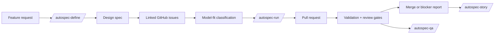

# AutoSpec

AutoSpec turns everyday software-development intent into durable specs, GitHub
issues, validation gates, pull requests, review evidence, and project memory.

It is built for developers who use AI coding agents but do not want important
work to disappear into an unstructured chat transcript. AutoSpec gives the agent
a workflow: clarify the request, write down the plan, split the work into
reviewable issues, implement behind tests, prove what changed, and leave a trail
that a maintainer can inspect later.

## Why Developers Use It

Most agent-assisted coding breaks down in the same places: the request was vague,
the agent changed too much, the tests were an afterthought, the PR summary was
hand-wavy, or nobody remembers why the work was split the way it was.

AutoSpec helps with that day-to-day reality. It is not a hosted product and it is
not "press a button and trust the robot." It is an operating system for using
coding agents on real repositories:

- Capture a rough feature idea before it turns into hidden scope creep.
- Convert the idea into a written spec with acceptance criteria.
- Split the spec into GitHub issues small enough for focused agent work.
- Label issues by context size and reasoning depth so they can be routed sanely.
- Run implementation loops that create branches, PRs, validation output, reviews,
  and closeout reports.
- Stop, resume, audit, and explain long-running agent work without losing state.
- Keep docs, QA proof, repository memory, and release-readiness checks connected
  to the actual changes.

The result is a workflow where AI can do more of the mechanical development work
while the human still has the artifacts needed to judge risk.

## Autonomous Development Model

AutoSpec is increasingly centered on autonomous development: not a single large
agent prompt, but a supervised conductor that keeps turning evidence-backed
work into safe, reviewable progress.

In quick form:

1. **Intent enters the system.** A developer writes a feature request, files an
   issue, asks for a spec, or lets `/autospec-listen` capture an imperative
   request from conversation.
2. **Planning becomes durable.** `/autospec-define`, `/autospec-refine`, or
   `/autospec-split` turns that intent into specs, linked issues, acceptance
   criteria, model-fit labels, and primary smoke tests.
3. **The queue runs itself.** `/autospec-run` claims ready `auto-implement`
   issues, creates isolated worktrees, implements behind validation gates,
   opens PRs, requests review, records closeout evidence, and merges only when
   configured gates pass.
4. **The conductor keeps finding work.** `/autospec-autonomous` walks a
   never-idle priority waterfall: control-channel commands first, then backlog
   work, open-issue promotion, local discovery, architecture and coverage
   improvements, and later broader discovery inputs.
5. **Safety rails stay active.** Stop/resume sentinels, usage and spend ledgers,
   QA gates, security audits, release checks, branch/worktree isolation, and
   closeout reports make the loop interruptible and inspectable.
6. **The system learns.** Story, sweep, explore-ledger, docs, persona, and memory
   flows feed back into better issue selection, better prompts, and better
   operator alignment.

The practical goal is simple: a developer should be able to point AutoSpec at a
repository, give it a direction, and get a sequence of small, reviewable,
validated changes rather than one opaque burst of code.

For the full skill map, including every autonomous, planning, QA, recovery,
security, documentation, and reporting surface, see [`SKILLS.md`](SKILLS.md).

## A Normal Day With AutoSpec

Use AutoSpec when a normal chat prompt would be too fragile and a full manual
project-management pass would be too slow.

```text
/autospec-define Add CSV export to the reports page with tests and documentation
```

AutoSpec investigates the repo, writes a design spec, creates a parent issue,
splits the work into child issues, adds model-fit labels, and prepares the queue.

```text
/autospec-run
```

AutoSpec then processes ready issues: it creates a worktree and branch, drives a
test-first implementation loop, opens a PR, runs validation, asks for review,
records evidence, and merges when configured gates pass. If something is blocked,
it leaves the issue and PR in a state a developer can understand and resume.

That makes it useful for routine work:

- Turning a Slack-style feature request into tracked engineering work.
- Splitting a messy improvement into a sequence of reviewable PRs.
- Letting an agent handle small implementation issues while preserving proof.
- Revalidating a running app after agent changes.
- Producing a release-readiness report before shipping.
- Explaining what has shipped by reading specs, issues, PRs, docs, and git
  history together.

## Core Workflows

| Goal | Start with | Output |
| --- | --- | --- |
| Capture a chat request as tracked work | `/autospec-listen` | Draft issue, spec handoff, or routed workflow |
| Plan a feature without implementing it | `/autospec-define` | Design spec plus classified GitHub issues |
| Plan and ship in one flow | `/autospec` | Spec, issue tree, PRs, reviews, and final report |
| Ship already-classified issues | `/autospec-run` | PRs with validation, review, and closeout reports |
| Classify existing issues | `/autospec-classify` | `ctx:*` and `reasoning:*` labels plus model-fit notes |
| Split an existing spec | `/autospec-split` | Linked issues ready for classification |
| Revalidate a running app | `/autospec-qa` | QA proof, findings, and stronger tests |
| Audit release readiness | `/autospec-release` | Release verdict and blocker report |
| Explain what exists | `/autospec-story` | Cited product and implementation narrative |
| Stop or resume a monitor | `/autospec-stop` | Clean pause, graceful stop, or resumed queue |

## How The Pieces Fit



AutoSpec is a multi-harness workflow suite for Claude Code, Codex CLI, and
OpenCode. The current operational surface is the installed skill set plus shell
validation scripts. The early Rust workspace under `crates/` is additive: it is
building a stricter future core for spec parsing, state, validation, evidence,
and queue primitives while the existing workflows remain the path users run
today.

See [`docs/architecture.md`](docs/architecture.md) for the longer system
overview and [`docs/cli-reference.md`](docs/cli-reference.md) for the current
Rust CLI command surface.

## Getting Started Quickstart

The installer ensures the core local commands AutoSpec needs: Bash, Git, curl,
Cargo/Rust, Python 3, GitHub CLI (`gh`), and `jq`. It also requires at least one
supported AI coding harness: Claude Code, Codex CLI, or OpenCode. The curl
one-liner below naturally requires curl in order to fetch the bootstrap script;
the bootstrap can install Git before cloning AutoSpec.

Optional tools such as `bats`, `ajv`, `yq`, Bun, and browser automation remain
best-effort capabilities. Their absence does not fail the core installation.

Install the latest `main` version on macOS/Linux:

```bash
curl -fsSL https://raw.githubusercontent.com/berlinguyinca/autospec/main/bootstrap.sh | bash
```

On Windows, run the PowerShell bootstrap from PowerShell:

```powershell
irm https://raw.githubusercontent.com/berlinguyinca/autospec/main/bootstrap.ps1 | iex
```

Or install from a checkout when developing AutoSpec itself:

```bash
git clone https://github.com/berlinguyinca/autospec.git
cd autospec
autospec validate --fast
bash install.sh --skill all --harness all
```

In a target repository:

```text
/autospec-define Add a small feature with tests and documentation
```

When the generated issues are ready:

```text
/autospec-run
```

## Managed GitHub Projects

Autospec can own one durable GitHub Project per product or initiative. The Project is shared
across that product's repositories and autonomous runs; it is not recreated for each repository
or conductor generation. Autospec verifies identity with this marker in the Project readme and
never adopts a Project by title alone:

```text
<!-- autospec-managed-project:begin -->
schema: 1
product-key: autospec
owner: berlinguyinca
<!-- autospec-managed-project:end -->
```

Configure the target repository's `.autospec/autonomous.yml` with an explicit seed and admission
boundary:

```yaml
project_board:
  mode: managed
  product_key: autospec
  owner: berlinguyinca
  repository_seeds: ["berlinguyinca/autospec"]
  repo_allowlist: ["berlinguyinca/autospec", "berlinguyinca/autospec-*"]
  discovery_max_repos: 25
  write_back: true
```

Then resolve the marked Project or onboard existing repositories:

```bash
autospec project resolve --repo-dir "$PWD"
autospec project onboard --repo-dir "$PWD" --repo berlinguyinca/autospec
autospec project onboard --repo-dir "$PWD" --workspace /absolute/path
autospec project onboard --repo-dir "$PWD" --owner berlinguyinca --allow 'berlinguyinca/autospec-*'
autospec project sync --repo-dir "$PWD"
```

The Rust command accepts repeatable `--repo` and `--workspace` seeds. Owner onboarding requires
at least one repeatable `--allow`: an exact repository, a trailing-`*` repository-name prefix, or
`OWNER/*` for the bounded owner-wide set. It requests at most `discovery_max_repos` from `gh repo
list` and also fails closed if the response itself exceeds that cap. Command-line patterns are
applied before matching repositories become exact scanner seeds, and the configured
`repo_allowlist` is enforced again. Discovery may follow concrete repository metadata, but it
cannot widen either boundary; out-of-bound repositories are reported and never indexed.
Repeat `--issue-url` during onboarding to select bounded existing open or closed issues; each URL
must belong to an admitted owner/allowlist repository. The report includes `selected_issues` and
`reconciled_issues` counts.
Verified repository creation uses `--repo OWNER/NAME --spawned-from IDENTITY` after `gh repo
view` succeeds. `--spawned-from` cannot be combined with owner enumeration because creation
provenance must identify exactly one repository. Adopted repositories receive only an active
`contains` relationship.

Reconciliation is additive and idempotent. Deterministic evidence becomes an active relationship;
ambiguous name-only evidence remains proposed and cannot gate execution. When onboarding has
already journaled repository state but its remote reconciliation encounters a transient failure,
the command exits successfully with JSON `outcome: journaled_projection_pending`. Managed
`autospec project sync --repo-dir "$PWD"` does not use that success outcome: a remote failure is a
nonzero error, and an operator must rerun it after the cause clears. A pending Project create with
no verified remote identity is a hard fail-closed condition, not automatically recoverable; verify
the remote Project state before retrying. The authoritative product-global recovery journal is
`${AUTOSPEC_HOME:-$HOME/.autospec}/projects/<product-key>/events.jsonl`, with its checkpoint at
`${AUTOSPEC_HOME:-$HOME/.autospec}/projects/<product-key>/binding.json`. The per-product lock in
that directory serializes creation across every repository. On first writable open, an existing
private repo-local `.autospec/state/projects/<product-key>` journal is validated and copied into
the absent global binding; the legacy source is retained as a compatibility backup.

Existing `project_board.url` configurations remain compatible in `external` mode. The legacy
`~/.autospec/project-map.yml` maps labels to GitHub Project numbers for the independent
`/autospec-classify --apply-boards` workflow; it is not a repository-to-Project managed routing
map. Accountability alone may use its mapped Project number as a compatibility fallback when no
managed policy exists. To migrate accountability, add the managed policy above, run `autospec
project resolve --repo-dir "$PWD"`, the bounded `autospec project onboard --repo-dir "$PWD" ...`
command, and `autospec project sync --repo-dir "$PWD"`. Autospec does not delete or rewrite the
legacy file, and `--apply-boards` continues to consume it independently.

## Install

For day-to-day use, install the latest `main` version on macOS/Linux:

```bash
curl -fsSL https://raw.githubusercontent.com/berlinguyinca/autospec/main/bootstrap.sh | bash
```

On Windows, run the PowerShell bootstrap from PowerShell:

```powershell
irm https://raw.githubusercontent.com/berlinguyinca/autospec/main/bootstrap.ps1 | iex
```

From a local checkout:

```bash
bash install.sh --skill all --harness all
```

On Linux, missing system packages are installed as root or through `sudo` for
a non-root user, so installation may request your sudo credentials. macOS uses
Homebrew when available; Windows bootstrap uses winget, Chocolatey, or Scoop.
AutoSpec verifies required commands after every install attempt and reports all
remaining requirements together before exiting non-zero.

To prevent automatic package-manager changes, set
`AUTOSPEC_SKIP_SYSTEM_TOOLS=1`. This skips installation attempts but still
verifies required commands:

```bash
AUTOSPEC_SKIP_SYSTEM_TOOLS=1 bash install.sh --skill all --harness all
```

To preview bootstrap and installation without writes, package installation, or
privilege prompts, pass `--dry-run`:

```bash
curl -fsSL https://raw.githubusercontent.com/berlinguyinca/autospec/main/bootstrap.sh \
  | bash -s -- --dry-run
```

After manually installing anything named in the error report, rerun:

```bash
bash install.sh --skill all --harness all
```

For target repositories that will use GitHub issues and PRs, read
[`docs/target-repo-setup.md`](docs/target-repo-setup.md) before running
implementation workflows.

## Worktree runtime isolation

`autospec runtime env` is the resource authority for linked-worktree development. Its public
resource commands are `up`, `status`, `down`, `exec`, `session`, `gc`, and
`normalize-compose`; `down --purge-maven` is the explicit guarded Maven cleanup path.
Manifest `version: 2` gives each environment a unique Compose project, labeled containers,
networks, volumes, dynamic host ports, and a Maven 4 split local repository.

Set `AUTOSPEC_MAVEN_ISOLATION=off` or `AUTOSPEC_COMPOSE_ISOLATION=off` to bypass one
resource family, or `AUTOSPEC_ENV_DISABLE=1` to bypass the whole broker for a direct child.
Every opt-out exports `AUTOSPEC_ISOLATION_BYPASSED=1`; isolation claims must then be
downgraded from verified. Unix state directories are `0700`, state files are `0600`, and
`RUNTIME_STATE_SYMLINK_REJECTED` fails closed before cleanup. See the
[runtime manifest runbook](docs/runbooks/agent-runtime-manifest.md) and the checked-in
[forty-stack proof](reports/runtime-isolation/compose-40-stack.json).

## No-Side-Effect Demo

The launch demo shows the shape of an AutoSpec run without creating GitHub issues
or pushing branches:

```bash
bash scripts/demo-recording.sh
```

Useful demo artifacts:

- [`examples/hello-autospec/spec.md`](examples/hello-autospec/spec.md) shows a tiny input spec.
- [`examples/hello-autospec/sample-issue.md`](examples/hello-autospec/sample-issue.md) shows the issue shape an implementer receives.
- [`examples/hello-autospec/expected-closeout.md`](examples/hello-autospec/expected-closeout.md) shows the result-first closeout evidence AutoSpec expects.

## Comparison

| Plain agent chat | AutoSpec |
| --- | --- |
| Prompt and result live mostly in conversation history. | Specs, issues, PRs, validation logs, and closeouts persist in the repo workflow. |
| Scope often expands silently. | Work is decomposed into explicit issues with acceptance criteria. |
| Model choice is usually ad hoc. | Issues are labeled by context and reasoning needs. |
| Testing depends on the individual prompt. | Implementation loops are built around validation gates and closeout evidence. |
| Long runs are hard to interrupt cleanly. | Monitors can stop, resume, release claims, and report blockers. |
| Post-hoc summaries are easy to overtrust. | Claims are tied to artifacts and re-runnable commands. |

## Current Maturity And Limitations

AutoSpec is ready for developers comfortable with shell tools, GitHub CLI, and AI
coding harnesses. It is most useful on repositories that already have a real test
or validation command.

Known limits:

- The full implementation workflow assumes GitHub issue and PR access.
- Some QA and release gates depend on optional tools such as `bats`, `ajv`, `yq`,
  browser automation, or target-repo services.
- The Rust CLI includes implemented commands and explicit stubs; skills and shell
  workflows remain the main user surface today.
- AutoSpec does not remove maintainer responsibility for production impact,
  credentials, destructive operations, security policy, or risky merges.
- Public docs are improving; skill-level READMEs remain the most detailed
  operational references.

For the current autonomous platform source of truth, see
[`docs/specs/2026-07-06-autospec-autonomous-platform-design.md`](docs/specs/2026-07-06-autospec-autonomous-platform-design.md).

### Autonomous preview

Run `scripts/autospec-local autonomous preview` to generate a ranked,
non-mutating candidate list. The result is written to
`.autospec/reports/autonomous-preview.json` with `filed: 0`. Review it, then
run `scripts/autospec-local autonomous start --confirm-preview` to permit live
implementation. `AUTOSPEC_AUTONOMOUS_PREVIEW_TIMEOUT_SEC` bounds the discovery
pass (default: 120 seconds).

Implementation-lint results can be cached by content with
`scripts/lint-implementation-cached.sh --staged`; unchanged staged diffs reuse
the prior result from `.autospec/cache/lint/`.

### Provider-neutral executor dispatch

`scripts/executor-dispatch.sh --request <file.json>` runs one dispatch through a
single `dispatch(request) → result` contract shared by the `claude`, `codex` and
`opencode` harnesses, so orchestration never special-cases a provider. stdout is
a result envelope with the same keys whichever harness ran, validated by
`schemas/autospec-dispatch-result.schema.json`.

Metrics the harness never reported are emitted as `"unknown"`, never `0` — a
fabricated zero is indistinguishable from a measured one in the routing ledger.
An unknown provider exits 12 rather than guessing. See
[`docs/CONFIG_REFERENCE.md`](docs/CONFIG_REFERENCE.md#provider-neutral-executor-dispatch).

### Local model dispatch

Once a model is discovered and qualified, `scripts/calibrate-profile.sh --profile <name>`
replays already-merged issues against it and records the verdict, and
`scripts/local-dispatch.sh` runs real dispatches through Codex CLI's `--oss` local
provider. Both fail closed to the cloud tier rather than guessing.

### Local model discovery

Run `scripts/discover-model-supply.sh --profiles` to see what this host can
actually run — usable accelerator, reachable local runtimes (Ollama, vLLM,
llama.cpp, LM Studio), and each installed model's *measured* context length —
and to emit a `model-profiles.yml` fragment. Models the host cannot run
usefully are emitted commented out rather than silently offered. Add `--only
<profile>` for a single-profile fragment. See
[`docs/CONFIG_REFERENCE.md`](docs/CONFIG_REFERENCE.md#local-model-supply-discovery).

A profile may also declare an `effort:` tier, reported by `route-decide.sh
--print-effort`. Raising effort on the same model is often a better dial than
swapping models, because a model switch invalidates the whole prompt cache.
`route-decide.sh` itself is advisory tooling — see
[`docs/CONFIG_REFERENCE.md`](docs/CONFIG_REFERENCE.md#evidence-based-model-routing)
for its current (not-yet-wired) dispatch status.

The autonomous research-cycle preview wiring is maintained alongside this
documentation so its environment contract remains discoverable.
For companion repository boundaries, see
[`docs/companion-repositories.md`](docs/companion-repositories.md).

## Documentation

Start here:

- [`docs/index.md`](docs/index.md)
- [`docs/quickstart.md`](docs/quickstart.md)
- [`docs/concepts.md`](docs/concepts.md)
- [`docs/architecture.md`](docs/architecture.md)
- [`docs/workflows.md`](docs/workflows.md)
- [`docs/faq.md`](docs/faq.md)
- [`docs/roadmap.md`](docs/roadmap.md)
- [`docs/target-repo-setup.md`](docs/target-repo-setup.md)
- [`docs/good-first-issues.md`](docs/good-first-issues.md)
- [`docs/release-checklist.md`](docs/release-checklist.md)
- [`docs/public-launch-checklist.md`](docs/public-launch-checklist.md)
- [`docs/cli-reference.md`](docs/cli-reference.md)
- [`SKILLS.md`](SKILLS.md)

## Contributing

AutoSpec needs users who will try it on real repositories and report where the
workflow is unclear, too heavy, or too trusting. Good first contributions include
docs fixes, demo improvements, validation coverage, and small safety hardening
patches.

Read [`CONTRIBUTING.md`](CONTRIBUTING.md), [`SAFETY.md`](SAFETY.md), and
[`SECURITY.md`](SECURITY.md) before opening a PR.
