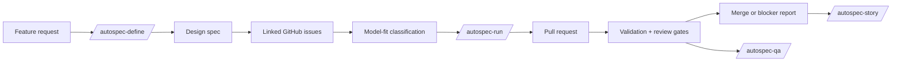

# AutoSpec

AutoSpec turns a feature idea into specs, GitHub issues, validation gates, and reviewable pull requests for AI-assisted software teams.

AutoSpec is for developers who want agentic coding work to leave a trail: what was requested, what was specified, what was split into implementation units, what was validated, and what still needs human judgment.

## What AutoSpec Does

AutoSpec is a multi-harness workflow suite for Claude Code, Codex CLI, and OpenCode. It provides skills that help an AI coding agent:

- Turn a rough product request into a written design spec.
- Decompose that spec into linked GitHub issues sized for different model capabilities.
- Classify work by context size and reasoning depth.
- Run implementation loops that open PRs, validate changes, review results, and merge when configured gates pass.
- Stop, resume, audit, and explain long-running agent work.
- Keep docs, tests, QA proof, and repository memory aligned over time.

## Why It Matters

AI code is only useful when the team can trust where it came from and why it changed. AutoSpec makes agent work more auditable by keeping specs, issues, validation scripts, PR summaries, and final reports connected.

It does not promise unattended magic. It gives you a structured operating system for agentic development: scoped work, explicit validation, safety rails, and artifacts a maintainer can inspect.

## Getting Started: 5-Minute Quickstart

Prerequisites: Git, Bash, GitHub CLI (`gh`), `jq`, Python 3, and one supported AI coding harness.

One-command install for users who want the latest `main` installer:

```bash
curl -fsSL https://raw.githubusercontent.com/berlinguyinca/autospec/main/bootstrap.sh | bash
```

1. Clone the repository:

   ```bash
   git clone https://github.com/berlinguyinca/autospec.git
   cd autospec
   ```

2. Run the local validator:

   ```bash
   bash scripts/validate.sh --fast
   ```

3. Install the skills into your harness:

   ```bash
   bash install.sh --skill all --harness all
   ```

4. In a target repository, start with planning:

   ```text
   /autospec-define Add a small feature with tests and documentation
   ```

5. When issues are ready, run implementation:

   ```text
   /autospec-run
   ```

For a no-side-effect walkthrough, read [`examples/hello-autospec/`](examples/hello-autospec/) and run:

```bash
bash scripts/demo-recording.sh
```

## Install

From a local checkout:

```bash
bash install.sh --skill all --harness all
```

For target repositories that will use GitHub issues and PRs, read [`docs/target-repo-setup.md`](docs/target-repo-setup.md) before running implementation workflows.

## Demo

The launch demo is intentionally conservative. It shows the shape of an AutoSpec run without creating GitHub issues or pushing branches:

- [`examples/hello-autospec/spec.md`](examples/hello-autospec/spec.md) shows a tiny input spec.
- [`examples/hello-autospec/sample-issue.md`](examples/hello-autospec/sample-issue.md) shows the issue shape an implementer receives.
- [`examples/hello-autospec/expected-closeout.md`](examples/hello-autospec/expected-closeout.md) shows the result-first closeout evidence AutoSpec expects.
- [`docs/assets/demo-placeholder.md`](docs/assets/demo-placeholder.md) is the shot list for a real recording.

## Architecture



The Mermaid source lives in [`docs/assets/architecture.mmd`](docs/assets/architecture.mmd). See [`docs/architecture.md`](docs/architecture.md) for the longer explanation.

## Rust Core Workspace

AutoSpec now includes an early Rust workspace under `crates/` for the V62+ core platform work. The Rust surface is intentionally narrow: `autospec-core` owns future spec parsing, dependency ordering, state, validation, and evidence primitives, while `autospec-cli` currently exposes only `autospec doctor`.

The existing shell, Python, JavaScript, and skill workflows remain the operational surface for current users. The Rust workspace is additive until later V62+ specs wire stable commands.

See [`docs/cli-reference.md`](docs/cli-reference.md) for the current Rust CLI command surface and which commands are implemented versus explicit stubs.

## Core Workflows

| Goal | Start with | Output |
| --- | --- | --- |
| Capture a chat request as tracked work | `/autospec-listen` | Draft issue, spec handoff, or routed workflow |
| Plan a feature without implementing it | `/autospec-define` | Design spec plus classified GitHub issues |
| Ship already-classified issues | `/autospec-run` | PRs with validation, review, and closeout reports |
| Split an existing spec | `/autospec-split` | Linked issues ready for classification |
| Revalidate a running app | `/autospec-qa` | QA proof, findings, and stronger tests |
| Audit release readiness | `/autospec-release` | Release verdict and blocker report |
| Explain what exists | `/autospec-story` | Cited product and implementation narrative |

## Comparison

| Approach | Best for | Tradeoff |
| --- | --- | --- |
| Plain chat with an AI coder | One-off edits | Little durable context, weak audit trail |
| GitHub issues only | Human-led backlog management | Does not define agent execution protocol |
| CI only | Verifying code after it exists | Does not shape issue quality or agent behavior |
| AutoSpec | Spec-first agentic development with traceability | More ceremony than a quick manual patch |

## Current Maturity And Limitations

AutoSpec is launch-ready for developers comfortable with shell tools, GitHub CLI, and AI coding harnesses. It is not a hosted product and it is not a replacement for maintainers reviewing risky work.

Known limitations:

- The full workflow assumes GitHub issue and PR access.
- Some release and QA gates depend on optional tools such as `bats`, `ajv`, `yq`, browser automation, or target-repo services.
- Long-running autonomous workflows are powerful but intentionally outside the V61 launch focus.
- Public docs are improving; skill-level READMEs remain the most detailed operational references.

## Documentation

Start here:

- [`docs/index.md`](docs/index.md)
- [`docs/quickstart.md`](docs/quickstart.md)
- [`docs/concepts.md`](docs/concepts.md)
- [`docs/architecture.md`](docs/architecture.md)
- [`docs/workflows.md`](docs/workflows.md)
- [`docs/faq.md`](docs/faq.md)
- [`docs/roadmap.md`](docs/roadmap.md)
- [`docs/target-repo-setup.md`](docs/target-repo-setup.md)
- [`docs/good-first-issues.md`](docs/good-first-issues.md)
- [`docs/release-checklist.md`](docs/release-checklist.md)
- [`docs/public-launch-checklist.md`](docs/public-launch-checklist.md)
- [`docs/cli-reference.md`](docs/cli-reference.md)

## Contributing

AutoSpec needs users who will try it on real repositories and report where the workflow is unclear, too heavy, or too trusting. Good first contributions include docs fixes, demo improvements, validation coverage, and small safety hardening patches.

Read [`CONTRIBUTING.md`](CONTRIBUTING.md), [`SAFETY.md`](SAFETY.md), and [`SECURITY.md`](SECURITY.md) before opening a PR.
