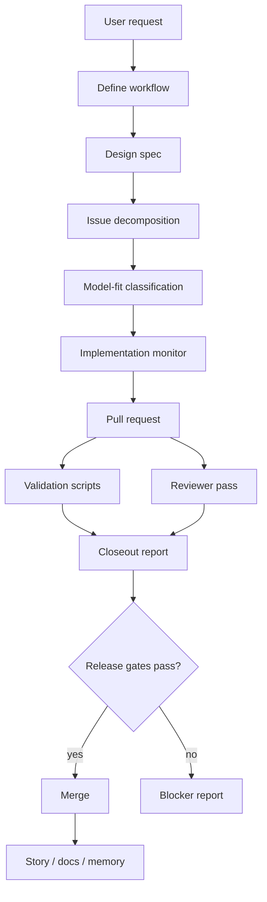

# Architecture

AutoSpec is a set of portable skills, scripts, schemas, tests, and documentation that run inside supported AI coding harnesses. The repository is designed around explicit artifacts: specs, GitHub issues, PRs, validation output, and final reports.

## Repository Layers

| Layer | Paths | Responsibility |
| --- | --- | --- |
| Skills | `skills/*/SKILL.md` | Workflow instructions loaded by Claude Code, Codex CLI, and OpenCode |
| Harness mirrors | `skills/*/codex/prompt.md`, `skills/*/opencode/agent.md` | Lock-step prompt bodies for supported harnesses |
| Scripts | `scripts/*.sh`, `scripts/*.mjs`, `scripts/*.py` | Deterministic gates, installers, prompt generation, QA helpers |
| Rust core | `crates/autospec-core`, `crates/autospec-cli` | Additive V62+ core primitives and CLI entry point |
| Tests | `tests/**` | Bats, shell, and Python validation coverage |
| Schemas | `schemas/*.json` | Contracts for QA, fleet, fab, reliability, and related artifacts |
| Docs | `docs/**` | User, developer, architecture, config, and launch documentation |

## Data Flow

1. A user asks for a feature or release audit.
2. AutoSpec writes or consumes a design spec.
3. The spec is decomposed into GitHub issues.
4. Deterministic classification and optional model review assign work size labels.
5. Implementation runs in scoped worktrees and produces PRs.
6. Validation scripts, CI, QA, and review gates decide whether the PR can merge.
7. Closeout reports and story docs preserve what changed and why.

## Trust Model

AutoSpec treats agent claims as claims, not proof. Scripts and reviewers must re-read cited artifacts, run the relevant checks, and report gaps directly.

## Rust Boundary

The Rust workspace is the future home for core platform primitives: spec metadata, dependency graph ordering, state transitions, validation registries, evidence bundles, and release reports. It does not replace the existing skill and script surfaces. Until later V62+ specs promote stable commands, Rust code stays isolated under `crates/` and must preserve the current shell-validated behavior.

The first core primitives are deliberately read-only. Spec metadata parsing converts generated Markdown specs into strict IDs, dependencies, acceptance criteria, and validation commands. Dependency graph ordering then validates missing dependencies and cycles before producing a deterministic execution order. Execution, retries, and persistence remain deferred to later V65+ specs.

Agent integration is represented as a contract layer, not as hidden automation. The Rust core normalizes task/result fields, renders handoff prompts, and blocks destructive instructions in safe mode before any runner-specific invocation. Codex, Claude, and Fable prompt templates share the same required result fields.
