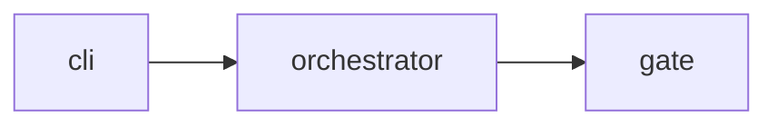

# Autospec Family Docs Amendment — Universal Doc Generation + Reverse-Engineer Mode + Drift Gate

**Status:** Draft design (2026-05-22)
**Author:** berlinguyinca + brainstorm
**Scope:** Amends existing autospec skills (`autospec-define`, `autospec-run`, autospec-test, autospec-classify). No new skill.

## 1. Goal & non-goals

### Goal
Make documentation a first-class output of every autospec run. Every `/autospec-define` and `/autospec-run` produces or updates `docs/USER_MANUAL.md`, `docs/API_REFERENCE.md`, and `docs/ARCHITECTURE.md`. A deterministic doc-drift gate runs in Phase 4 QA and in CI. `/autospec-define` gains a reverse-engineer-from-existing-repo mode that backfills missing specs and bootstraps docs. Output includes LLM-ingestible artifacts (`llms.txt`, `.llm-manifest.json`, paste-ready assistant prompt), auto-generated screenshots and architecture diagrams, and an AI-reviewer step that replaces blanket "needs human review" with confidence-graded approval.

### Non-goals
- Translating docs to other languages
- Sequence diagrams auto-derived from runtime traces (deferred — hard to do well)
- Real-time doc preview (live server) — operator uses any markdown previewer
- Shipping vector embeddings of docs into repos (consumers compute embeddings on their end)

## 2. Architecture & integration with autospec family

No new skill. All changes amend existing skills.

| Skill | Amendment |
|---|---|
| `/autospec-define` | New `--init` flag + auto-detect-with-prompt → reverse-engineer mode: tree-sitter scan → emit one ARCHITECTURE-level spec + per-module specs to `docs/specs/` + initial USER_MANUAL/API_REFERENCE/ARCHITECTURE/llms.txt/.llm-manifest.json. |
| `/autospec-define` (normal mode) | After spec PR merges, generate/update sections in `docs/USER_MANUAL.md` + `docs/API_REFERENCE.md` + `docs/ARCHITECTURE.md` matching the new feature. |
| `/autospec-run` Phase 4 implementer | New QA step between build/lint/test and LGTM: `bash $AUTOSPEC_SCRIPTS_DIR/check-doc-drift.sh <PR>`. Failure feeds the self-heal loop as `failing_doc_drift` classification. |
| `/autospec-run` Phase 4 implementer | New required edit surface: docs files. Implementer expected to update doc sections whose `autospec-doc-scope` matches changed source. |
| `/autospec-run` Phase 4 (issue body) | `docs: skip` in issue body demotes drift to warning-only for that PR. |
| Top-level autospec | New `.github/workflows/autospec-doc-drift.yml` runs the same check on all PRs (idempotent installer). |
| Top-level autospec | Optional pre-commit hook via `bash $AUTOSPEC_SCRIPTS_DIR/install-doc-drift-hook.sh` for local feedback. |

**New shared tooling (lives at `$AUTOSPEC_SCRIPTS_DIR`, NOT vendored into target repos):**

- `check-doc-drift.sh <PR_or_diff>` — deterministic drift checker
- `scan-doc-scope.mjs` — parses `autospec-doc-scope` comment blocks into `{ section_path → globs }`
- `reverse-engineer.sh <repo_root>` — tree-sitter scan + backfill specs + initial docs
- `tree-sitter-walk/<lang>.scm` — language-specific queries
- `gen-docs-from-spec.mjs` — given a spec + target doc file, produces/updates the relevant section
- `gen-llms-txt.sh` — composes `llms.txt`/`llms-full.txt` from existing docs
- `gen-llm-manifest.mjs` — composes `.llm-manifest.json` from tree-sitter output + spec frontmatter
- `gen-screenshots.mjs` — Playwright-based, reuses v1 safety/intercept; outputs to `docs/assets/screenshots/`
- `gen-arch-diagram.mjs` — tree-sitter module graph → mermaid syntax embedded in ARCHITECTURE.md
- `ai-review-doc.mjs` — LLM reviewer pass with `high|medium|low` confidence grading

**Target-repo file layout (unchanged convention):**
```
docs/
  USER_MANUAL.md       # operator-facing narrative
  API_REFERENCE.md     # per-symbol reference
  ARCHITECTURE.md      # system-shape + mermaid graphs
  ASSISTANT_PROMPT.md  # paste-ready system prompt
  AUTOSPEC_INIT_REPORT.md  # one-shot output from reverse-engineer
  .llm-manifest.json
  assets/
    screenshots/<route-slug>__<viewport>.png
    transcripts/<command>.cast
  specs/               # existing convention
llms.txt              # repo-root
llms-full.txt         # repo-root
```

## 3. Doc scope declarations + drift check

### 3a. Markdown comment syntax

Each section in a doc file declares its source scope:

```markdown
## Installing autospec-test

<!-- autospec-doc-scope:
  src: ["path/to/install.sh", "path/to/skill/install.sh"]
  reason: "User-facing install instructions must reflect actual install.sh behavior"
-->

To install, run …
```

Schema (parsed deterministically):
- `src:` array of globs (repo-root-relative)
- `reason:` optional one-line note
- `visual:` optional glob pointing to companion screenshot(s) — see §6
- `generated: true` — section is fully auto-regenerated; never expected to be hand-edited
- `mismatch_action: warn | hard_fail` — (default: `hard_fail`) controls drift gate behaviour for this scope. `hard_fail` blocks the PR (exit 1); `warn` emits the finding to `drift_warn[]` without blocking (exit 0). Use `warn` for over-broad scopes that are intentionally wide until narrowing ships.
- One block per section; section delimited by markdown headings, scope applies until the next same-or-higher heading.

### 3b. Drift detection algorithm

```
Inputs: PR diff (or local working-tree diff)
Outputs: exit code (0=clean, 1=drift, 2=missing-scope), stdout JSON

1. Parse every docs/*.md → { (file, heading) → [globs] } via scan-doc-scope.mjs
2. Compute { changed_source_files: set, changed_doc_files_with_lines: set } from diff
3. For each (doc_file, heading, globs):
     matches = { f ∈ changed_source_files : any(glob_match(f, g) for g in globs) }
     if matches empty → skip
     else if doc section's lines are in changed_doc_files_with_lines → CLEAN
     else → DRIFT (doc_file, heading, matches)
4. If issue body has `docs: skip` → demote DRIFT to warnings
5. Any changed source file not covered by any scope across all docs → MISSING_SCOPE finding
6. For sections with `visual:` glob: if source under src: changed AND any matching screenshot mtime < change → VISUAL_STALE
7. For sections with `generated: true` and tree-sitter graph diff present → REGEN_REQUIRED
8. Emit JSON; exit 0/1/2
```

Gate JSON shape (consumed by Phase 4 self-heal classifier):

```json
{
  "passed": false,
  "drift": [
    { "doc_file": "docs/USER_MANUAL.md", "heading": "## Installing autospec-test",
      "matching_source_files": ["skills/autospec-test/install.sh"],
      "reason": "User-facing install instructions must reflect actual install.sh behavior" }
  ],
  "missing_scope": [
    { "source_file": "skills/autospec-test/scripts/new-thing.sh",
      "suggestion": "no docs section declares scope for this path" }
  ],
  "visual_stale": [
    { "doc_file": "docs/USER_MANUAL.md", "heading": "## /dashboard",
      "screenshot": "docs/assets/screenshots/dashboard__desktop.png",
      "source_changed": ["components/dashboard/index.tsx"] }
  ],
  "ai_review_stale": [
    { "doc_file": "docs/ARCHITECTURE.md", "heading": "## Module graph",
      "last_reviewed_at": "<ISO>", "source_changed_after": "<ISO>" }
  ],
  "skipped": false
}
```

### 3c. Self-heal loop classifier extension

V1 loop classifier (Section 4 of v1 spec) gains new categories:

| Category | Loop action |
|---|---|
| `failing_doc_drift` | Loop edits the named doc section to reflect source changes |
| `missing_doc_scope` | Loop adds `autospec-doc-scope` comment to appropriate doc file; default to ARCHITECTURE.md if no clear home |
| `failing_visual_stale` | Loop reruns `gen-screenshots.mjs` for matching routes |
| `failing_ai_review_stale` | Loop reruns `ai-review-doc.mjs` for that section |
| `failing_manifest_stale` | Loop reruns `gen-llm-manifest.mjs` for affected modules |

### 3d. Anti-rubber-stamp guardrail

Per v1's assertion-shift-classifier pattern:

| Loop edit | Bucket | Auto-merge |
|---|---|---|
| Remove `autospec-doc-scope` comment | LOOSENING | ❌ blocked |
| Narrow `src:` globs (remove a glob) | LOOSENING | ❌ blocked |
| Remove a section that had non-empty scope | LOOSENING | ❌ blocked |
| Add new `autospec-doc-scope` block | STRENGTHENING | ✅ |
| Widen `src:` globs | STRENGTHENING | ✅ |
| Edit doc section body (content shift) | SHIFTING | conditional: requires same-iteration source edit + `JUSTIFICATION:` |

### 3e. `docs: skip` semantics

Issue body line matching `^docs:\s*skip\s*$` (case-insensitive) demotes drift to warnings. PR still gets `docs:skipped` label + comment listing what would have flagged. Operator sees what was let through.

## 4. Reverse-engineer mode (`/autospec-define --init`)

### 4a. Trigger

- Explicit: `/autospec-define --init` (headless-safe, required for CI)
- Auto: `/autospec-define` detects "code exists but `docs/specs/` empty OR no doc has any `autospec-doc-scope`" and asks: *"This repo has source code but no autospec docs. Run reverse-engineer first? [yes / no / always-this-repo]"*. "always-this-repo" writes `.autospec/init-done.flag` so subsequent runs skip the prompt.

### 4b. Pipeline (`reverse-engineer.sh <repo_root>`)

```
1. Inventory source files
   - Walk repo_root, respect .gitignore
   - Group by language via extension → match to tree-sitter grammar
   - Skip: docs/, vendor/, node_modules/, .git/, generated dirs declared in .autospec/init.yml

2. Per-language tree-sitter pass
   - Run queries from $AUTOSPEC_SCRIPTS_DIR/tree-sitter-walk/<lang>.scm
   - Extract: exported functions/classes, public types, CLI entry points, HTTP routes,
     config schema keys, top-level constants
   - Emit per-module JSON

3. Cluster modules into "significant units"
   - Significant = ≥1 public export, OR CLI entry point, OR imported by ≥3 others
   - Trivial leaves bubble into parent module's spec

4. Emit specs to docs/specs/
   - One top-level: docs/specs/<DATE>-architecture-reverse-engineered-design.md
   - One per significant unit: docs/specs/<DATE>-<module-slug>-reverse-engineered-design.md
   - All carry frontmatter:
       ---
       reverse_engineered: true
       source_root: <module_path>
       generated_at: <ISO>
       commit: <sha>
       ai_reviewed: { confidence: high|medium|low }
       ---

5. Generate initial human docs
   - ARCHITECTURE.md: module graph (mermaid) + per-module summary, scopes declared
   - API_REFERENCE.md: per-public-export entry, scopes declared per source file
   - USER_MANUAL.md: stub sections per CLI entry point / HTTP route group, scopes declared

6. Generate LLM-ingestible artifacts (§5)
   - llms.txt (short index ≤200 lines)
   - llms-full.txt (concatenated full content)
   - docs/.llm-manifest.json
   - docs/ASSISTANT_PROMPT.md

7. Generate visual artifacts (§6)
   - docs/assets/screenshots/<route>__<viewport>.png (if Playwright config + clone URL)
   - docs/assets/transcripts/<command>.cast (for CLI tools)
   - Mermaid diagrams inline in ARCHITECTURE.md

8. AI-review pass (§7)
   - Every generated section → confidence grading
   - low → `needs-human-review` + concerns listed

9. Write docs/AUTOSPEC_INIT_REPORT.md
   - what found (counts by file type, language)
   - what generated (paths + line counts)
   - what needs human review (low-confidence sections)
   - explicit next-steps checklist
```

### 4c. Output as one branch + PR

Creates `feat/spec-reverse-engineer-init`, commits all artifacts, opens PR. Existing autospec lint + new drift gate runs (should pass — every section freshly scoped). Operator reviews; merging unlocks normal `/autospec-define` brainstorm mode.

### 4d. LLM use is scoped

- Tree-sitter does deterministic structure extraction — no LLM
- Module summary line per spec: 1 LLM call per module with `(path, exports, first 50 lines)` context
- Per-section AI review: 1 LLM call per generated section (see §7)
- Total per reverse-engineer pass: bounded at ~2× module count + 1× per generated section

### 4e. Idempotency

Rerunning `--init` against a repo with existing reverse-engineered specs:
- Skips specs whose `source_root` hash matches `commit:`
- Regenerates only specs whose source has changed
- Never silently rewrites operator-edited specs (frontmatter `reverse_engineered: true` flips to `false` once a human commits a change — detected via git history)

## 5. LLM-assistant-ready output

### 5a. `llms.txt` (repo root)

Follows llmstxt.org convention. Two variants:
- `llms.txt` — short curated index (≤200 lines): repo summary, key doc paths, primary entry points
- `llms-full.txt` — concatenated full content of three docs + key spec excerpts, ready for direct context-window ingestion

### 5b. `docs/.llm-manifest.json`

Structured per-symbol manifest, deterministic from tree-sitter pass:

```json
{
  "schema_version": "1.0",
  "repo": "berlinguyinca/autospec",
  "generated_at": "2026-05-22T...",
  "commit": "<sha>",
  "modules": [
    {
      "path": "skills/autospec-test/scripts/run-gate.sh",
      "summary": "Top-level orchestrator: Stage 1 + Stage 2 + Stage 2.5 + assertion-shift + PR report.",
      "public_api": [
        { "name": "run_gate", "signature": "...", "params": [...], "returns": "...",
          "usage_example": "..." }
      ],
      "depends_on": ["skills/autospec-test/scripts/gate-stage-unit.sh"],
      "spec_ref": "docs/specs/2026-05-21-autospec-test-design.md#section-2"
    }
  ],
  "cli_entry_points": [...],
  "http_endpoints": [...],
  "concepts": [
    { "name": "Stage 2.5", "definition": "...",
      "source_anchor": "docs/specs/2026-05-21-autospec-test-invariants-design.md#section-2" }
  ],
  "faq": [
    { "q": "How do I enable Mode II scoped-production?", "a": "...", "needs_review": false }
  ]
}
```

### 5c. `docs/ASSISTANT_PROMPT.md`

Paste-ready system prompt for Claude/GPT to bootstrap an app-assistant:

```markdown
# Assistant Prompt for <repo>

You are an assistant for berlinguyinca/autospec. Answer questions about installation, usage, troubleshooting, and architecture using:

- Repo manifest: docs/.llm-manifest.json
- Full docs: llms-full.txt
- Design specs: docs/specs/

When citing, use the spec_ref field. If a question is outside the manifest, say so.

## Sample Q&A pairs
[LLM-generated, marked needs_review where confidence < high]
```

### 5d. Why not ship embeddings

Different consumers want different models + dimensions. Binary indexes bloat the repo. Manifest provides clean chunk boundaries; consumers embed on their end.

## 6. Auto-generated visual artifacts

### 6a. Screenshots / transcripts

**Tool:** `gen-screenshots.mjs` — reuses v1 Playwright infrastructure (same `forbidden_url_patterns`, same Mode I/II safety, same network intercept).

**During reverse-engineer + during maintenance:**
- If Playwright config + clone URL declared: capture screenshots of every crawled route (v2 crawler reused), default desktop + mobile viewports
- Output: `docs/assets/screenshots/<route-slug>__<viewport>.png`
- Per-route snippet inserted in USER_MANUAL.md / ARCHITECTURE.md with `visual:` scope key

**CLI tools (no UI):** captured via `asciinema rec` (or fallback `script -c`), stored as `docs/assets/transcripts/<command>.cast` with rendered markdown snippet.

**Mode II safety:** screenshots go through same network intercept; any forbidden_url match aborts capture.

### 6b. Architecture diagrams (mermaid)

**Tool:** `gen-arch-diagram.mjs` — tree-sitter module graph → mermaid syntax → inline in ARCHITECTURE.md.

**Generated diagrams:**
- Module dependency graph (top-level, auto-clustered by directory)
- Entry-point call trees (depth 3, configurable), one per CLI/HTTP entry
- (Deferred): sequence diagrams for cross-module flows

**Inline embedding** with `generated: true` scope so the loop regenerates rather than edits manually:

````markdown
## Module graph

<!-- autospec-doc-scope:
  src: ["path/to/src/**/*.ts", "path/to/src/**/*.py", "path/to/src/**/*.go"]
  generated: true
-->


````

## 7. AI-as-reviewer

### 7a. Replaces blanket `needs_human_review`

**Tool:** `ai-review-doc.mjs` — LLM review pass on every auto-generated doc section.

**Prompt template (deterministic):**

```
You are reviewing auto-generated documentation for accuracy against source code.

Section: <heading>
Generated content: <markdown body>
Declared scope (autospec-doc-scope): <globs>
Source files in scope (full text): <concatenated>

Verdict (exactly one line, machine-parseable):
  ai_reviewed: { confidence: high|medium|low, concerns: [str, ...] }

Rules:
- high: content accurately reflects source; no concerns
- medium: minor inaccuracies (phrasing, missed nuance); list in concerns
- low: significant mismatch or unverifiable claim; PR flagged for human review
```

### 7b. Output integration

| confidence | PR label | Doc annotation |
|---|---|---|
| high | (none) | `<!-- ai-reviewed: high -->` |
| medium | (none) | `<!-- ai-reviewed: medium; concerns: ... -->` |
| low | `needs-human-review`, `docs:ai-low-confidence` | `<!-- ai-reviewed: low; concerns: ... -->` + PR comment listing concerns |

### 7c. Cost ceiling

- Per-section budget: ≤2000 input tokens, ≤200 output tokens
- Per reverse-engineer pass: ~2× module count + 1× per generated section
- Output cached by `(section_hash, source_files_hash)` — rerun only on real change
- AI reviewer is the ONLY LLM call in the doc maintenance pipeline (besides module summaries from §4)

### 7d. Maintenance

Every autospec-run that updates a doc section reruns the AI reviewer on that section. Drift gate flags `ai_review_stale` when section content unchanged but source under its scope changed AND last review predates the source change. Loop runs reviewer to refresh.

## 8. Failure semantics & reporting

### 8a. Per-PR drift outcomes

| State | Labels | Auto-merge | Pipeline impact |
|---|---|---|---|
| No source change matches any scope | (none) | ✅ | normal |
| All matched doc sections edited in same PR | `docs:updated` | ✅ | normal |
| Drift, `docs: skip` declared | `docs:skipped` + warning comment | ✅ | normal |
| Drift, loop healed | `docs:auto-updated`, `e2e:healed` | ✅ | normal |
| Drift, loop exhausted | `docs:drift`, `needs-human-review` | ❌ | move on |
| `missing_scope` | `docs:missing-scope`, `needs-human-review` | ❌ | move on |
| `.llm-manifest.json` stale | `docs:manifest-stale`, `needs-human-review` | ❌ | move on |
| `visual_stale` | `docs:visual-stale`, `needs-human-review` | ❌ | move on |
| `ai_review_stale` | `docs:ai-review-stale`, `needs-human-review` | ❌ | move on |
| Loop attempted scope LOOSENING | `docs:scope-loosening`, `needs-human-review` | ❌ | anti-rubber-stamp blocks merge |
| AI reviewer returns `confidence: low` | `docs:ai-low-confidence`, `needs-human-review` | ❌ | move on |

### 8b. PR report subsection (appended to autospec-test comment)

```markdown
### Docs drift gate

**Source files changed:** 5
**Matching doc sections:** 3
**Drift detected in:** 1
- `docs/USER_MANUAL.md` → `## Installing autospec-test` (matches: `skills/autospec-test/install.sh`)
  reason: User-facing install instructions must reflect actual install.sh behavior

**Visual artifacts to refresh:** 1
- `docs/assets/screenshots/dashboard__desktop.png` (source change: `components/dashboard/index.tsx`)

**Manifest entries to refresh:** 2
- `.llm-manifest.json` → `modules[skills/autospec-test/scripts/run-gate.sh]` (signature changed)

**AI review:** 4 sections re-reviewed — 4 high-confidence, 0 medium, 0 low

**llms-full.txt:** regenerated automatically.
```

## 9. Testing

### 9a. Unit tests
- `scan-doc-scope.mjs`: valid + malformed scope blocks → expected `{ heading → globs }` map
- `check-doc-drift.sh`: table of (changed src, changed docs, scopes) → expected exit + JSON
- `gen-llm-manifest.mjs`: fixture tree-sitter output → expected manifest shape
- `gen-llms-txt.sh`: golden against fixture repo
- `gen-arch-diagram.mjs`: tree-sitter module-graph fixture → expected mermaid output
- `gen-screenshots.mjs`: mock Playwright API → assert capture invocations + filenames
- `ai-review-doc.mjs`: stubbed LLM responses → expected confidence routing

### 9b. Integration tests (extend existing synthetic targets)
- Extend `target-clean-pass`: add full docs + scopes → drift check passes; manifest + llms.txt + screenshots all generate
- New `target-doc-drift-bait`: source change with no doc update → drift check fails with specific reason
- New `target-reverse-engineer-bait`: tiny repo with code, no docs → reverse-engineer.sh produces expected backfill (golden diff)
- New `target-manifest-stale-bait`: doc updated, manifest not → manifest-stale flag
- New `target-visual-stale-bait`: dashboard component changed, screenshot not regenerated → visual_stale flag
- New `target-ai-low-confidence-bait`: deliberately mismatched doc + source → AI reviewer returns `low`

### 9c. Cross-language matrix

Reverse-engineer pass tested against tiny synthetic repos per tree-sitter language (Node, Python, Go, Rust, JVM).

## 10. Dependencies & scope boundaries

| Dependency | Status | Failure mode |
|---|---|---|
| v2 #351 (Stage 2.5 orchestrator) merging | in flight | drift gate hooks same orchestration point |
| Tree-sitter foundation | this spec lands it; tooling-optimization reuses | if tooling-optimization ships first, doc-amendment reuses |
| Playwright ≥1.40 in target | per-repo | autodetect; missing → screenshots skipped, NOT an error |
| `gh` CLI | live | required for labels + PR report |
| `asciinema` (optional, for CLI transcripts) | optional | falls back to `script -c` |

### Out of scope
- Translating docs to other languages
- Sequence diagrams from runtime traces
- Real-time live preview
- Shipping vector embeddings

### Skill family map (unchanged structure, expanded behavior)
```
autospec-define      (existing, gains --init mode + auto-docs)
autospec-run         (existing, gains drift gate in Phase 4 + auto-docs)
autospec-test        (existing, drift gate composes with Stage 2.5)
autospec-classify    (existing, unchanged)
autospec-review      (existing, unchanged)
```

## 11. Decision log

| Q | Decision | Rationale |
|---|---|---|
| New skill vs amend family? | Amend (no new skill) | User Q2=B; capabilities folded into existing skills |
| Trigger model | Always-on with `docs: skip` escape hatch | User Q1=B |
| Required doc set | USER_MANUAL + API_REFERENCE + ARCHITECTURE triad | User Q2=C |
| Drift detection | Section-level scope via markdown comments | User Q3=B — deterministic over LLM |
| Reverse-engineer trigger | Auto-detect + explicit `--init` flag | User Q4=C — interactive default, headless option |
| Reverse-engineer granularity | ARCHITECTURE-level + per-module hybrid | User Q5=D |
| Language scope | Tree-sitter universal | User Q6=D — same primitive as queued tooling-optimization |
| Drift enforcement | Phase 4 QA + CI workflow + optional pre-commit | User Q7=D — three layers |
| Screenshots in scope? | Yes — Playwright already exists | User §4e amendment |
| Architecture diagrams in scope? | Yes — mermaid inline, deterministic | User §4e amendment |
| AI-as-reviewer? | Yes — replaces blanket needs_review with confidence grading | User §4e amendment |
| Loop can edit docs? | Yes (STRENGTHENING + SHIFTING with justification); never LOOSENING | Same anti-greenwash as v1 §5c |
| Ship embeddings? | No | Consumer responsibility, repo binary bloat |

## 12. Open follow-ups (separate specs)

1. Sequence-diagram auto-derivation from runtime traces (future)
2. Multi-language docs translation (out of scope)
3. Visual regression baseline for screenshots (future v2)
