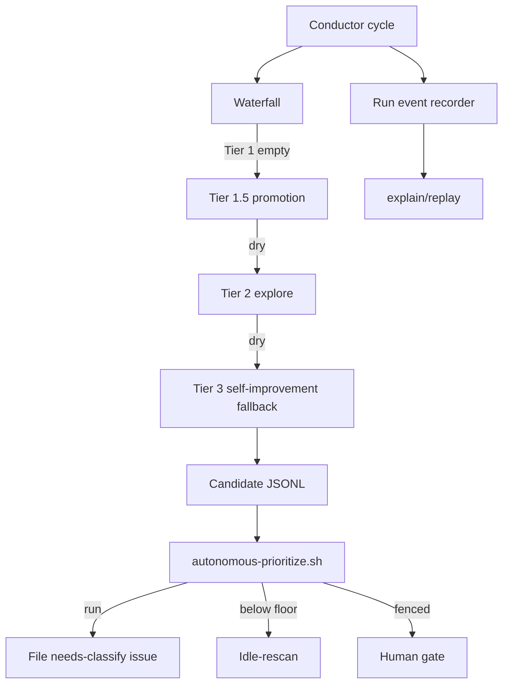

# Autonomous Self-Improvement Foundation Design

**Date:** 2026-07-10
**Request:** Implement the proposed run black box/replay, boundary-truth guardrails, adoption readiness doctor, and autonomous discovery behavior so AutoSpec finds this class of repo improvement without an operator asking for it.
**Mode:** Autonomous autospec workflow, no confirmation gates.

## Goal

AutoSpec must detect high-value repo-improvement work when the normal backlog is empty, rank it with the existing value-gated waterfall, and leave deterministic evidence explaining why it acted, idled, quarantined, or recommended follow-up work.

## Team Personality

**Reliability platform team.** Roles: platform engineer, SRE, release engineer, test engineer, and security-minded maintainer. This team fits because the feature changes autonomous scheduling, evidence, guardrails, and first-run trust rather than product UI. It should prioritize deterministic behavior, clear recovery signals, no hidden GitHub writes in dry-run paths, and small shell/Rust surfaces that can be validated by existing Bats and Cargo tests.

### Review Counter-Team

**Operator trust and scope critic.** Roles: operations reviewer, security/privacy reviewer, and autospec scope guardian. This team challenges silent mutation, repo-specific hardcoding, false confidence from shallow scans, event logs that are not replayable, and readiness reports that claim safety without checking the actual repo boundary.

## Architecture

The implementation is a small deterministic foundation layered under the existing Phase-4 autonomous platform. It does not replace `/autospec-explore` or the conductor. It adds three local helper scripts and one CLI readiness surface, then wires the conductor's Tier 3 fallback to the self-improvement candidate builder when no richer architecture-improvement command is configured.

## Interfaces

- `scripts/autospec-run-events.sh`
  - `record --repo OWNER/REPO --run-id ID --event EVENT --decision DECISION --reason TEXT [--issue N] [--pr N]`
  - `explain --events FILE`
  - `replay --events FILE`
- `scripts/autospec-boundary-guardrails.sh scan --repo-root DIR`
  - Emits JSON with findings for contract drift, silent failure branches, and missing boundary-realistic integration tests.
- `scripts/autonomous-self-improvement.sh candidates|apply`
  - `candidates` emits JSONL candidates from local deterministic signals.
  - `apply` files high-value candidates as `needs-classify` issues only when `--apply` and `AUTOSPEC_SELF_IMPROVEMENT_APPLY=1` are both present.
- `autospec doctor --readiness --json`
  - Emits a target-repo readiness report with workflow safety recommendations.

## Data Model

Run events are append-only JSONL records under `.autospec/run-events/<run-id>.jsonl`. Candidate queues are JSONL records with the same scoring fields consumed by `autonomous-prioritize.sh`: `id`, `workstream`, `title`, `severity`, `value`, `confidence`, `reversibility`, `effort`, `blast_radius`, and `files`.

## Error Handling

Every helper is fail-loud on malformed arguments and fail-open only where the conductor must keep running. GitHub writes are double-gated. Readiness and guardrail scans must degrade to explicit `missing_tool` or `unknown` facts rather than silently returning `ok`.

## Testing

- Bats tests verify run-event record/explain/replay behavior.
- Bats tests verify boundary guardrail findings on fixture files.
- Bats tests verify self-improvement candidate generation and double-gated issue filing.
- Conductor wiring tests verify Tier 3 chooses deterministic self-improvement when no richer command exists.
- Cargo tests verify `autospec doctor --readiness --json` emits workflow recommendations.

## Acceptance Criteria

- [ ] `scripts/autospec-run-events.sh` records JSONL events and explains the final decision from a fixture event stream.
- [ ] `scripts/autospec-run-events.sh replay` returns a deterministic final decision from the same fixture stream.
- [ ] `scripts/autospec-boundary-guardrails.sh scan` detects allow-list/schema drift, silent error swallowing, and typed-fake-only external tests in fixtures.
- [ ] `scripts/autonomous-self-improvement.sh candidates` emits value-scored candidates for local repo gaps without GitHub access.
- [ ] `scripts/autonomous-self-improvement.sh apply` performs no GitHub writes unless both the flag and env opt-in are present.
- [ ] The conductor Tier 3 fallback can invoke deterministic self-improvement and treat filed candidates as work.
- [ ] `autospec doctor --readiness --json` reports repo, git, GitHub remote, validation, config, and workflow readiness.

## Critical Risk Check

The highest-risk failure is self-improvement becoming churn or hidden remote mutation. The mitigation is double-gated `apply`, deterministic candidates with evidence paths, value-floor scoring before filing, and event logs that explain every action.

