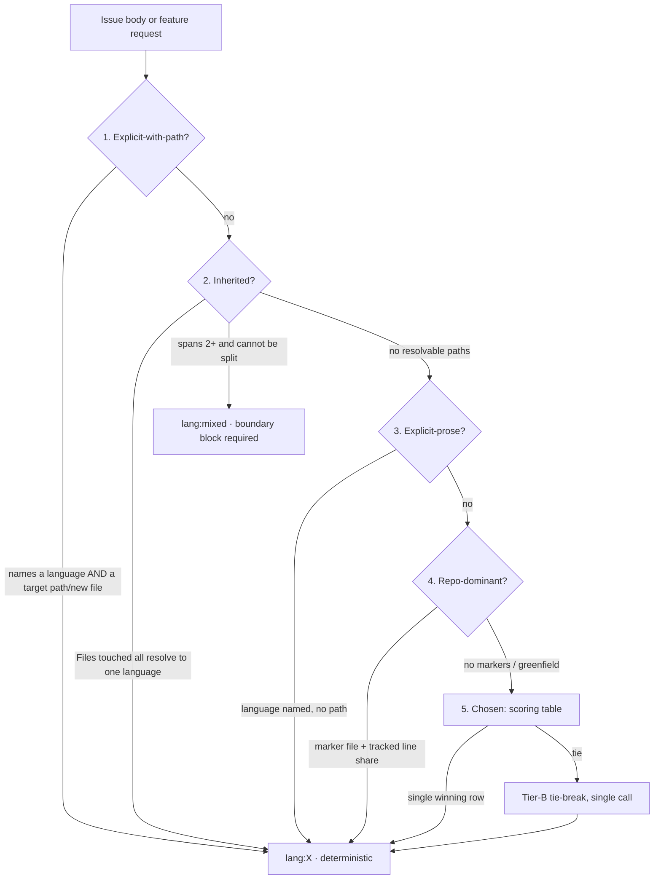

# Language selection axis + cross-language boundaries — design

**Date:** 2026-08-12
**Status:** design
**Repo:** berlinguyinca/autospec

## Problem

autospec *detects* a target stack but never *chooses* a language, and has no model
of a cross-language boundary. Verified against source:

| # | Evidence | Consequence |
|---|---|---|
| 1 | `scripts/autospec_autonomy_stack.py:39-54` — taxonomy is 4 profiles (react-vite-typescript, nextjs-web-app, python-cli-tool, playwright) + `unknown` | No Rust, Go, Java, Kotlin, C#, Ruby, PHP, bash |
| 2 | `_detect_profiles()` on this repo returns `playwright` @ 0.90 primary, off the single path `tests/fixtures/evidence/react-vite-with-playwright/playwright.config.ts` | A fixture representing *someone else's* stack is read as ours |
| 3 | `_source_files` (`:19, 22-24`) skips only `.git`/`node_modules` | Walks `target/`, `dist/`, and ~20 nested `.claude/worktrees/` copies of that fixture. `autospec-detect-stack-profile.sh:34` already has a fuller `SKIP_DIRS` — the two walkers disagree |
| 4 | `MIN_SCAFFOLD_STACK_CONFIDENCE = 0.8` (`autospec-autonomy-v2-lib.py:210-220`) refuses *below* 0.8 | A confidently-wrong 0.90 primary **opens** a gate that `unknown` @ 0.1 would have closed. Latent only because `allow_runtime_features: false` (`autospec-supervisor-cycle.sh:270-278`). `autospec-verify-worker-pr.sh:534-543` re-asserts the same value, so review inherits the false pass |
| 5 | `skills/autospec-define/SKILL.md:157,166` — Phase 0 infers stack from the *description string* ("Go TUI for X" → `go-tui-x`), fallback `mixed/unknown: skip` | Greenfield language choice is never made; the one interactive question asks name/visibility/owner |
| 6 | `skills/autospec-run/SKILL.md:1417-1451` — pre-merge fail-closed quality gate hardcodes `cargo clippy`; zero hits for eslint/ruff/gofmt/golangci/shellcheck/mypy | TS, Go, Python and bash PRs merge with no lint gate |
| 7 | `scripts/extract-shared-contracts.sh` compares token *strings*; signature regex is backtick-anchored C-family syntax | `parse<T: De>(s)` and `Foo::bar(x)` yield **no token**. A Rust struct serialized to JSON and read by a TS client is invisible; two sides sharing a name but disagreeing on shape look aligned |

**Non-goal.** This is not harness selection (`executor_bridge/harness.rs`) and not
`ctx:*`/`reasoning:*` model-fit. Three orthogonal axes; conflating them is a defect.

## Team personality

**Toolchain & classification** — architect, maintainer, bash/Python engineer,
test engineer, documentation owner.

Fits because the bulk of the work reshapes existing mechanisms (a detector, a
merge gate, a contract scanner) rather than building a new subsystem, while
adding exactly one new deterministic classifier that must mirror a proven
in-repo contract.

Risks this team is expected to notice: confidently-wrong classification that
*opens* a fail-closed gate; label proliferation without a consumer; installer
drift when a new runtime script ships; trio/golden lockstep breakage;
detection that votes on fixtures and build output.

Emphasis carried into child issues: every detection change needs a regression
test pinned to a *real* polyglot tree, never a fixture the detector itself
generated.

### Review counter-team

**False-positive skeptics** — maintainer, regression-test engineer,
architecture reviewer.

Assumptions to challenge: that a higher confidence number means a better
answer; that adding a label changes behavior; that the marker table is
complete; that a boundary declared in prose is a boundary that is verified.
Review stays inside issue scope by asking, per issue, "what input makes this
classifier confidently wrong, and does a test cover it?"

## Architecture

One new deterministic classifier, two repaired mechanisms, one extended
contract scanner. No new IPC layer — the repo already has subprocess + JSON
stdout + exit codes and 30+ versioned schemas under `schemas/`.



Precedence **short-circuits in order**.

**The explicit/inherited discriminator.** A language named in prose is often
discussion, not a decision; touched paths are ground truth. So *explicit* is
split across two ranks by whether it is actionable:

- **Explicit-with-path (rank 1)** — the body names a language **and** a target
  path or a file to create ("add `scripts/foo.py` in Python"). This is a
  directive about the code being written, so it outranks inheritance.
- **Explicit-prose (rank 3)** — a language is named with no path ("we should
  probably use Python here"). It is demoted **below** inheritance, so an issue
  mentioning Python while touching only `crates/**/*.rs` resolves to
  `lang:rust`.

Inheritance must win over bare prose: choosing a language for a change under
`crates/autospec-cli/` is a bug, not a feature, and inheritance is ~90% of real
issues.

### Components

| Component | Path | Status |
|---|---|---|
| Language classifier | `scripts/classify-language.sh` | new |
| Marker/extension table | `scripts/autospec-language-table.sh` | new, shared by classifier + detector |
| Stack detector | `scripts/autospec_autonomy_stack.py` | repaired |
| Pre-merge quality gate | `skills/autospec-run/SKILL.md` trio | repaired, table-driven |
| Contract scanner | `scripts/extract-shared-contracts.sh` | extended |
| Label + block application | `skills/autospec-classify/` trio | extended |
| Bootstrap + boundary phases | `skills/autospec-define/` trio | extended |

## API shape

`classify-language.sh` mirrors `classify-model-fit.sh:1-22` exactly:

```
scripts/classify-language.sh <body-file>          # emit "## Language fit" markdown block
scripts/classify-language.sh <body-file> --json   # emit JSON object
scripts/classify-language.sh --help
```

JSON contract:

```json
{"lang":"rust","source":"inherited","rationale":"...","deterministic":true,"confidence":0.95}
```

- `source` ∈ `explicit | inherited | repo-dominant | chosen`
- `deterministic` is `false` only when step 4 ties; that is the sole LLM escalation,
  a single Tier-B call, never Tier A.
- Telemetry: one JSON line per invocation to `.autospec/telemetry/classify-language.jsonl`,
  matching the model-fit classifier's convention.
- Exit codes: `0` success, `1` usage error / body file not found, `2` escalation failed.

### Implementation status

- Ranks 1–2 (explicit-with-path, inherited) are implemented in
  `scripts/classify-language.sh` per issue #3107; ranks 3–5 (repo-dominant,
  chosen, step-4 LLM tie-break) are not implemented yet, so
  `source` in practice is `explicit | inherited | unknown` and
  `deterministic` is always `true` until rank 4 lands.
- An **existing but empty** body file is a valid input: it classifies as
  `lang:unknown`, `confidence:0.0`, exit `0` (abstention with telemetry).
  Exit `1` is reserved for a missing body file or usage errors.
- `install.sh` ships the script unchanged: `copy_repo_scripts` globs
  `scripts/*.sh`, so no install.sh edit was required.

### Label vocabulary (closed set)

`lang:rust` `lang:go` `lang:python` `lang:typescript` `lang:javascript`
`lang:java` `lang:bash` `lang:ruby` `lang:csharp` `lang:markdown`
`lang:mixed` `lang:unknown`

Exactly one `lang:*` per issue. `lang:markdown` is first-class — skill prose is
the most common change class in this repo. `lang:unknown` means the classifier
abstained and no gate may treat it as confident.

**When a single issue gets `lang:mixed`.** The default is to **split**: an issue
whose `Files touched` span two languages should become two issues joined by a
`Depends on` edge. `lang:mixed` applies only when the sizing caps forbid that —
i.e. the spanning files are **one logical unit** that cannot be split without
breaking a lockstep rule (e.g. a skill trio plus the Rust helper it shells out
to, which must land in one commit). `lang:mixed` is therefore not a fallback but
a positive assertion that an irreducible boundary lives inside one issue.

Phase 3.75 emits a boundary block when **either** the sibling set spans ≥2
distinct `lang:*` **or** any single child carries `lang:mixed`.

### Chosen-language scoring table (step 4 only)

| Signal in the request | Favors |
|---|---|
| single binary, distributed to users, no runtime dependency | go, rust |
| hot loop / parser / memory-bound / must not GC-pause | rust |
| glue over existing CLIs, ≤200 lines, POSIX host | bash |
| web UI / browser target | typescript |
| ML, dataframes, scientific libraries | python |
| must call into an existing library in language L | L |

Ties break toward languages already present in the repo (`source: chosen`,
rationale `repo-affinity`), then to the operator default in
`.autospec/autospec.yml`. Only a genuine remaining tie escalates.

The operator default is the `language:` key in `.autospec/autospec.yml`
(e.g. `language: rust`): the value is canonicalized, must name a member of
the closed language set, and applies only when it is one of the tied
candidates. An absent key, or a value outside the set, means no default.

## Data model

**`.autospec/state/stack-profile.json`** gains a language/framework split. The
`primary_profile` key may only ever hold a **language** profile; frameworks
(playwright, next, vite) move to a sibling `frameworks` array and can never set
`primary`. `stack_confidence()` continues to read `primary_profile.confidence`,
so the `MIN_SCAFFOLD_STACK_CONFIDENCE = 0.8` gate keeps its meaning while losing
its false-positive path.

Confidence is capped: when the winning marker's tracked-source line share is
below 50%, confidence is clamped to `0.5` — below the scaffold gate, which is
the fail-closed direction.

**Markers and line share are counted separately, and only markers are
fixture-filtered.** A *marker* (`Cargo.toml`, `package.json`, `pyproject.toml`,
`go.mod`, `playwright.config.*`, …) decides which languages are *candidates*; it
counts **only** at the repo root or in a declared workspace member. A marker
nested inside a fixture or evidence tree never counts — that is precisely the
`tests/fixtures/evidence/react-vite-with-playwright/playwright.config.ts` defect.
*Line share* decides how strong a candidate is and is counted over all tracked
source files, so a legitimate `.rs` or `.sh` file under `tests/` still counts
normally. Excluding all of `tests/**` would be over-broad and is explicitly not
what this spec asks for.

**Cross-language boundary block**, appended by Phase 3.75 between
`<!-- autospec-shared-contracts:begin -->` markers when children span ≥2
distinct `lang:*` or any child is `lang:mixed`:

```markdown
## Cross-language boundaries

| Boundary | Transport | Schema (source of truth) | Owner | Golden fixture |
|---|---|---|---|---|
| cli→worker | subprocess + JSON stdout | schemas/autospec-x.schema.json | lang:rust | tests/fixtures/boundary/x.json |
```

Rules the block encodes: the owning side lands the schema **first**; the
consuming issue carries `Depends on issue #N` against it; each boundary gets one
golden fixture under `tests/fixtures/` asserted by **both** sides' own test
runners. That two-sided assertion is the only thing that actually catches drift.

## Error handling

- Classifier on an empty/missing body file → exit 1, usage error, no telemetry line.
- Classifier cannot resolve any precedence step → `lang:unknown`, `confidence: 0.0`,
  `deterministic: true`. Abstention is a valid answer and must never be dressed up
  as a choice.
- Tier-B tie-break unavailable (quota, network) → fall back to `lang:unknown`, exit 2.
  Never silently pick a language.
- Detector finds no markers → `unknown` @ 0.1 as today. Preserved deliberately: it is
  the fail-closed value.
- Quality gate: a language whose marker is present but whose linter is not installed →
  fail the gate loudly with `FINAL_QUALITY_GATE_FAILED command=<cmd> rule=<lang>-unavailable`,
  matching the existing `cargo-unavailable` precedent at `autospec-run/SKILL.md:1433-1434`.
  A missing linter must not be a silent pass.
- Boundary block: a declared boundary with no schema file under `schemas/` → Phase 3.75
  fails closed rather than emitting an unbacked table.

## Testing

TDD per AGENTS.md. Real files, no mocked filesystem, no DB mocks.

- **Detector regression (highest value).** Build a real polyglot fixture tree —
  Cargo.toml + `.rs`, `scripts/*.sh`, a `tests/fixtures/**/playwright.config.ts` —
  and assert `primary_profile.id` is `rust`, that `playwright` appears only under
  `frameworks`, and that the fixture path contributes **zero** votes. This test
  reproduces the exact observed defect and must fail before the fix.
- **Walk scope.** Assert `target/`, `dist/`, `build/`, `.next/`, `coverage/` and
  `.claude/worktrees/` are excluded, and that the two walkers
  (`autospec_autonomy_stack.py`, `autospec-detect-stack-profile.sh:34`) agree on
  one shared exclusion list.
- **Confidence clamp.** A repo whose winning marker covers <50% of tracked lines
  yields confidence ≤0.5, and `stack_confidence()` therefore **closes** the
  scaffold gate.
- **Classifier precedence.** One test per rank, plus the two discriminator cases:
  an issue naming Python in prose while touching only `crates/**/*.rs` resolves to
  `lang:rust` (inheritance beats explicit-prose); an issue saying "add
  `scripts/foo.py` in Python" while touching `*.rs` resolves to `lang:python`
  (explicit-with-path beats inheritance).
- **Classifier abstention.** No resolvable signal → `lang:unknown`, never a guess.
- **Quality gate table.** A fixture repo with Cargo.toml *and* package.json *and*
  `*.sh` runs all three linters, not the first; a marker-present/linter-absent repo
  fails closed.
- **Boundary block.** Children spanning rust+typescript emit the table; single-language
  children emit nothing; a boundary naming a nonexistent schema fails closed.
- **Idempotency.** Re-running Phase 3.5/3.75 replaces blocks between markers and never
  stacks duplicates.

**Mermaid:** included above (precedence flowchart). No further diagram warranted —
the remaining work is tabular, and tables already carry it.

**UI/design cohesion:** not applicable. No user-facing UI surface in this feature.

## Acceptance criteria

- [ ] `_detect_profiles()` on this repo returns a language as `primary_profile.id`, not `playwright`
- [ ] A marker file nested under `tests/fixtures/**` contributes zero candidate votes
- [ ] A tracked `.rs`/`.sh` source file under `tests/` still contributes to line share
- [ ] `target/`, `dist/`, `build/`, `.next/`, `coverage/`, `.claude/worktrees/` are excluded from the source walk
- [ ] Both stack walkers share one exclusion list defined in exactly one file
- [ ] Detection confidence is ≤0.5 when the winning marker covers <50% of tracked source lines
- [ ] `scripts/classify-language.sh <body> --json` emits the documented five-key object
- [ ] `deterministic:false` occurs only on a step-4 tie and triggers at most one Tier-B call
- [ ] An issue whose `Files touched` are all `*.rs` classifies `lang:rust` with `source:inherited`
- [ ] An issue with no resolvable signal classifies `lang:unknown` with `confidence:0.0`
- [ ] The pre-merge quality gate runs every language whose marker is present, not only the first
- [ ] A present marker with a missing linter fails the gate with a `FINAL_QUALITY_GATE_FAILED` line
- [ ] Phase 3.75 emits a `## Cross-language boundaries` table when children span ≥2 `lang:*`
- [ ] A declared boundary naming a nonexistent `schemas/*.schema.json` fails Phase 3.75 closed
- [ ] `install.sh` ships every new script under `scripts/` and `scripts/lib/`
- [ ] `bash install.sh --update` on a clean HOME leaves `classify-language.sh` executable and on PATH
- [ ] `autospec validate` passes

## Verification

**Primary smoke test (inner loop):**

```bash
bats tests/unit/test_classify_language.bats
```

**Operator/full verification:**

```bash
autospec validate && bats tests/unit tests/smoke
```

## Constraints

- Selection is **deterministic**, not an LLM judgment call — 60–120k small-LLM
  target, correctness ≫ speed, and tracker #421's thesis.
- `install.sh` drops `scripts/lib/` runtime libs; ship-completeness does not catch
  it. Every issue adding a runtime script extends the installer **in the same change**.
- Any trio edit re-derives mirrors via `derive-trio.sh --in-place` and regenerates
  goldens via `gen-skill-goldens.sh` in the **same commit**, or `validate.sh` fails closed.
- Fixes land in classify/define/run, **not** in `autospec-autonomous`. Autonomous drives
  the waterfall that invokes them, so the axis propagates through Tiers 1–3 for free;
  the only change it needs is that Tier 2/3 proposals carry a `lang:*` label.

## Sequencing

1. Detection repair + quality-gate table (independent, valuable immediately).
2. Classifier precedence steps 1–3 (pure detection, no policy debate).
3. Chosen-language table + Phase 0 bootstrap integration.
4. Cross-language boundaries.
