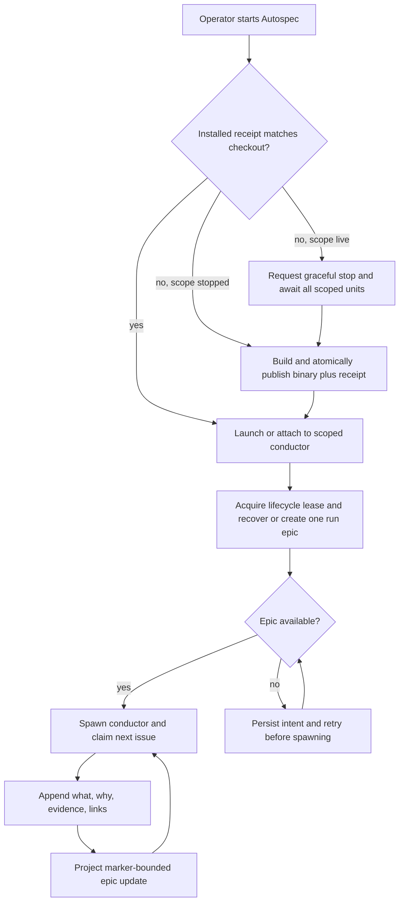
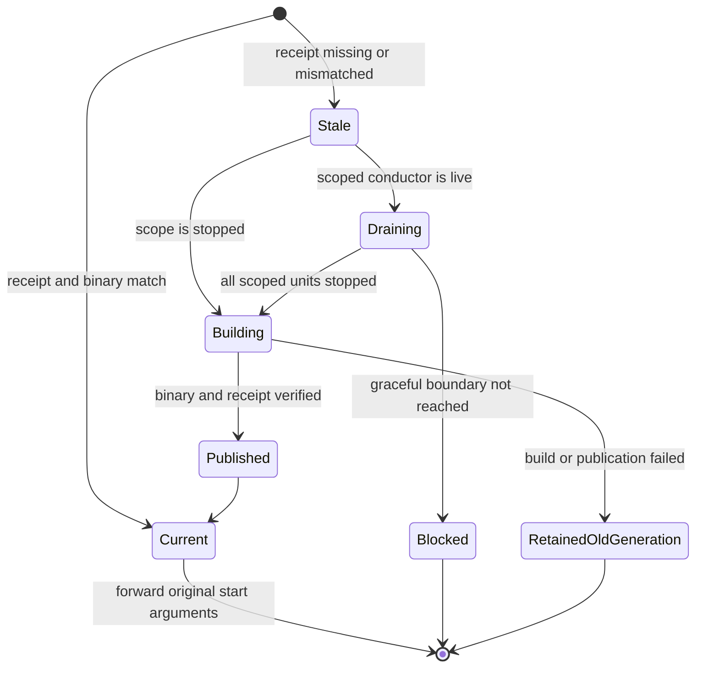

# Autonomous Runtime Refresh and Run Accountability

## Goal

Every `autospec-autonomous start` must run the conductor built from the requested checkout and create exactly one durable GitHub epic that explains, in concise language and diagrams, what that conductor is building and why.

## Team personality

The implementation team is **Reliability/backend**: a platform engineer owns process and installation boundaries, a backend engineer owns the GitHub projection, an SRE owns recovery and observability, and a test engineer owns failure injection. This team fits because both halves of the feature are durable-control-plane work. It must notice split-brain conductors, partial installation generations, duplicate epics, stale projections, GitHub rate limits, and recovery after interruption.

### Review counter-team

The counter-team is **Security and product comprehension**: a security reviewer challenges filesystem trust and command-injection boundaries; a product/documentation reviewer challenges whether a human can understand the epic without reading logs; and a maintainer challenges unnecessary coupling. Review stays within runtime refresh, run journaling, GitHub projection, and their tests.

## Architecture

The feature has two independent durable boundaries joined at `start`:

1. A shell compatibility preflight runs before Rust argument parsing. It compares the requested checkout with a private installed runtime receipt. A stale start drains the existing scoped conductor gracefully, publishes one immutable binary/receipt generation, then executes that exact generation path with the original arguments. A narrow runtime-only installer performs this operation without reinstalling skills, harnesses, or peer tooling.
2. The launcher creates or recovers one run-accountability record after acquiring the lifecycle lease and before spawning the conductor. Local private state is authoritative for recovery. A marker-bounded GitHub epic is the human-readable projection and may optionally be added to a configured GitHub Project.

Read-only and stop commands bypass runtime rebuilding. Later GitHub projection failures do not corrupt the local journal or duplicate an epic; pending projections retry at later safe boundaries. A new conductor is not spawned until creation or adoption of its epic is verified.



## Runtime identity and installation transaction

The receipt schema records the canonical checkout path, Git `HEAD`, a deterministic SHA-256 digest of Cargo manifests/configuration and Rust/build-script inputs, the installed binary digest, and an RFC 3339 installation timestamp. The digest covers relevant tracked, staged, unstaged, and untracked build inputs but excludes documentation-only changes. The installer compares source identity before and after the build and refuses to publish a receipt for a moving source snapshot.

Missing, malformed, unsafe, older-schema, source-mismatched, or binary-mismatched receipts are stale. Unsafe ownership, modes, symlinks, ambiguous locks, or interrupted transaction journals fail closed.

Installation writes an immutable generation directory keyed by source digest. The directory contains the binary and receipt, is fully verified and synced before publication, and is never mutated afterward. A single atomic `current` pointer supports ordinary CLI discovery, while start/restart execute the exact generation path returned by their preflight so a concurrent refresh for another repository cannot substitute a different binary.

Publication serializes through a private global generation lock containing independently validated canonical positive PID, process-start identity, and timestamp fields. Before pointer publication, it writes a private transaction journal naming the phase and artifacts. Recovery distinguishes an abandoned clean lock from an interrupted publication. Signals may interrupt any external command without exposing a partial generation or losing recovery evidence. Recovery defers further signals until journal cleanup and lock release complete. There is no production fault-injection hook; tests inject failures through PATH shims.

Build identity is computed through batched hashing rather than one process per file. It includes non-Rust crate assets reachable by build scripts, `include_bytes!`, and `include_str!`. A matching checkout fast path has a sub-50ms target after filesystem cache warmup.

## Start-boundary refresh

Bare `autospec-autonomous`, `start`, `restart`, and `autospec-autonomous-start` run the preflight. `status`, `list`, `logs`, `timeline`, `watch`, `monitor`, `supervise`, `cleanup`, and `stop` remain usable without a build.

The preflight resolves `--repo-dir` or the caller's Git root, recomputes freshness after acquiring a repo-scoped refresh lock, and preserves all original Rust arguments. Start/restart fail closed with an actionable diagnostic when the helper is missing; read-only and stop commands still bypass it. When stale state is live, it uses the existing graceful stop contract and waits for conductor, monitor, and supervisor metadata to become stopped. It never force-kills work or launches a competing conductor. Build failure leaves the prior generation intact and exits non-zero rather than relaunching stale work.



## Run epic contract

Each conductor generation has a stable `run_id` derived from repository identity and the launcher generation. Its private state directory contains:

- `accountability.json`: schema, repository, run ID, epic number/URL, state, timestamps, counts, and last successful projection;
- `accountability-events.jsonl`: append-only typed events;
- `accountability-outbox.jsonl`: projections not yet acknowledged by GitHub.

The first start writes a private launch intent, then searches open and closed issues for an exact hidden marker before creating anything:

```text
<!-- autospec:run-epic repo=OWNER/REPO run_id=RUN_ID -->
```

After issue creation it re-queries and verifies the marker before persisting the binding. Zero matches creates once, one match adopts, and multiple matches fail closed. This recovers a lost create response without duplicating issues. The marker, lifecycle lease, and atomic metadata write make creation idempotent across retries and restarts. `start --follow` and supervisor repair adopt the live generation and its epic. An explicit restart or a start after terminal stop creates a new generation and epic labeled `epic`, `type:tracker`, `no-auto`, and `autospec:run-accountability`.

The epic body preserves human-authored text outside Autospec markers and renders these bounded sections:

- **Overview**: requested outcome, current state, and a short explanation of why this run exists.
- **Build flow**: Mermaid flowchart of queued, active, merged, failed, and blocked work.
- **Decision timeline**: short chronological paragraphs, each containing **What**, **Why**, and **Evidence**.
- **Deliverables**: linked child issues and PRs with their outcomes.
- **Verification and remaining risk**: commands/evidence and the most likely hidden failure.

Events are projected at run creation, issue claim, implementation completion/failure, PR open, review outcome, merge, blocked transition, and run close. An opened PR is never described as implemented; only target-branch merges enter completed outcomes. Repeated low-level polling is not projected. The renderer caps the managed body at 48 KiB, displays at most 25 work nodes, and summarizes older events without deleting the local journal.

GitHub Project assignment is optional. When `~/.autospec/project-map.yml` maps `autospec:run-accountability` to a project number, the epic is added idempotently. Missing project permissions warn and do not block the epic.

## Data flow and failure handling

Every accountability mutation is local-first: append and sync the event, update private metadata atomically, render the desired projection, then call GitHub. Creation/adoption failure is startup-blocking. A failed later edit remains in the outbox and retries with bounded backoff and `Retry-After` support. A local journal failure blocks the next work mutation because the run would otherwise become unauditable. A closed active epic, removed marker, or ambiguous duplicate pauses before the next mutation rather than silently replacing the epic. Later projection failures are visible in `status`/`list` and do not stop already-accountable implementation.

All GitHub text is derived from typed fields and escaped before Mermaid rendering. Logs, prompts, environment variables, credentials, and raw tool output are never copied wholesale. Evidence is limited to public issue/PR/check links, commands, paths, and concise outcomes.

`autospec autonomous status --json` and `list --json` expose `run_id`, `epic_number`, `epic_url`, `accountability_state`, `event_count`, `pending_projection_count`, and `last_projected_at` from local state without making a network request.

## Testing

TDD covers each behavior before production changes:

1. Receipt identity: deterministic digests, relevant dirty/untracked changes, strict schema/calendar/path validation, unsafe targets, and binary tampering.
2. Installer transaction: immutable-generation publication, cross-repository concurrent starts, signal and SIGKILL at every publication boundary, stale clean versus interrupted locks, malformed/reused PID metadata, pointer rollback, cleanup failure, and no-prior-generation recovery.
3. Start refresh: current bypass, stale stopped rebuild, stale live graceful drain, argument preservation, concurrency, failed build retention, ambiguous metadata fail-closed, and read-only/stop bypass.
4. Epic lifecycle: exactly-once creation, lost-response marker recovery, follow/supervisor adoption, explicit-restart succession, project assignment, queue exclusion, human-text preservation, local-first outbox retry, body-size compaction, Mermaid escaping, and pre-spawn gating.
5. Event projection: claim, implementation, review, PR, merge, failure, blocked, and close events produce concise What/Why/Evidence paragraphs and correct links.
6. Status/list: accountability fields are local, accurate, and nonblocking.
7. Platform gates: release build on macOS and Linux-specific ownership behavior in Linux CI.

Required verification is `cargo test --workspace`, `cargo clippy --workspace --all-targets`, `cargo build --release -p autospec-cli`, `autospec validate`, focused Bats suites, `bash -n` for changed shell, ShellCheck for changed shell, workflow validation, and `git diff --check`.

## Acceptance criteria

- A direct stale start cannot attach to or launch an outdated runtime.
- Binary and receipt always describe one verified installation generation after success, interruption, or recovery.
- Concurrent repository starts execute the exact generation each preflight verified, even when another repository publishes a newer global `current` pointer.
- Runtime freshness does not reinstall skills, harnesses, peer tools, or unrelated user-environment configuration.
- Every conductor generation has exactly one verified GitHub run epic before its process is spawned.
- The epic explains what is being built and why in short paragraphs, contains Mermaid flow/state visuals, and links issues, PRs, and evidence.
- Restarts and adoption reuse the same epic; new generations create new epics.
- GitHub edit failures remain visible and retryable without losing the local accountability journal.
- `status --json` and `list --json` expose epic identity and projection health without network access.
- Optional GitHub Project assignment never replaces or blocks the issue-based epic.
- Existing autonomous safety, graceful-stop, and auto-merge contracts remain unchanged.

## Scope boundaries

This feature does not create a new general project-management system, duplicate every raw log line into GitHub, force-stop conductors, expose private prompts or credentials, or auto-refresh unrelated Autospec commands. The GitHub issue is an accountability projection over existing lifecycle facts, not a second execution authority.
