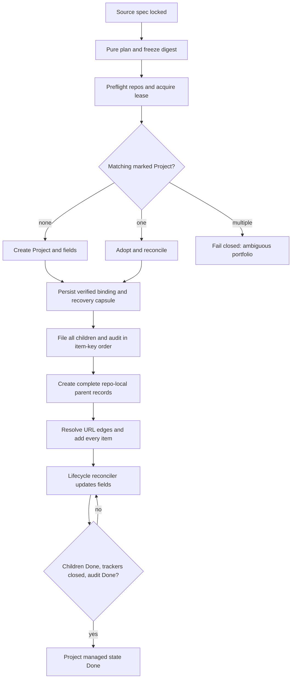
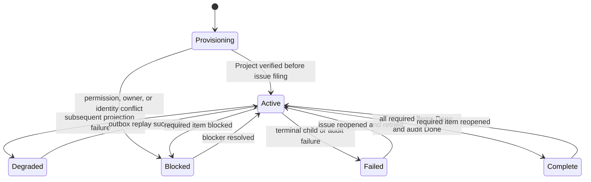

# Automatic GitHub Projects for Spec Decomposition

## Goal

Every Autospec issue-decomposition run must create or adopt exactly one GitHub Project that shows the complete cross-repository delivery state of the source spec before any child issue is filed.

## Team personality

The implementation team is **Reliability/backend**: a workflow engineer owns decomposition ordering, a GitHub integration engineer owns Projects v2, a data-model engineer owns durable cross-repository identity, an SRE owns recovery and rate-limit behavior, and a test engineer owns failure injection. This team fits because the feature turns an optional board projection into a required control-plane artifact. It must notice duplicate projects, partial issue filing, owner-scope mismatches, permission gaps, stale status, cross-repository dependency loss, and retries after ambiguous GitHub responses.

Confidence is high based on the existing Phase 3 umbrella/child workflow, typed parent lifecycle, and autonomous accountability projection.

### Review counter-team

The counter-team is **Security, product comprehension, and maintainability**: a security reviewer challenges token scopes and untrusted Project metadata; a product reviewer verifies that a human can answer “what is done and what remains?” without reading issue bodies; and a maintainer challenges duplicated lifecycle state. Review stays inside spec decomposition, Projects v2 projection, cross-repository membership, and their tests.

## Problem

Phase 3 currently creates a repository-local umbrella and children, then Phase 3.5 optionally adds classified children to Projects named in `~/.autospec/project-map.yml`. That requires prior operator configuration, can spread one spec across unrelated boards, omits the umbrella, and cannot represent one concept spanning several repositories. A successful decomposition can therefore leave no single portfolio view of completion.

The desired invariant is stronger: a decomposition is not complete until one spec Project exists, every generated tracker and child is present, dependencies and repository identity are visible, and status reflects authoritative issue/PR lifecycle facts.

## Architecture

Add a required **spec portfolio** transaction around Phase 3 in the canonical decomposition surfaces: `autospec`, `autospec-define`, `autospec-split`, and the internal existing-spec path used by `autospec-explore`. Other issue-filing helpers do not create spec portfolios unless they explicitly invoke that transaction.

1. Run a pure planning pass that performs no GitHub mutation. It emits schema `autospec.portfolio-plan.v1` with stable logical `item_key` values, target repositories, repository-local parentage, cross-repository edges, and the Phase 5.5 audit item.
2. Canonicalize, lint, and freeze the plan. `plan_digest = sha256(canonical_plan)`; any subsequent shape change requires a new plan revision before mutation resumes.
3. Resolve the Project owner, preflight every target repository, and acquire the distributed portfolio lease.
4. Create or reconcile one GitHub Project, its managed fields, and its recovery capsule before filing any issue.
5. File issues in deterministic `item_key` order, resolve logical edges to canonical URLs, add every issue to the Project, and checkpoint after each acknowledged mutation.
6. Create each repository-local parent record only after that repository's complete child set, including its audit child where applicable, is known and filed.
7. Reconcile Project fields from issue, PR, CI, review, and parent lifecycle events.
8. Mark the Project complete only when every required child is terminal-success, every local tracker is closed by parent reconciliation, and the Phase 5.5 audit is complete.

GitHub Projects is a human-facing projection. Repository issues, PR merge state, typed parent records, and the cross-repository portfolio manifest remain authoritative.



## Portfolio identity and ownership

The stable identity is:

```text
portfolio_id = sha256(canonical_source_repo || source_spec_path || source_spec_blob_oid)
```

The frozen plan has stable logical keys such as `source-tracker`, `repo:<owner/repo>:tracker`, `issue:<slug>`, and `audit:phase-5.5`. Before remote mutation Autospec writes a recovery capsule containing the complete ordered item-key set, repository-local parent sets, cross-repository logical edges, `plan_digest`, and a random 128-bit `create_nonce`. The bounded capsule is stored both locally and inside the managed Project README after binding; plans too large for the README are rejected and must be decomposed into separate specs.

The Project README contains exactly one immutable marker:

```text
<!-- autospec:spec-project schema=1 portfolio_id=ID source=OWNER/REPO:path@OID -->
```

Creation searches the selected owner's open and closed Projects with pagination. Zero exact markers permits creation, one adopts, and multiple fail closed. The create-time title includes a bounded nonce suffix `[autospec:<create_nonce>]`, so a lost create response is discoverable before the README marker exists. After creation, Autospec records the returned node identity locally, writes the marker and recovery capsule, then re-queries and verifies both before filing issues. An ambiguous timeout enters `create_unknown`; retries search by exact nonce title, bind at most one result, and never blindly create again.

Every issue is created with an immutable hidden marker in its initial body:

```text
<!-- autospec:portfolio-item portfolio_id=ID plan_digest=DIGEST item_key=KEY -->
```

On a lost issue-create response, reconciliation enters `create_unknown` and paginates the target repository for the exact marker. It never retries an ambiguous create automatically: one match binds, multiple fail closed, and zero remains blocked until GitHub exposes the item or returns definitive evidence that the create failed. Subsequent body edits preserve the marker.

Two hosts may not mutate one portfolio concurrently. Reuse the managed-Project product lock locally and add a repository-hosted optimistic lease at `refs/heads/autospec-state/portfolio/<portfolio_id>` in the source repository. Lease acquisition is a compare-and-swap fast-forward update over the observed ref tip; only one contender can advance from a generation. The lease records `portfolio_id`, `plan_digest`, random holder ID, lease generation, expiry, and last checkpoint but no secrets. A live lease blocks; an expired lease may be advanced only after reconciling Project and issue markers. The holder must renew when less than one-third of the lease duration remains and re-read/revalidate holder ID, generation, and expiry immediately before every remote mutation; a stale generation is fenced and may perform read-only reconciliation only. The coordination ref is retained as an audit chain and never force-updated.

The default Project owner is deterministically the source repository owner. Cross-repository target owners and the credential that first runs the command do not change it. Add `--project-owner <login>` to all decomposition entry points for an explicit organization or user owner. The resolved owner is frozen in the plan and coordination record; Autospec never falls back to a different owner after planning.

Extend the existing `ManagedProjectStore` under a portfolio product key rather than creating a parallel store. Its private state root remains `0700` with `0600` files and adds:

- a portfolio snapshot with schema, identity, owner, Project number/ID/URL, source spec, plan digest, lease generation, state, and projection high-water mark;
- ordered item bindings with `item_key`, repository, issue URL, role, dependencies, and terminal state;
- the existing append-only journal and pending-projection set, extended with stable operation IDs for field, view, item, and status mutations.

Writes are local-first, atomic, and idempotent. Each operation moves through `intent`, `sent`, and `acknowledged`; replay is ordered by journal sequence, and compaction retains the recovery capsule plus acknowledged high-water mark. A missing local snapshot may be reconstructed from one verified marker-bearing Project and its complete recovery capsule, then reconciled against item markers. Without a complete matching capsule, Autospec may recover the Project binding but must stop and require the original frozen plan before further filing. Conflicting identity, unsafe files, changed ownership, mismatched digest, or multiple candidates fail closed.

## Project shape

Create a Projects v2 board titled `<spec title> — Autospec delivery`. The README includes the source spec link, portfolio ID, included repositories, current counts, blockers, and a bounded Mermaid dependency graph. Preserve human-authored text outside Autospec markers.

Autospec extends the existing managed-Project field resolver and stores every managed field and option node ID in the binding. Autospec-created fields carry an ownership record in the recovery capsule. Duplicate names, an incompatible type, a missing managed option, or a human-owned same-name field are blocking; Autospec never deletes, renames, or silently repurposes operator fields.

Autospec creates or verifies these fields by stable field name and data type:

| Field | Type | Values or source |
|---|---|---|
| `Autospec delivery` | single select | Planned, Ready, Running, PR Open, Review, Verifying, Blocked, Failed, Unknown, Done |
| `Repository` | text | canonical `owner/repo` |
| `Work kind` | single select | Umbrella, Implementation, Audit, Prerequisite |
| `Source spec` | text | canonical spec path |
| `Depends on` | text | comma-separated canonical issue URLs |
| `Pull request` | text | canonical PR URL |
| `CI` | single select | Not started, Pending, Passing, Failing |
| `Last activity` | date | last acknowledged lifecycle event |

When the GitHub API exposes supported view mutation, Autospec creates a table grouped by `Autospec delivery` and a board using its columns. If view creation is unavailable, field and item provisioning remain mandatory and the command reports `view_setup: manual` with an exact URL and field list; it never claims the default views exist. The managed README summary and fields must still answer completed, active, blocked, failed, and outstanding counts without custom views.

## Decomposition contract

Project provisioning moves ahead of issue creation in Phase 3. The decomposer receives a verified portfolio binding and an explicit list of target repositories. Every generated issue, including repository-local umbrellas, blocked prerequisites, ordinary children, and the Phase 5.5 audit, is added before the run can report success.

The source repository retains the primary umbrella. Each additional repository with generated work receives a local `type:tracker` linked to the primary umbrella and Project. Child bodies gain a `## Delivery portfolio` section containing the canonical Project URL and portfolio ID. Existing `autospec parent record` relationships remain repository-local; one typed apply command owns materialization and resume:

```bash
autospec portfolio validate --manifest <planned.yml>
autospec portfolio apply --manifest <planned.yml>
autospec portfolio reconcile --portfolio <ID>
```

`portfolio apply` is the only provisioning/materialization entry point. It does not expose separate public record/add commands that could let Project identity, issue creation, membership, and recovery ordering diverge.

The planned YAML is rendered and linted before remote mutation. It names the source spec, owner, repositories, planned local trackers, children, audit node, and cross-repository dependency edges. Before filing, edges use stable `item_key` values; after acknowledgment they also record canonical issue URLs rather than ambiguous issue numbers.

Cross-repository targets may come from explicit spec sections or decomposer output. Every target repository must be accessible and pass a read/write capability probe before the Project is created. A repository that cannot accept issues is a blocking prerequisite, not a silently omitted lane.

### Canonical lifecycle and admission ordering

Phase 3A is pure planning: it runs issue lint, safety lint, security artifact validation when applicable, supersession resolution, DAG validation, and capability probes over the full multi-repository manifest. The audit logically depends on every implementation/prerequisite deliverable. Dry-run ends here.

Phase 3B applies the frozen plan in this order: primary umbrella; secondary repository trackers; implementation/prerequisite children; source-repository Phase 5.5 audit. Implementation and audit issues are initially filed with `needs-classify`, never `auto-implement`, so an external runner cannot claim a partially prepared portfolio. Blocked prerequisites retain their blocking label. After every issue URL exists, apply creates complete repository-local parent records in a new portfolio mode that requires authoritative terminal-success evidence for implementation children; manual closure alone remains pending. It then persists the cross-repository graph. Parent or graph persistence failure blocks admission.

Phase 3.5 reviews every non-tracker node across its owning repository, including the audit, and applies model-fit/quality metadata. Phase 3.75 computes shared contracts across all implementation nodes, including cross-repository contracts. Only after all body mutations finish does final lint and Rust safety admission transition eligible nodes from `needs-classify` to `auto-implement`. The audit remains dependency-blocked until every deliverable is terminal-success.

Phase 3 may report success only when every planned key is bound exactly once, every initial Project membership/field projection is acknowledged, all local parent records and graph edges are durable, and each required child is admitted or explicitly blocked. Resume uses the frozen manifest and checkpoints; it never re-decomposes a partially applied plan.

Cross-repository edges are authoritative queue prerequisites, not display-only links. The typed portfolio graph is consulted before claim and during monitor sweeps. A child becomes Ready only when every hard predecessor is terminal-success according to its repository's issue/PR state; unavailable or contradictory predecessor state fails closed as Blocked. Repository-local issue bodies retain `Depends on issue #N`; cross-repository dependencies use `Depends on <canonical-issue-url>`, and the parser, queue admission, and monitor must accept both forms. This expands queue gating but does not change merge authority after a child is admitted.

The automatic spec Project composes with, rather than replaces, the existing product-level managed Project. Provisioning order is: required spec portfolio, existing `project-sync-issue.sh` product Project, then optional `project-map.yml` boards. The first is blocking before issue filing; the latter two retain their existing journaled-pending and optional semantics. All three reuse `GithubTransport`, URL normalization, marker verification, field resolution, journal, and lock primitives from `managed_project`.

## Status reconciliation and completion

Each item declares one completion policy: `merged-pr`, `closed-tracker`, `audit-receipt`, or `external-prerequisite`. Status is a total derived function, never manually authoritative. Precedence is: `Unknown` for missing/stale/contradictory identity facts; `Failed` for current terminal failure; `Blocked` for safety/pause/inaccessible state or a dependency that is Blocked, Failed, or Unknown; `Done` when the issue is closed and its policy is satisfied; `Verifying` after merge while checks, receipt, or closure remain; `Review`; `PR Open`; `Running`; `Ready` when admitted and all dependencies are Done; otherwise `Planned`, including healthy unfinished dependencies. Reopen or retry may move a terminal item backward. CI failure alone does not make an active issue terminal Failed unless the implementation workflow exhausts retries.

| Authoritative lifecycle fact | Project status |
|---|---|
| filed with unresolved dependency | Planned |
| dependencies satisfied and queued | Ready |
| implementation claimed | Running |
| PR open | PR Open |
| reviewer active or changes requested | Review |
| blocked prerequisite or safety quarantine | Blocked |
| terminal implementation/audit failure | Failed |
| merged while required evidence remains | Verifying |
| missing or contradictory authoritative identity/state | Unknown |
| completion policy satisfied and issue closed | Done |

Opening or approving a PR is not completion. Manual issue closure without a merged implementation PR remains non-success unless the item is a non-code tracker. Reopening an issue moves the item out of Done. Reconciliation runs after each Phase 4 lifecycle boundary, after parent reconciliation, during monitor sweeps, and on explicit `autospec portfolio reconcile`.

Non-code trackers become Done only when portfolio-mode parent reconciliation closes them after every recorded local child is terminal-success. This mode requires a merged target-branch PR plus required post-merge checks for implementation/audit children, or an explicit typed non-code success outcome; a manually closed child remains pending. `Last activity` is the date of the latest acknowledged authoritative issue, PR, CI, review, parent, or audit event, not a projection retry.

The source repository's Phase 5.5 audit is created before its final parent record and belongs to the source tracker. Other repository trackers contain only their local implementation/prerequisite children. The portfolio is complete only when all implementation and prerequisite items are Done, every repository-local tracker is closed by parent reconciliation, no required item is Blocked or Failed, and the source audit item is Done. Autospec then writes a completion summary and `managed_state: done` inside the marker-bounded README recovery block. It does not close or delete the Project.



## CLI and user-visible behavior

All issue-definition commands print the Project URL before issue URLs and include it in their JSON result:

```json
{
  "portfolio_id": "…",
  "project": {"owner": "org", "number": 42, "url": "https://github.com/orgs/org/projects/42"},
  "umbrellas": ["…"],
  "children": ["…"]
}
```

`--dry-run` performs read-only probes and emits the frozen plan but creates no Project, fields, views, issues, coordination ref updates, or durable binding. Each capability is reported as `verified`, `unavailable`, or `unknown`; dry-run never claims a write permission was proven by a read. Re-running decomposition for the same spec blob and plan digest adopts and reconciles the existing Project. A changed plan digest stops for explicit plan revision reconciliation; a materially changed source-spec blob creates a new portfolio unless spec supersession explicitly migrates outstanding items.

## Permissions and error handling

Preflight verifies `gh auth status`, Projects v2 read/write scope, owner kind, owner-level Project access, private cross-owner issue visibility/item-add access, and issue creation in every target repository. The diagnostic names the missing scope or owner permission and exits before creating anything. Write capability is established from token scopes plus non-mutating owner/repository permission metadata where GitHub exposes it; uncertain field/view mutation capability is `unknown` until provisioning and therefore must have a resumable failure path.

An explicit or inferred owner never falls back. A definitive policy denial produces a blocking diagnostic recommending an explicit `--project-owner`; transient errors, rate limits, ambiguous responses, and partial provisioning likewise never trigger creation under a second owner.

Project creation, marker verification, managed field provisioning, and recovery-capsule verification are blocking because untracked issue generation violates the feature invariant. A Project created with incomplete fields/views remains in resumable `provisioning`; it is not abandoned and no second Project is created. Subsequent field or item update failures are appended to the journaled pending set, exposed in command JSON/status, and retried with bounded exponential backoff plus `Retry-After`. Issue creation failure after Project verification leaves the portfolio in `blocked` with the exact planned/created/linked delta; resume continues from the frozen plan without duplicating the Project or issues.

Command results use `complete`, `blocked`, or `degraded`. They include the plan digest, lease generation, every planned item key, acknowledged issue/Project identities, pending operation IDs, and planned/created/linked counts. `complete` means every required initial projection is acknowledged; `degraded` is reserved for a previously complete portfolio with retryable subsequent projection failures.

No token, GraphQL payload, absolute local path, prompt, or raw command output enters Project text. Markdown, HTML comments, URLs, field values, and Mermaid labels are validated and escaped. Autospec uses GraphQL node IDs internally and canonical HTTPS URLs externally.

## Implementation boundaries

The Rust CLI owns portfolio identity, frozen-plan schemas, distributed lease, GitHub GraphQL transport, idempotency, status derivation, and reconciliation. Skill prompts own when the typed commands run and how decomposition populates the plan. `--project-owner` is passed unchanged from each skill entry point into the typed provision command. Shell may invoke the Rust interface but must not implement Projects v2 lifecycle logic itself.

Expected implementation areas include:

- a portfolio specialization of `crates/autospec-cli/src/commands/managed_project/` plus a `portfolio` CLI surface;
- extensions to the existing Projects v2 `GithubTransport`, typed models, store, field resolver, and projection journal;
- Phase 3 and lifecycle integration in the lock-step `autospec`, `autospec-define`, and `autospec-split` skill trios;
- validation for mandatory Project provisioning across every decomposition path;
- focused Rust and Bats fixtures for retries, cross-repository graphs, and lock-step generation.

Prefer reusing accountability marker/recovery primitives and parent lifecycle queries. Do not introduce a second generic GitHub client or make Project fields an execution authority.

## Testing

TDD must cover:

1. Stable identity, source blob changes, owner selection, marker pagination, one-match adoption, duplicate ambiguity, and lost-create-response recovery.
2. Private manifest permissions, atomic writes, partial-tail recovery, unsafe path rejection, reconstruction, and outbox replay.
3. Projects v2 creation, exact field types/options, supported table/board views, incompatible existing fields, human-text preservation, and escaped README Mermaid.
4. Cross-repository planning, capability preflight, one local tracker per target repository, canonical URL dependencies, partial filing resume, and no duplicate items.
5. Status transitions for queued, claimed, PR-open, review, blocked, failed, merged, reopened, post-merge validation, and audit completion.
6. Completion proof that fails when any child, prerequisite, local tracker, or Phase 5.5 audit remains outstanding.
7. Every issue-definition entry point provisions the portfolio before its first `gh issue create`; lock-step skill bodies and generated goldens remain identical.
8. `--dry-run` proves zero remote and durable local mutation while returning the planned portfolio shape and tri-state capabilities.
9. Deterministic failpoints cover lost Project/issue create responses, two-host lease races, pagination, mid-field failure, item-add ambiguity, rate-limit replay, journal-tail recovery, and credential revocation.
10. Real GitHub integration smoke tests are opt-in, declare fixture owners/repositories, create uniquely named disposable artifacts, and always reconcile then clean them up; default CI remains hermetic with recorded GraphQL protocol fixtures rather than mocked domain state.
11. Permission tests cover missing `project` scope, explicit-owner denial, inferred-owner denial without fallback, private cross-owner visibility, inaccessible target repositories, rate limits, and mid-run credential revocation.

Required verification is `cargo test --workspace --no-fail-fast`, focused Bats suites, `autospec validate`, `cargo clippy --workspace --all-targets`, `bash -n` and ShellCheck for changed shell, skill trio/golden validation, `git diff --check`, and a no-mock cross-repository Projects v2 smoke run.

## Acceptance criteria

- Every successful spec decomposition returns exactly one verified Project URL created or adopted before the first issue is filed.
- The Project contains every umbrella, implementation child, blocked prerequisite, and Phase 5.5 audit generated from the spec.
- One Project can contain and distinguish work from multiple repositories and owners through canonical repository and issue identities.
- A human can determine completed, active, blocked, failed, and outstanding work from the managed Project fields and README without reading monitor logs; supported default views make the same data easier to navigate.
- Project status is derived from authoritative issue, PR, CI, review, and audit lifecycle facts; an open or approved PR never counts as Done.
- Project creation ambiguity, incompatible fields, missing Projects permission, or an inaccessible target repository blocks issue filing with a resumable diagnostic.
- Interrupted and repeated runs adopt the same marked Project and do not duplicate Projects, issues, or items.
- Subsequent projection failures remain visible and retryable without corrupting repository-local parent lifecycle state.
- `project-map.yml` may add secondary boards but cannot suppress the mandatory per-spec Project.
- Cross-repository dependency edges survive in the typed portfolio manifest even when GitHub lacks a native relationship.
- Existing specs, issue safety admission, parent reconciliation, auto-merge authority, and autonomous accountability remain compatible; queue admission additionally enforces typed cross-repository prerequisites.

## Scope boundaries

This feature does not replace GitHub Projects, make Project fields authoritative for execution, migrate unrelated existing issues, delete or archive completed Projects, infer arbitrary cross-repository scope from repository search alone, or create one permanent global board for all Autospec work. The typed portfolio graph, not the visual board fields, is authoritative only for prerequisites among issues Autospec generated from the same spec. The feature creates one durable delivery portfolio per immutable source-spec version and keeps it synchronized with that work.
