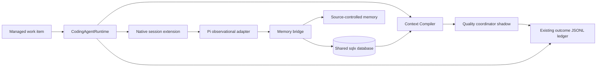

# Observational Memory, Native Sessions, and Readiness Integration Delta

**Status:** Approved integration design  
**Date:** 2026-09-01  
**Repository:** `berlinguyinca/autospec`

## Purpose

Integrate the genuinely missing requirements from four supplied AutoSpec
specifications without duplicating existing AutoSpec schedulers, executor
bridges, workflow/change graphs, resource lifecycle, Projects, benchmark,
routing, evidence, memory-file, or learning-ledger authorities.

Source references are preserved in the InferWeave integration repository:

- `berlinguyinca/autospec-inferweave/docs/specs/2026-09-01-autospec-native-agent-control-plane-design.md`
- `.../2026-09-01-autospec-next-generation-control-plane-design.md`
- `.../2026-09-01-autospec-observational-durable-memory-design.md`
- `.../2026-09-01-autospec-prompt-quality-task-readiness-design.md`

## Team personality

**Implementation team: AutoSpec core runtime and learning integration.**

- Rust runtime maintainer owns compatibility with existing core traits.
- Orchestration architect owns identity/state/authority boundaries.
- Memory/quality engineer owns typed evidence, scoring, and retrieval.
- Security engineer owns untrusted-data, secret, scope, and policy controls.
- Test/benchmark engineer owns recovery, transfer, staleness, preservation, and
  calibration proof.

### Review counter-team

**Counter-team: Duplication and autonomy-safety review.** Maintainers challenge
parallel ledgers/engines/stores; security reviewers challenge authority drift;
independent evaluators challenge uncalibrated scoring and self-review; operators
challenge degraded-mode and recovery claims.

## Existing authorities to preserve

- `docs/specs/2026-08-16-next-generation-control-plane-design.md` owns Context
  Compiler, Complexity Governor trigger, and Policy Compiler, delegating other
  workstreams to existing systems.
- `docs/specs/2026-08-16-autonomous-engineering-organization-design.md` and ADR
  AS-AEO-001 own the binding 14-role vocabulary, policy, and separation of
  duties.
- Existing `CodingAgentRuntime`/executor bridge and issues #3172/#3316/#3324
  own provider-neutral execution and isolated role sessions.
- Change Graph, resource lifecycle, automatic Projects, and managed handoff
  contracts own DAG/PR/worktree/project lifecycle.
- RealWork and multi-model designs own benchmark truth and outcome routing.
- The append-only JSONL routing/execution ledger is the single outcome ledger.
- The shared sqlx SQLite/PostgreSQL-compatible database and migrations are the
  single relational durable authority; no subsystem-specific database.
- Source-controlled `docs/memory/` remains the portable cross-tool memory floor.
- `2026-05-01-autospec-issue-quality-gate-design.md` owns issue linting; this
  delta adds semantic/readiness evidence rather than replacing lint.

## Shared contracts

Freeze additive versioned records for:

- scoped native session identity and lineage;
- canonical artifact/revision/target-role/target-model identity;
- observation candidate and promotion result;
- structured memory/evidence/revision/relation/challenge/validation;
- quality provider result/report/policy fingerprint/decision;
- context/freshness fingerprint;
- requirement-preservation result;
- execution/outcome correlation and calibration band.

Reuse existing event envelopes, 14 role IDs, managed Project work IDs,
repository/worktree/issue/PR IDs, evidence types, and ledger correlation IDs.

## Native session delta

Extend `CodingAgentRuntime`; do not introduce AHAP as a parallel runtime.

Required additions:

- multi-harness scoped native IDs;
- resume/inspect/attach and typed event-stream contracts;
- creation intent/idempotency for crash-after-create;
- heartbeat/lease/fencing and reconciliation;
- lineage to work item, stage, role, worktree, branch, PR, model/provider;
- truthful hidden-context capability reporting;
- degraded/fallback mapping without weakening tools, privacy, role, or
  separation of duties.

## Pi observational-memory bridge

- Pin and compatibility-test `pi-observational-memory` before use.
- Generate project/worktree-local configuration where supported.
- Health-check extension and expose degraded state.
- Continue foreground work safely if observer processing is unavailable.
- Ingest bounded candidates into AutoSpec-owned normalization/promotion.
- Preserve local raw ledger and avoid WAN transfer of full conversations.
- Redact credentials before storage, remote processing, or agent injection.
- Treat observations as untrusted data and candidate evidence, never policy.

Licensing and pinned-version compatibility are a blocking precondition for
enabling the adapter, not for implementing provider-neutral bridge contracts.

## Durable structured memory delta

Augment source-controlled Markdown memory with relational structured records:

- type, statement, reason, scope, authority, confidence, status;
- origin agent/role/model/provider and timestamps;
- evidence references and source commit/range;
- revisions, content hash, tags, typed relations;
- challenge, validation, supersession, staleness, archive, and audit events.

Failed approaches are first-class and include conditions, replacement,
retry-conditions, and do-not-retry evidence.

Retrieval supports deterministic structured queries without embeddings,
role/task context budgets, branch/commit compatibility, mandatory constraint
reservation, stale/conflict warnings, and on-demand evidence recall.

No database record silently replaces current source/spec/test truth. Important
memory changes are exportable back to reviewable Markdown when policy requires.

## Readiness shadow foundation

Introduce provider-neutral quality traits and a coordinator for:

- deterministic rules;
- repository/context freshness;
- dependency validity;
- optional PromptModel semantic scoring;
- hard-failure-aware aggregation;
- disabled/shadow/warn/enforce policy fingerprinting;
- persistent dimension/provider/provenance reports.

Initial dimensions follow the supplied quality spec. Final compiled prompts are
scored after target-specific compilation. Ordinary inference scoring remains an
InferWeave analytics concern; AutoSpec artifacts add readiness lifecycle.

V1 rollout is shadow only. It never blocks existing execution and never rewrites
canonical requirements.

## Controlled repair and preservation boundary

Safe restructuring and authoritative-context insertion may create a new
artifact revision. Requirement invention, architecture changes, weakened
constraints, scope changes, and acceptance-criteria invention are forbidden.

Every repair requires a preservation result. A higher quality score cannot
override preservation failure. Repair attempts are bounded at two. Enforcement
and automatic repair remain separate later issues after shadow evidence.

## Outcome and prediction boundary

Correlate quality/memory/session evidence with the existing outcome ledger and
RealWork benchmark identifiers. Do not create a second outcome or benchmark
store.

Success prediction remains advisory and unimplemented until representative
samples and calibration thresholds are approved. Future predictors must expose
first-pass/test/review/rework/human-intervention probabilities, expected time,
and expected tokens/cost with calibration evidence.

## Security and trust

- User-approved specifications and authenticated directives outrank inferred
  memory and semantic scores.
- Repository, issue, provider, prompt, output, observation, and memory content
  are untrusted data.
- Secrets are references, not persisted contents.
- Cross-repository and branch-local memories stay scope-isolated.
- Same execution/model/vendor cannot self-approve where existing SoD forbids it.
- Model/provider failure cannot silently weaken required validation.
- Score/memory/training poisoning receives adversarial fixtures.

## Error and degraded handling

- Observer unavailable: queue bounded candidates and continue safe foreground
  execution.
- Durable projection unavailable: retain bounded local candidates and report
  degraded persistence.
- Semantic provider unavailable: deterministic providers continue; required
  provider policy controls decision.
- Embeddings unavailable: structured/text retrieval remains.
- Stale/conflicting memory: mark and surface; do not fabricate consensus.
- Context stale: rebuild/recompile/re-score when safe, otherwise escalate.
- Malformed/corrupt records: quarantine with audit evidence.

## Issue decomposition

1. **Contract reconciliation** — map supplied identities/states/events onto the
   existing runtime, database, ledger, evidence, role, Project, and routing
   contracts.
2. **Native session extension** — multi-harness resume/inspect/attach/events,
   reconciliation, and lineage in `CodingAgentRuntime`.
3. **Pi observation bridge** — pinned adapter, local configuration, health,
   degraded mode, candidate ingestion, and redaction.
4. **Durable memory core** — structured shared-db records, failed approaches,
   challenge/staleness/supersession, query/tools, and role bootstrap.
5. **Readiness shadow foundation** — artifact revisions, quality provider
   traits/coordinator, deterministic validators, reports, preservation and
   freshness evidence, no enforcement.
6. **Integration and benchmark gate** — session recovery, compaction survival,
   cross-agent transfer, stale/conflict/security tests, and quality/outcome
   correlation. Prediction/enforcement remains gated.

## Testing

- Unit/property tests for schemas, authority/confidence/status, revisions,
  scope, ranking, fingerprinting, aggregation, policy, and preservation.
- Integration tests for Pi observer bridge, multi-harness native sessions,
  shared DB/ledger projection, context compilation, and final shadow report.
- Recovery tests for crashes, provider/store outage, compaction, worktree
  deletion, resume, concurrent mutation, and idempotent ingestion.
- Adversarial tests for secret leakage, prompt/repository/memory injection,
  architecture invention, requirement deletion, score manipulation, stale high
  score, cross-repo scope, and reviewer independence.
- Benchmark corpus for ready/repairable/blocked/clarification artifacts,
  failed-approach avoidance, memory retrieval, context overhead, and score/outcome
  calibration.
- Full `cargo test --workspace --no-fail-fast` and repository validation.

## Acceptance criteria

1. No parallel executor, scheduler, DAG, Project, cleanup, ledger, benchmark,
   policy, role, or database authority is introduced.
2. Native sessions survive crash/restart and retain scoped lineage across
   supported harnesses.
3. Pi observation integration is pinned, optional behind an adapter, and
   truthfully degraded when unavailable.
4. Durable memories preserve provenance/authority/confidence/status/revisions
   and survive worktree cleanup.
5. Failed approaches are retrieved before repeated attempts in benchmark cases.
6. Staleness, contradiction, challenge, validation, supersession, and secret
   redaction are enforced.
7. Memory bootstrap respects role/task context budgets and reviewer
   independence.
8. Readiness reports run in shadow mode with deterministic providers and
   optional semantic scoring.
9. Repair preservation and freshness evidence are versioned and auditable; no
   requirement invention occurs.
10. Existing workflows remain compatible when integrations are disabled or
    degraded.
11. Quality/memory/session evidence correlates with the one existing outcome
    ledger and benchmark system.
12. Full tests, security/adversarial benchmarks, docs, CLI/diagnostics, and
    independent review pass.

## Mermaid architecture

