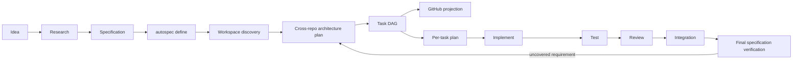

# AutoSpec Initiative, Planning & Multi-Repository Orchestration v2 — design

**Status:** Phase 1 implemented (core model, registry, scheduler, coverage, projection, CLI)
**Target:** AutoSpec
**Implementation Language:** Rust
**Spec Type:** Architecture + Execution + GitHub Integration
**Date:** 2026-09-03
**Code:** `crates/autospec-core/src/initiative/`, `crates/autospec-cli/src/commands/initiative.rs`
**Related:**
- `docs/specs/2026-08-16-change-graph-pr-orchestration-design.md` (change graph, PR stacks)
- `docs/specs/2026-08-16-multi-model-engineering-team-design.md` (role/model routing)
- `docs/specs/2026-08-16-autonomous-engineering-organization-design.md` (AS-AEO-001)

## 1. What this specification contributes

AutoSpec already normalizes a specification and runs an issue queue against one
repository. It has no first-class object for work that spans repositories,
owners, and hosts, and no artifact that separates *what must be true* from *how
we will make it true*.

This design adds that layer:

- The **Initiative** — the top-level coordination unit, which belongs to no
  repository and no organization.
- The **Definition** — `REQ-*` / `AC-*` with provenance back to the
  Specification, versioned, and changeable only through change control.
- The **Architecture Plan** — repository-aware, versioned independently of the
  Definition, and replaceable.
- The **Task DAG** — cross-repository dependencies expressed in AutoSpec task
  ids, with a scheduler that releases independent branches concurrently and
  blocks only the branch a missing permission actually affects.
- The **evidence and coverage model** — a requirement is done when an
  independent session verified it, not when an issue closed.
- The **GitHub projection** — derived from canonical state on every render, so
  losing a Project loses nothing.

## 2. Canonical lifecycle



Workspace discovery may start during `define` where it is needed to understand a
requirement. Deep implementation analysis belongs after the Definition exists.

## 3. Artifact authority

| Artifact | Owns | Mutability |
|---|---|---|
| Specification | requirements, invariants, constraints, non-goals | change control only |
| Definition | normalized `REQ-*`/`AC-*` with provenance | new version only |
| Architecture Plan | implementation strategy across repositories | replaceable, versioned |
| Task Graph | the executable DAG | replaceable, versioned |
| Task Plan | one task against its current worktree | regenerated per attempt |
| Evidence | implementation, tests, review, integration, verification | append-only |
| GitHub Project | a human-facing view | derived, never authoritative |

Evidence never outranks the requirement it is evidence for.

## 4. Module map

| Module | Responsibility |
|---|---|
| `initiative::ids` | `INIT-*`, `TASK-*`, `REQ-*`, `AC-*`, `PLAN-ARCH-*`, `DAG-*`, `ATTEMPT-*`, `EV-*`, `TASKPLAN-*-v*` |
| `initiative::repository` | `host/owner/repository` identity, per-repository capability records, workspace manifest, revision drift |
| `initiative::definition` | requirements, acceptance criteria, provenance, verifiability gaps, definition diffing |
| `initiative::plan` | versioned architecture plans, cross-repository contracts, the replan flow |
| `initiative::task` | task records, the twelve lifecycle states, transitions, leases |
| `initiative::dag` | graph validation, topological order, the scheduler, concurrency waves |
| `initiative::roles` | the eight roles, Pi session identity, separation of duties |
| `initiative::routing` | capability-based model selection, quota/capacity fallback, auditable decisions |
| `initiative::dispatch` | the Pi invocation contract, worktree scope, secret refusal |
| `initiative::traceability` | evidence, coverage states, the requirement matrix, the completion gate |
| `initiative::projection` | issue and Project projection, reconciliation policies, degraded sync |
| `initiative::store` | the artifact registry layout, immutable versions, the audit log |

## 5. Repository identity and multi-organization support

A repository is `host/owner/repository`. A bare `owner/repository` is rejected,
because accepting it would silently assume a host.

Every repository carries its own capability record — `read`, `issues`,
`branches`, `push`, `pull_requests`, `workflows`, `project_mutation`,
`administration` — its own default branch, its own build systems, and its own
credential *reference*. Nothing is assumed to be shared across repositories.

Credential references are checked against known secret shapes
(`ghp_`, `github_pat_`, `-----BEGIN`, …) and refused, so a durable artifact
cannot carry live credential material into a prompt or an issue body.

A read-only repository participates as a context and dependency source. It is
never a blocker for work that does not target it.

## 6. Scheduling

The scheduler walks the graph in topological order and, for each releasable
task, reports the first reason it cannot run:

| Reason | Meaning |
|---|---|
| `dependency_unverified` | a direct dependency has not been independently verified |
| `ancestor_blocked` | something upstream is blocked, so this branch cannot advance |
| `missing_capability` | the task's repository does not grant what the task needs |
| `exclusivity_held` | another live task holds the task's exclusivity key |

Only `VERIFIED` satisfies a dependent. `AWAITING_REVIEW` does not: a dependent
task that starts on unreviewed work inherits the risk that the review rejects it.

A permission failure therefore blocks the failing task and its descendants and
nothing else, which is what lets an Initiative keep making progress in one
organization while another organization's access is still being granted.

## 7. Separation of duties

Session identity is `aspec-<INIT-NNNN>-<TASK-NNNN>-<role>-a<attempt>`. Because
the name is derived from the role and attempt, distinct roles get distinct
sessions by construction. A dispatch that deliberately reuses another session
records that, and the policy decides:

| Rule | Enforcement |
|---|---|
| verification in a session that implemented | blocking |
| review or UX review in a session that implemented | blocking |
| planning in a session that implemented | advisory (blocking under `SeparationPolicy::strict`) |
| testing in a session that implemented | advisory (blocking under `SeparationPolicy::strict`) |

Model fallback narrows the eligible model set and never touches these rules: a
fallback reviewer running the same model as the implementer still runs in its
own session.

The coverage engine enforces the same rule a second time on the evidence side.
Review or verification evidence produced by a session that also produced
implementation evidence for that task is discarded, listed in
`rejected_evidence`, and does not close the completion gate.

## 8. Model routing

Roles declare capabilities, not providers: a minimum model class, vision, tool
support, a context floor, local-only eligibility, a privacy ceiling, and an
optional cost ceiling in integer millicents per 1000 tokens. The router walks
the catalog in preference order, records why each candidate was rejected —
`below_minimum_class`, `no_vision`, `context_too_small`, `not_local`,
`privacy_too_open`, `too_expensive`, `quota_exhausted`, `no_capacity`,
`quota_unknown` — and returns the first survivor with its fallback depth.

A role may forbid fallback (`fallback_allowed: false`); the router then fails
loudly rather than quietly downgrading.

Costs are integers. No money value in this subsystem is a float.

## 9. Replanning

Replanning is normal. Changing a requirement during a replan is not.

`initiative::plan::replan` refuses when:

- the Definition moved (`RequirementsChanged`, with the added/removed/modified
  requirement ids, and a pointer at change control),
- the new plan is not a later version (`NonMonotonicVersion`),
- the plan being replaced was already superseded (`AlreadySuperseded`).

On success it records the reason, the version pair, changed assumptions,
superseded tasks, preserved tasks (everything already `VERIFIED`), and the
impacted region — the superseded tasks plus their descendants, not the whole
graph.

## 10. Artifact registry

```text
.autospec/initiatives/INIT-2026-0042/
  initiative.json
  spec/spec.md
  definition/definition-v1.json
  workspace/repositories.json
  workspace/permissions.json
  plans/architecture-plan-v1.json
  plans/architecture-plan-v2.json
  graph/task-graph-v3.json
  tasks/TASK-0017/task-plan-v1.json
  tasks/TASK-0017/implementation-result-a3.json
  tasks/TASK-0017/test-report.md
  tasks/TASK-0017/review.md
  integration/integration-report.md
  verification/evidence.json
  verification/waivers.json
  verification/requirements-matrix.json
  verification/final-report.md
  projections/github.json
  audit/events.jsonl
```

Versioned artifacts and per-attempt implementation results are immutable: the
store refuses to rewrite one that already exists, so a superseded plan or graph
stays queryable after the Initiative moves on. Derived artifacts — the rendered
projection, the coverage matrix — are rewritten freely, because they can always
be rebuilt from canonical state.

The layout follows §18 of the source specification, with one deliberate
deviation: canonical machine state is stored as JSON rather than YAML. The
shapes are identical, but JSON round-trips through the Rust model without a
lossy hand-written mapping, and the registry is machine state rather than a file
humans hand-edit.

## 11. GitHub projection

Each task projects to an issue in *its own* repository, carrying the Initiative
id, task id, requirement ids, plan version, dependencies, and cross-repository
dependencies in its metadata. A repository that does not grant `issues` is
reported as unprojectable rather than silently skipped.

Project rows are emitted only for repositories that grant `project_mutation`, so
an Initiative that spans two organizations projects issues into both and rows
into whichever one permits it.

Manual GitHub edits are reconciled under one of four policies — `import`,
`reject`, `approval_required`, `drift` — and only `import` reports
`canonical_mutated: true`. An issue with no canonical task is rejected under
every policy.

A synchronization failure calls `degrade(reason)`. The projection records that
GitHub is stale; canonical state is untouched.

## 12. Coverage and the completion gate

Coverage states are `defined`, `planned`, `in_progress`, `implemented`,
`tested`, `reviewed`, `verified`, `failed`, `blocked`, `waived`. Progress is
reported per state, never as a single "issues closed" number.

The Initiative can complete only when every actionable requirement is `verified`
or carries an approved `Waiver` (requirement, reason, approver, approval time).
`autospec initiative verify` exits non-zero otherwise, and names the
requirements that are missing.

## 13. CLI surface

```text
autospec initiative init      --id INIT-2026-0042 --slug <slug> [--spec <path>]
autospec initiative validate  --id INIT-2026-0042 [--json]
autospec initiative ready     --id INIT-2026-0042 [--json] [--now <unix>]
autospec initiative coverage  --id INIT-2026-0042 [--json]
autospec initiative verify    --id INIT-2026-0042 [--json]
autospec initiative project   --id INIT-2026-0042 [--json]
autospec initiative status    --id INIT-2026-0042 [--json]
```

`validate` and `verify` exit `1` when the Initiative is not executable or not
complete, so both are usable as gates.

## 14. Acceptance criteria coverage

| # | Criterion | Where it is enforced |
|---|---|---|
| 1 | Specification normalized before planning | `definition::Definition::validate`, `gaps`; `plan::ArchitecturePlan::validate` rejects a stale definition version |
| 2 | A separate architecture session produces the plan | `roles::SeparationPolicy`, `dispatch::PiInvocation` |
| 3 | Plans versioned independently of the Definition | `plan::ArchitecturePlan::version` vs `definition_version` |
| 4 | An Initiative spans ≥3 repositories | `repository::Workspace`; CLI fixture spans three |
| 5 | A fixture spans ≥2 owners | `Workspace::is_multi_organization`; CLI fixture spans `InferWeave` and `OtherOrg` |
| 6 | Cross-repository dependencies use AutoSpec task ids | `dag::TaskGraph::cross_repository_edges`; `TaskId` rejects issue numbers |
| 7 | Independent tasks execute concurrently in isolated worktrees | `dag::TaskGraph::schedule`, `concurrency_waves`, `dispatch::WorktreeScope` |
| 8 | Each implementation task gets a fresh task-local plan | `ids::TaskPlanId`, `dispatch::PiInvocation::with_task_plan` |
| 9 | Planner/implementer/reviewer separation enforced | `roles::SeparationPolicy`, `traceability::CoverageMatrix::build` |
| 10 | Model selection and fallback are role-aware and auditable | `routing::ModelCatalog::select`, `RoutingDecision::considered` |
| 11 | Issues created in their owning repositories | `projection::GithubProjection::build` |
| 12 | A Project shows the cross-repository Initiative | `projection::ProjectItem`, gated on `project_mutation` |
| 13 | GitHub sync is non-authoritative and recoverable | `GithubProjection::build` is pure; `degrade`; rebuild test |
| 14 | REQ traces through implementation/test/review/verification | `traceability::CoverageMatrix::trace` |
| 15 | A changed repository assumption triggers replanning without changing the requirement | `repository::Workspace::drifted_since`, `plan::replan` |
| 16 | Missing permissions block only affected branches | `dag::BlockReason::MissingCapability`, `Schedule::permission_blocked` |
| 17 | Cross-repository integration gates completion | `task::TaskKind::Integration`, `dag::integration_tasks` |
| 18 | Completion impossible while an unwaived requirement is unverified | `traceability::CompletionGate`, `autospec initiative verify` |

## 15. What is deliberately not built here

This design implements the orchestration model, the registry, and the gates.
It does not implement:

- **Specification normalization itself.** Turning prose into `REQ-*`/`AC-*` is
  language work and stays with the `autospec-define` skill. What lives here is
  the shape that skill must emit and the checks it must survive: unique ids,
  provenance, non-goals that carry no acceptance criteria, and the verifiability
  gap report that holds the Initiative at `defined` until every actionable
  requirement has a criterion a verifier can check.
- **Live Pi process invocation.** `dispatch::PiInvocation` is the contract the
  launcher renders; spawning the session stays in the skill and script layer.
- **Live GitHub mutation.** The projection is rendered and stored; the writer
  belongs with the existing GitHub tooling, and reconciliation policies are
  already modelled here for it to consume.
- **Workspace discovery I/O.** `Workspace` is the manifest the discovery step
  produces; cloning and probing repositories is executor work.
- **The dashboard.** `InitiativeStatus` is the serializable snapshot a dashboard
  renders.

Each of those consumes this model rather than duplicating it.

## 16. Validation

- `cargo test --workspace --no-fail-fast` — 113 unit tests in
  `crates/autospec-core/src/initiative/`, 16 end-to-end tests in
  `crates/autospec-cli/tests/initiative_commands.rs`.
- `scripts/autospec-initiative-contract.sh` — checks that the module surface,
  the CLI subcommands, the schema, and this design document stay in step. It
  exits non-zero on drift and is ready to run as a CI gate; adding the step to
  `.github/workflows/rust.yml` needs a token with `workflow` scope, so it is
  currently run on demand:

  ```yaml
  - name: Initiative contract
    run: bash scripts/autospec-initiative-contract.sh
  ```
