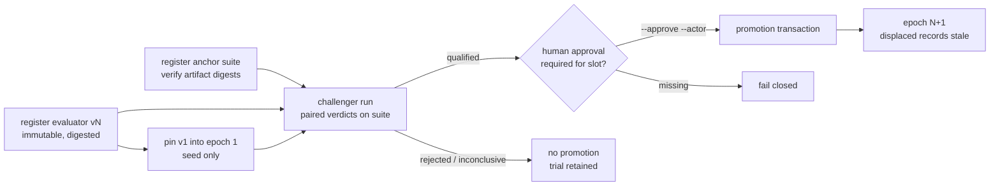
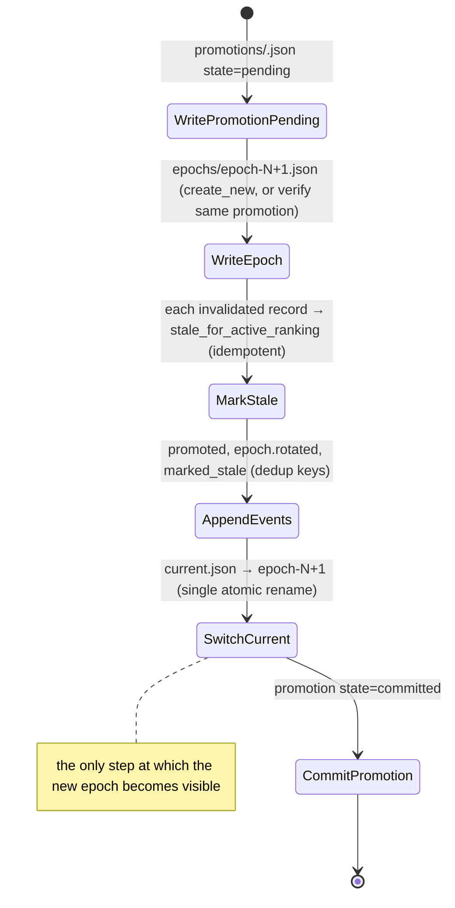

# Evaluator Co-Evolution: Versioned Evaluators, Frozen Epochs, and Controlled Promotion

**Status:** Implementation-ready — slice 1 decomposable now; slices 2–5 gated (see "Follow-up slices")
**Date:** 2026-09-05
**Repository:** `berlinguyinca/autospec`
**Implementation language:** Rust (`crates/autospec-core`, `crates/autospec-cli`), no new dependencies
**Source proposal:** `docs/superpowers/specs/2026-09-05-agentic-evolution-evaluator-coevolution-handoff.md` (Codex handoff, verbatim)
**Reconciliation:** `docs/decisions/0002-evaluator-coevolution-integration-strategy.md`
**Task-level plan:** `docs/superpowers/plans/2026-09-05-evaluator-coevolution-slice-1.md`
**Attaches to:** tracker #3381 (review diversity — a reviewer that does not share the implementer's priors)
**Related:**
- `docs/specs/2026-08-16-autonomous-engineering-organization-design.md` §23.3, §24, §25 (benchmark integrity, qualification, requalification)
- `docs/specs/2026-08-16-repository-derived-real-work-benchmark-design.md` §42, §63 (review benchmarks, validity)
- `docs/specs/2026-08-16-multi-model-engineering-team-design.md` §4 (reviewer independence)
- `docs/specs/2026-07-07-autonomy-guardrails-foundation-design.md` (`diff-guard`, the protected kernel)
- `docs/decisions/0001-as-aeo-001-phase-0-integration-strategy.md` D2, D3, D6, D10

## Purpose

AutoSpec's learned reviewers (LLM judges for architecture, maintainability, test quality, documentation, and the other quality dimensions) are today unversioned prompts. As implementers improve, a fixed judge becomes the weakest link: patches can satisfy its habits while still adding needless abstraction, brittle tests, or drift. This spec gives AutoSpec a controlled way to improve those judges without letting the system redefine success:

1. every learned evaluator is an **immutable, content-digested version**;
2. active versions are pinned per slot into an **epoch**, and never edited in place;
3. a **challenger** replaces an incumbent only after beating it on a **labeled anchor suite** whose protected-holdout labels no mutation process can read, using a conservative statistic that is implemented and tested, not asserted;
4. replacement is an **atomic, crash-recoverable transaction** that marks displaced judgments stale for active ranking while keeping every historical record inspectable.

The papers behind the design are *The Red Queen Gödel Machine* (arXiv:2606.26294 — epochs, ε-best-belief replacement, selective erasure) and *AVO* (arXiv:2603.24517 — agentic variation, deferred to slice 3). Only three of the handoff's eight subsystems have no existing owner in AutoSpec: the protected holdout, the challenger-versus-incumbent statistic, and per-slot epochs with atomic promotion. This spec builds those three and wires them to what exists. Nothing else is restated.

## Team personality

**Implementation team: Security-sensitive** (confidence: high — the feature's entire value is resisting reward hacking, anchor poisoning, self-approval, and silent partial state; the handoff's §5 "system laws" and §21 threat model are security invariants, and `docs/memory/feedback_self_consistent_test_fixtures_mask_bugs.md` shows the repo has been bitten by evaluators validated against their own output).

- **Security advisor** owns the threat model (§ Security and trust): holdout redaction, artifact digests, fail-closed promotion, no self-approval.
- **Architect** owns module boundaries: `crates/autospec-core/src/evaluation/` consumes ADR 0001 decisions and never creates a second ledger, router, or benchmark.
- **Backend (Rust) developer** owns the domain types, the integer-only statistic, and the file store.
- **Platform engineer** owns crash-safe I/O, the hash-chained journal, and recovery on open.
- **Test engineer** owns the crash matrix, the reference-value fixtures, and the end-to-end CLI demo.

Team emphasis carried into child issues: every protected state transition has a test that injects a failure after it; every statistic is checked against independently computed values; every "cannot happen" is an `EvaluationErrorKind` with a test.

### Review counter-team

**Counter-team: Product, maintainer, and test review** (a different lens from the implementers, per the Phase 2 derivation rule for security-sensitive teams).

- **Product/operator reviewer** challenges whether an operator can actually explain, from CLI output alone, why an evaluator is current, what replaced it, and which judgments went stale.
- **Maintainer reviewer** challenges duplication: does any new file re-implement `atomic_write`, digests, immutability, or ledger patterns that already exist, and does every file stay under the 600-line ratchet?
- **Test reviewer** challenges self-consistent fixtures: are reference values derived independently of the code under test, and does the crash matrix cover every persistence step, not a sample?

Review stays inside issue scope: the counter-team applies these lenses to the files in the issue's `## Files touched`, not to the whole module.

## Existing authorities to preserve

| Concern | Authority | What this spec does |
|---|---|---|
| System of record | ADR 0001 D3: the append-only JSONL ledger; any database is a projection | Evaluation state is repo-local JSON files plus a hash-chained `events.jsonl`; `autospec-db` views are a later, optional projection |
| Persistence layer | ADR 0001 D5/D10: sqlx + global database accepted but **not yet in any `Cargo.toml`** | No database dependency; when #3188 lands, projections are additive |
| Benchmarks | ADR 0001 D6: RealWork spec owns `autospec bench` | Anchor suites are *evaluator* ground truth (labeled patches), not task benchmarks; RealWork §42 review benchmarks are a future anchor source |
| Hard gates outrank soft scores | AS-AEO-001 §7.5, §37, §41, §46; constitution doctrine 19 | Consumed as-is: learned verdicts never waive deterministic failures; this spec adds no composite scalar |
| Reviewer independence | multi-model §4.1–§4.6; `autonomous/review_policy.rs`; `executor_bridge/review_provider.rs` (`providers_are_diverse`, unknown ⇒ not diverse); issue #3531 attestation | `RuntimeProvenance` on every evaluation record mirrors #3531's fields; unknown provider ⇒ `Independence::None` |
| Protected kernel | `diff-guard`, `blast-radius`, `separation-of-powers` in `scripts/autonomous-guardrails.sh` | Promotion policy, anchor labels, and the transition algorithm are never mutable by any agent lane; slice 3's variation loop must declare its mutable surface as an explicit lane |
| Idle/stagnation | `2026-07-06-autospec-autonomous-platform-design.md` §F1; `docs/memory/feedback_capabilities_are_conductor_tiers_not_new_conductors.md` | No supervisor in this spec; slice 3 adds a quality-plateau signal as a conductor tier with no separate budget |
| Events | `emit-event.sh` → `autospec.events.v1` (additive-only, `event_uuid` idempotency) | Journal kinds below are additive kinds for that envelope; forwarding is slice 4 |
| Model routing digest | `aar::profile::ModelProfileRegistry::new(version, …)` (Rust) vs `~/.autospec/model-profiles.yml` (shell), unwired | Evaluator definitions carry a caller-supplied `routing_policy_digest`; slice 2 derives it from the Rust registry version |

## Architecture

### Placement

One cohesive module, `crates/autospec-core/src/evaluation/`, with a repo-local store at `.autospec/evaluation/`, exposed by two hand-rolled CLI groups `autospec evaluator` and `autospec anchor` registered in `crates/autospec-cli/src/commands/mod.rs` exactly like `explore`. No new crate (the core/CLI direction gate and the pinned-dependency policy stay untouched). Every new `.rs` file stays under 600 lines (file-size ratchet). No `f64` anywhere (the `financial_no_f64` architecture gate scans `crates/**/*.rs` and must not grow past its current 81 occurrences).

```text
crates/autospec-core/src/evaluation/
  mod.rs error.rs ids.rs digest.rs statistics.rs evaluator.rs anchor.rs policy.rs
  qualification.rs epoch.rs record.rs promotion.rs
  store/{mod.rs, layout.rs, io.rs, journal.rs, transition.rs}
crates/autospec-cli/src/commands/{evaluator.rs, evaluator/*.rs, anchor.rs}
```

Patterns reused, not re-invented: `InitiativeStore::is_immutable()` + `definition-v{n}.json` naming for versioned artifacts; `managed_project.rs` `atomic_write` / `append_synced_line(fail_after)` / `extend_journal_digest` for crash-safe writes and the hash chain; `review_evidence.rs` two-tier NUL-separated digests; `runtime_env/compose_normalize/transaction.rs` `Faults` for fault injection; `rag/score.rs` integer scoring in place of floats.

### Store layout

```text
.autospec/evaluation/
  policy.json                       PromotionPolicy; write-once (re-init fails)
  evaluators/<slot>/v<N>.json       EvaluatorDefinition; immutable
  anchors/<suite-id>/v<N>.json      AnchorSuite; immutable; artifact_ref paths are repo-relative, no `..`
  epochs/epoch-<NNNNNN>.json        EvaluatorEpoch; immutable
  current.json                      { "schema": 1, "epoch_id": "epoch-000001" } — the single atomic pointer
  trials/<trial-id>.json            ChallengerTrial; immutable
  promotions/<promotion-id>.json    PromotionEvent; state pending → committed (atomic rewrite)
  records/<evaluation-id>.json      EvaluationRecord; judgment fields immutable, ranking status appended
  events.jsonl                      hash-chained, idempotency keys
  events.checkpoint.json            { "schema": 1, "high_watermark": N, "digest": "<64 hex>" }
```

Writes are tmp + `sync_all` + `rename` + parent-directory `sync_all`. Immutable documents are opened with `create_new`; a second write is `EvaluationErrorKind::Immutable` naming the path. Timestamps are `u64` unix seconds supplied by the caller; core never reads a clock.

### Lifecycle



### Protected kernel (not evolvable, not agent-writable)

The promotion policy, the qualification rules, the transition algorithm, anchor labels and artifact digests, the holdout access rule, the journal integrity rule, and the CLI's approval requirement. A change to any of these is an ordinary spec/PR with human review.

## Interfaces

All subcommands accept `--root <path>` (default `.`) and `--json`. Diagnostics exit 2 via `CommandFailure::diagnostic`; `EvaluationError` renders as `<kind>: <message>` where kind is one of `invariant`, `immutable`, `integrity`, `io`, `parse`, `fail-closed`, `access-denied`.

```text
autospec evaluator init [--policy <file.json>]         write policy.json (default when omitted), epoch-000000, current.json
autospec evaluator register --file <definition.json>   validate, write evaluators/<slot>/v<N>.json, print definition digest
autospec evaluator list                                slot@version kind digest[..16] created_at, one per line
autospec evaluator show <slot@version>                 pretty JSON plus digest
autospec evaluator pin <slot@version> --actor <name>   seed an empty slot; creates the next epoch
autospec evaluator epoch current                       epoch id, started_at, policy digest, one line per slot
autospec evaluator epoch history                       every epoch oldest-first with its promotion id
autospec evaluator challenger run --incumbent <slot@v> --challenger <slot@v> --suite <suite-id@v>
        --incumbent-verdicts <file.json> --challenger-verdicts <file.json>
                                                       pair, qualify, write trials/<id>.json, print report and trial id
autospec evaluator challenger inspect <trial-id>       pretty JSON of the trial
autospec evaluator promote <trial-id> [--approve --actor <name>]
                                                       Approval::Human with --approve --actor, else Approval::Policy
autospec evaluator record add --file <record.json>     write-once evaluation record
autospec evaluator record list [--active | --stale]    id evaluator epoch outcome status, one per line
autospec anchor register --file <suite.json>           validate + verify artifacts + write-once + journal
autospec anchor list                                   id@version slot cases digest[..16]
autospec anchor show <suite-id@version> [--role operator|qualification|mutation]   default mutation (redacted)
autospec anchor verify <suite-id@version>              recompute digests; exit 2 naming mismatched cases
```

`challenger run` prints, in this order: `trial: ct-<16 hex>`, one `incumbent:` and one `challenger:` line with `successes= failures= best_belief=`, `margin_ppm: <n>  challenger_only_correct=<b> incumbent_only_correct=<c>`, one `subset <name>:` line per required subset, then `verdict: qualified | rejected (<reasons>) | inconclusive (<reasons>)`.

## Data model

Ids: `EvaluatorSlot` ∈ {`spec_compliance`, `architecture`, `maintainability`, `complexity_design`, `test_quality`, `security_reasoning`, `documentation`, `ui_ux`, `operability`}; `EvaluatorVersionRef` serialized `"<slot>@<n>"` (n ≥ 1); `EpochId` serialized `"epoch-NNNNNN"`; string ids `AnchorSuiteId`, `AnchorCaseId`, `ChallengerTrialId` (`ct-<16 hex>`), `PromotionId` (`promo-<16 hex>`), `EvaluationId`, all matching `[a-z0-9][a-z0-9._-]{0,63}` with no `..`. `Digest` is 64 lowercase hex, SHA-256 over NUL-separated parts. `Ppm(u32)` is parts per million.

```rust
struct EvaluatorDefinition { schema: u64, slot, version: u32, kind: Learned|Deterministic, rubric_ref: String,
    prompt_digest: Option<Digest>, skill_pack_digest: Option<Digest>, knowledge_base_digest: Option<Digest>,
    runtime_settings_digest: Option<Digest>, routing_policy_digest: Digest, tool_policy_digest: Digest,
    model_family: Option<String>, created_at: u64, parent_version: Option<u32>, provenance: Provenance }
// definition_digest() covers every behaviour-affecting field; never created_at or provenance.
// validate(): schema == 1, version >= 1, learned ⇒ prompt_digest present, parent_version < version.

struct AnchorCase { case_id, artifact_ref: String, expected_label: Option<Accept|Reject>, severity: Low|Medium|High|Critical,
    tags: BTreeSet<String>, visibility: Development|PublicRegression|ProtectedHoldout|Quarantine,
    source: String, adjudication: Option<String>, content_digest: Digest }
struct ProtectedSubset { name, tag, max_false_accept: Option<Ppm>, max_false_reject: Option<Ppm>, regression_tolerance_cases: u32 }
struct AnchorSuite { schema, suite_id, version: u32, slot, cases: Vec<AnchorCase>, minimum_case_count: usize,
    required_subsets: Vec<ProtectedSubset>, provenance }
// view(AccessRole::Mutation) strips expected_label from ProtectedHoldout cases and drops Quarantine cases;
// labeled_cases() is AccessDenied on a redacted view; verify_artifacts(root) recomputes every content_digest.

struct PromotionPolicy { schema, epsilon: Ppm, minimum_margin: Ppm, minimum_cases: usize, require_human_approval_slots: BTreeSet<EvaluatorSlot> }
// Default: epsilon 50_000, minimum_margin 10_000, minimum_cases 40, slots {architecture, security_reasoning}. policy_digest() over all fields.

struct EvaluatorEpoch { schema, epoch_id, slot_versions: BTreeMap<EvaluatorSlot, u32>, started_at, predecessor: Option<EpochId>,
    promotion: Option<PromotionId>, policy_digest: Digest, anchor_suite_digests: BTreeMap<AnchorSuiteId, Digest> }
// successor(slot, version, …) requires version > existing; a BTreeMap guarantees one version per slot.

enum Verdict { Accept, Reject, Unavailable }
struct PairedCaseResult { case_id, expected, severity, tags, incumbent: Verdict, challenger: Verdict }
struct QualificationReport { cases, incumbent: EvaluatorTally, challenger: EvaluatorTally, challenger_only_correct: u32,
    incumbent_only_correct: u32, margin_ppm: i64, subsets: Vec<SubsetOutcome>, regressions: Vec<Regression>,
    verdict: Qualified | Rejected{reasons} | Inconclusive{reasons} }
struct ChallengerTrial { schema, trial_id, slot, incumbent: EvaluatorVersionRef, challenger: EvaluatorVersionRef, suite_id, suite_version,
    suite_digest, policy_digest, report, results: Vec<PairedCaseResult>, created_at }
trait VerdictSource { fn verdicts(&self, evaluator: EvaluatorVersionRef, suite: &AnchorSuite) -> Result<BTreeMap<AnchorCaseId, Verdict>> }
struct RecordedVerdicts { schema, evaluator, suite_id, suite_version, verdicts, runtime: RuntimeProvenance }   // the only slice-1 VerdictSource

struct RuntimeProvenance { model_id, provider_family, execution_identity: String, independence: High|Reduced|None }
enum ActiveRankingStatus { Active, StaleForActiveRanking { superseded_by, epoch }, Replayed { replay_of }, HistoricalOnly }
struct EvaluationRecord { schema, evaluation_id, subject: String, epoch_id, evaluator: EvaluatorVersionRef, outcome: Verdict, score: Option<Ppm>,
    evidence_refs: Vec<String>, runtime: RuntimeProvenance, created_at, active_ranking_status, ranking_history: Vec<RankingTransition> }
// depends_on(slot, version): Active and exact version match. mark_stale(...) is idempotent and appends to ranking_history.

struct PromotionEvent { schema, promotion_id, state: Pending|Committed, slot, from: Option<u32>, to: u32, challenger_trial: Option<ChallengerTrialId>,
    prior_epoch, new_epoch, invalidated_evaluations: Vec<EvaluationId>, approval: { kind: Policy|Human, actor, at }, created_at, committed_at: Option<u64> }
struct JournalEvent { schema, sequence: u64, at, kind: String, key: String, fields: BTreeMap<String, String> }
```

Journal kinds: `evaluator.version.created`, `anchor.suite.verified`, `evaluator.challenger.completed`, `evaluation.completed`, `evaluator.promoted`, `evaluator.epoch.rotated`, `evaluation.marked_stale`. Every event carries `repo` plus the applicable `slot`, `evaluator`, `epoch`, `trial`, `promotion`, `evaluation`, `suite`, `digest` fields. Chain digest: start `sha256("autospec-evaluation-journal-v1")`, `extend(prior, line) = sha256(prior ‖ 0x00 ‖ line)`; `events.checkpoint.json` holds the high watermark and digest; a mismatch on open is `Integrity` and blocks promotion.

## Promotion semantics

### Statistic

`BB_ε(S, F)` is the ε-quantile of `Beta(1+S, 1+F)` (RQGM §3.1). For integer parameters this is a binomial upper tail: `I_x(a, b) = P[Bin(a+b−1, x) ≥ a]`, so `BB_ε` is the smallest `x` in parts per million with `P[Bin(S+F+1, x) ≥ S+1] ≥ ε`. It is computed in `u128` fixed point (weights relative to the binomial mode at scale 2⁴⁰, probabilities at scale 2⁶⁴, bisection over ppm, `S+F+1 ≤ 65 536`) and is bit-identical on every CI platform. Reference values for 17 `(S, F)` pairs at ε ∈ {0.05, 0.10} were computed by two independent methods (log-space binomial tail; Simpson integration of the Beta density) and agree with the fixed-point implementation within 1 ppm; tests assert ±2 ppm.

### Qualification rules (evaluated in this order; `qualify()` is pure)

1. fewer than `minimum_cases` paired cases → `Inconclusive[insufficient_cases]`
2. any `Unavailable` verdict on either side → `Inconclusive[incomplete_verdicts]` (handoff §22; orchestrator issue #39's no-output runs land here)
3. tallies: success = verdict matches label; `best_belief = BB_ε(S, F)`
4. for each required subset (cases carrying its tag): `ceiling_breached` if the challenger's false-accept or false-reject rate exceeds the ceiling; `regressed` if `challenger_errors > incumbent_errors + regression_tolerance_cases`; any → `Rejected`
5. `margin = BB_ch − BB_inc`; `< 0` → `Rejected[lower_best_belief]`; `< minimum_margin` (ties included; RQGM: ties favour the incumbent) → `Inconclusive[margin_below_minimum]`
6. `challenger_only_correct ≤ incumbent_only_correct` → `Inconclusive[paired_advantage_absent]` (uses the pair structure)
7. otherwise `Qualified`

### Promotion planning (fail closed)

`plan_promotion` returns `FailClosed` when: verdict ≠ `Qualified`; `trial.incumbent.version ≠ current epoch's version for the slot`; `trial.policy_digest ≠ policy.policy_digest()`; challenger version ≤ incumbent; the challenger definition is not registered; slot ∈ `require_human_approval_slots` and the approval is not `Human`. `plan_pin` seeds only an empty slot (`from: None`, no trial). `invalidated_evaluations` is computed at planning time as every `Active` record whose evaluator is exactly the displaced `slot@version`, so recovery marks exactly those.

### Transition transaction



Every step is idempotent. `EvaluationStore::open` scans `promotions/*.json` and re-runs the transaction for every `pending` record before returning, so a crash after any step converges to exactly one active epoch, one committed promotion, and each event exactly once. A `Faults { fail_after: Option<TransitionStep> }` hook, reachable only through a `#[doc(hidden)]` method, lets tests inject the failure after each step.

## Security and trust

| Threat (handoff §21) | Control in this spec |
|---|---|
| Reward hacking: a challenger tuned to the visible cases | Protected-holdout labels redacted for `AccessRole::Mutation`; `labeled_cases()` refuses a redacted view; suite `content_digest` and `suite_digest` pinned in the trial and epoch |
| Anchor poisoning | `anchor register` and `anchor verify` recompute every artifact digest; mismatches name the case and fail; suites are write-once versions |
| Self-approval / same-model bias | `RuntimeProvenance` on every record with `independence`; unknown provider family is `None`; protected slots require `--approve --actor` |
| Partial state / torn writes | tmp+fsync+rename; `create_new` immutability; hash-chained journal with checkpoint; recovery on open; crash matrix over all six steps |
| Statistic gaming | one fixed rule order; margin on a lower bound; per-subset ceilings; incomplete or too-small comparisons never promote; ties never promote |
| Prompt injection into judges | out of scope for slice 1 (no live judge); recorded verdicts are data; slice 2 inherits `review_provider.rs` policies |

Secrets never enter this store: definitions carry digests of prompts and routing policies, not their contents.

## Error handling

| Condition | Result |
|---|---|
| second write to an evaluator/suite/epoch/trial/record | `immutable:` naming the path; exit 2 |
| journal digest ≠ checkpoint | `integrity:`; `open` fails; nothing promotes |
| artifact digest mismatch | `integrity:` listing case ids |
| redacted suite used for pairing | `access-denied:` |
| promotion without qualification, with stale incumbent, policy drift, unknown challenger, or missing human approval | `fail-closed:` with the specific reason; nothing persisted before planning succeeds |
| crash mid-transaction | next `open` completes the transaction; second recovery is a no-op |
| future `schema` value | `invariant:` reject (readers reject unsupported major versions) |

No code path infers success from missing evidence: absent verdicts are `Unavailable`, and `Unavailable` blocks promotion.

## Testing

Rust only; no new `.bats` suites (the registration baseline would fail them). `cargo test --workspace --no-fail-fast`.

- **Unit (inline):** id/digest round trips; definition digest ignores timestamp and provenance but not prompt; anchor validation (duplicates, missing labels, unknown subset tags, absolute or `..` paths); redacted views; policy bounds; epoch successor monotonicity; `mark_stale` idempotency; `plan_promotion` fail-closed cases; journal dedup, tamper detection, torn-append rollback.
- **Integration (`crates/autospec-core/tests/`):** `evaluation_statistics.rs` (17 reference pairs ±2 ppm, monotone in S, below the posterior mean, input bounds); `evaluation_registry.rs` (init-once, immutability naming the file, artifact verification, write-once records); `evaluation_qualification.rs` on a 40-case fixture suite (`qualified` for v1→v2 with margin 169 001 ppm and paired counts 6/0; `rejected` for a challenger that accepts two `critical-security` cases; `inconclusive` for an equal-accuracy challenger and for an incomplete verdict file; `insufficient_cases` at 10); `evaluation_transition.rs` (full promotion; policy-approval refusal; **crash matrix**: inject after each of the six steps, reopen, assert one active epoch, one committed promotion, three non-dependent records, events exactly once, second recovery no-op; pin seeds only empty slots).
- **CLI (`crates/autospec-cli/tests/evaluator_commands.rs`):** the handoff §32 Step F demo end to end (register v1/v2, register suite, pin v1, add records, challenger run, promote refused without approval, promote with approval → epoch-000002, stale list shows exactly the displaced records, history shows all epochs); regressing and tied challengers never promote; `anchor show` defaults to the redacted view (30 of 40 labels visible) and `anchor verify` names a tampered case.
- **Fixtures** live under `crates/autospec-core/tests/fixtures/evaluation/` (suite v1 with 40 synthetic patches, five recorded-verdict files, definitions, records). Reference statistics are pinned from the independent computation, never from the implementation.
- **Gates:** `bash scripts/architecture-fitness.sh run --registry .autospec/architecture-fitness.yml` reports `forbidden_f64_occurrences` unchanged; every new `.rs` file ≤ 600 lines; `cargo clippy --workspace --all-targets`; `autospec validate --fast`.

Mermaid: the two diagrams above cover lifecycle and transaction; no further diagrams apply.

## Issue decomposition (guidance for Phase 3)

One child per plan task, in dependency order; each ≤ 3 logical units, ≤ 400 words, `lang:rust`.

1. ids + digest + error + module skeleton (`evaluation/{mod,error,ids,digest}.rs`, `lib.rs`)
2. integer best-belief statistic + reference test
3. evaluator definitions
4. anchor suites with redacted views and artifact verification
5. promotion policy
6. paired qualification, `VerdictSource`, `RecordedVerdicts`, fixture suite and verdict files
7. epochs, evaluation records, promotion planning
8. store layout + crash-safe I/O
9. immutable registry (`store/mod.rs`) + registry test
10. hash-chained journal
11. transition transaction + crash matrix
12. CLI `autospec evaluator` (+ end-to-end test)
13. CLI `autospec anchor`
14. docs (`cli-reference`, `CONFIG_REFERENCE`, `architecture`) + gate run

Companion-repo work (constitution clauses 0.7.0; baselines rules registry and fixture pack) is filed manually in those repositories after this spec merges; `/autospec-define` cannot file cross-repo issues.

## Acceptance criteria

- [ ] `autospec evaluator register` refuses to overwrite an existing `evaluators/<slot>/v<N>.json` (exit 2, message contains `immutable` and the path).
- [ ] `autospec evaluator epoch current` prints one `slot@version` per pinned slot and the epoch's policy digest.
- [ ] On the fixture suite, `challenger run` prints `verdict: qualified` for v1→v2, `verdict: rejected` for the critical-subset regressor, `verdict: inconclusive` for the equal-accuracy challenger and for the incomplete verdict file.
- [ ] `challenger run` reports `best_belief=621494` for 30/10 and `best_belief=790495` for 36/4 at ε = 0.05.
- [ ] `autospec evaluator promote <qualified-trial>` for slot `architecture` exits 2 with `fail-closed` and `human approval` absent `--approve --actor`.
- [ ] With `--approve --actor`, promotion creates `epoch-000002`, `record list --stale` lists exactly the records judged by `architecture@1`, and their `outcome` is unchanged.
- [ ] The crash-matrix test passes for all six `TransitionStep` values: one active epoch, one committed promotion, events exactly once, second recovery a no-op.
- [ ] `autospec anchor show <suite>` without `--role` prints no `expected_label` string for `protected_holdout` cases and omits `quarantine` cases.
- [ ] `autospec anchor verify <suite>` exits 2 and names the case after a fixture file is altered.
- [ ] `evaluation_statistics.rs` passes for all 17 reference pairs at ±2 ppm.
- [ ] `grep -rc '\bf64\b' crates/autospec-core/src/evaluation crates/autospec-cli/src/commands/evaluator crates/autospec-cli/src/commands/evaluator.rs crates/autospec-cli/src/commands/anchor.rs` prints `0` for every file.
- [ ] No `.rs` file added by this spec exceeds 600 lines (`wc -l`).
- [ ] `cargo test --workspace --no-fail-fast` and `cargo clippy --workspace --all-targets` pass; `Cargo.lock` package count is unchanged.

## Critical risk check

What could still fail with every test above green: the fixed-point statistic could be correct on the 17 pairs yet drift for very large suites. Mitigation folded into Testing: the monotonicity and below-mean property test runs over every `S` at `n = 40`, and `MAX_TRIALS` bounds inputs so intermediate values are proven to fit `u128`. Second risk: the redaction is API-level; a mutation agent with filesystem access could read the suite file. Slice 3 must run mutation agents in an orchestrator worktree that excludes `.autospec/evaluation/anchors/`; this spec records the requirement and slice 3's gate.

## Follow-up slices (each needs its own spec; gates must be true first)

| Slice | Scope | Gate |
|---|---|---|
| 2 — live judges | `VerdictSource` that dispatches a review-only role through the executor abstraction (PR #3196); provenance from `review_provider.rs`; `routing_policy_digest` from `ModelProfileRegistry` | a callable review-only dispatch exists (#3173 or equivalent); #3531's attestation type exists |
| 2b — orchestrator trials | submit qualification trials as `ExecutionManifest`s; map no-output runs to `Unavailable` | orchestrator issues #2, #4, #6–#8, #11–#13, #15, #20, #23, #25 merged; `shared-contracts.md` gains `labels`, `timeout_seconds`, `required_artifacts`, `exit_code`, and an issueless `ExecutionId` form |
| 3 — bounded AVO variation | candidate manifests and lineage for one mutable target; variation loop as a capability-gated conductor tier under the shared WSJF ranker; trio + goldens in one commit | a `diff-guard` lane for the declared mutable surface; slice 2 qualified in shadow mode |
| 4 — telemetry + GUI | forward journal kinds via `emit_event`; `autospec-db` `004_evaluation_views.sql` plain views; GUI page with `AUTOSPEC_TELEMETRY_SCHEMA=autospec` | journal kinds stable for one release |
| 5 — incident mining | false-accept/false-reject capture into `quarantine` cases, adjudication, replay | slice 2 producing real judgments |
