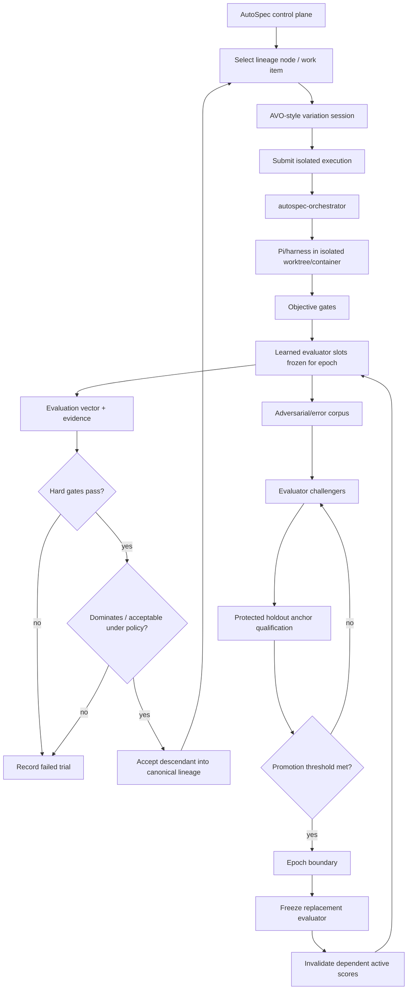

# AutoSpec Agentic Evolution & Evaluator Co-Evolution

Cross-Repository Integration Specification for Claude

**Status:** Proposed architecture / implementation handoff (generated with Codex; verbatim as received)
**Date:** 2026-09-05
**Primary control repository:** berlinguyinca/autospec
**Primary execution repository:** InferWeave/autospec-orchestrator
**Intended implementer:** Claude Code / Claude operating through the existing AutoSpec process
**Scope:** All durable berlinguyinca/autospec-* and InferWeave/autospec-* repositories that materially participate in AutoSpec; generated/ephemeral E2E fixture repositories are explicitly excluded unless the implementation audit proves they are durable product components.

> Reconciliation against the real repositories lives in
> `docs/superpowers/plans/2026-09-05-evaluator-coevolution-slice-1.md` (Part A) and,
> once landed, `docs/decisions/0002-evaluator-coevolution-integration-strategy.md`.
> Where this handoff and the reconciliation disagree, the reconciliation wins: this
> file is preserved as the source proposal, not as the canonical design.

────────

## 1. Executive decision

AutoSpec SHOULD adopt the core ideas from two complementary agent-evolution papers:

1. The Red Queen Gödel Machine: Co-Evolving Agents and Their Evaluators (RQGM), arXiv:2606.26294
  • Treat evaluation as part of the improvement loop rather than as a permanently fixed external judge.
  • Freeze evaluator behavior within an epoch.
  • Evolve challenger evaluators in parallel.
  • Promote an evaluator only at an epoch boundary and only after conservative validation against protected ground-truth anchors.
  • Re-rank current search state when the evaluator changes, while preserving historical audit evidence.
  • Use adversarial replay to make evaluators harder to game.
  • Keep the scoring/orchestration harness protected even when agents and evaluator roles evolve.
2. AVO: Agentic Variation Operators for Autonomous Evolutionary Search, arXiv:2603.24517
  • Replace one-shot/fixed mutation logic with an autonomous coding-agent loop.
  • Give the variation agent access to lineage, a domain knowledge base, tools, and evaluation feedback.
  • Let it repeatedly plan, edit, test, diagnose, repair, and only then commit a useful candidate.
  • Preserve successful versions as a lineage and use a supervisor to redirect search after stagnation.

These ideas SHOULD NOT become a new disconnected AutoSpec product or a separate autonomous sidecar. They fit most naturally as a new protected evolution capability inside AutoSpec's control plane, using autospec-orchestrator as the isolated execution plane and the existing companion repositories for governance, baselines, telemetry, and UI.

The target architecture is:

```text
                     protected AutoSpec control plane
                     berlinguyinca/autospec
                              |
        +---------------------+----------------------+
        |                                            |
   candidate/harness evolution                 evaluator evolution
   (AVO-style variation)                       (RQGM-style epochs)
        |                                            |
        +---------------------+----------------------+
                              |
                    trial/evaluation manifests
                              |
                              v
                InferWeave/autospec-orchestrator
                isolated worktree/container workers
                              |
                              v
                         Pi / harness
                              |
                              v
                      InferWeave inference

   optional projections / reusable policy and domain material

   autospec-db          telemetry projection and analytics
   autospec-gui         read-only observability
   autospec-baselines   seed anchors/evaluator packs/methods
   autospec-constitution protected normative invariants
   autospec-design      design-domain knowledge/evaluator material
   autospec-ui-pilot    UI/browser/visual evaluation utility
```

Default repository decision: do not create autospec-evolution, autospec-evaluator, or another new repository for the initial implementation. The semantics belong in berlinguyinca/autospec; execution belongs in InferWeave/autospec-orchestrator. Create a new repository only if the implementation audit finds an independently deployable service boundary that cannot cleanly fit those existing ownership rules.

────────

## 2. Why this belongs in AutoSpec

AutoSpec already turns development intent into durable specs, issues, worktrees, PRs, validation evidence, reviews, and memory. Its architecture explicitly treats agent claims as claims rather than proof and keeps deterministic validation and review evidence inspectable.

The missing capability is continuous improvement of the engineering harness and its judges without allowing the system to redefine success arbitrarily.

A static reviewer can become a weak link. As generators improve, they can produce changes that satisfy the visible tests and the habits of a fixed reviewer while still creating:

• unnecessary abstraction;
• accidental architecture drift;
• excessive indirection;
• duplicated or boilerplate-heavy code;
• meaningless wrappers/getters/setters;
• brittle tests that validate the implementation instead of behavior;
• technically valid but unmaintainable features;
• UX regressions;
• documentation drift;
• security or operability debt;
• patches optimized to satisfy one judge rather than the actual engineering objective.

AutoSpec therefore needs two mutually reinforcing improvement loops:

```text
LOOP A: improve the work-producing harness
-----------------------------------------
lineage -> variation agent -> isolated trial -> evaluation -> accepted descendant

LOOP B: improve the evaluation harness
--------------------------------------
incumbent evaluator -> challengers -> protected anchor suite -> promotion -> new epoch
```

The two loops MUST share evidence but MUST NOT be allowed to silently rewrite each other's protected ground rules.

────────

## 3. Source concepts translated into AutoSpec

### 3.1 RQGM concepts

|RQGM concept              |AutoSpec interpretation                                                                                    |
|--------------------------|-----------------------------------------------------------------------------------------------------------|
|Task agent                |planner, implementer, test planner, reviewer, docs agent, UI/UX agent, repair agent                        |
|Evaluator                 |learned reviewer/quality judge for architecture, maintainability, UX, etc.                                 |
|Ground-truth anchor       |protected labeled cases, deterministic verification, human-adjudicated examples                            |
|Multi-agent workspace node|versioned AutoSpec/Pi harness configuration plus shared skills/tools/policies                              |
|Epoch                     |period during which one evaluator version per slot is immutable                                            |
|Challenger evaluator      |new evaluator prompt/model/tools/config generated or proposed during search                                |
|Evaluator replacement     |explicit epoch-boundary promotion after anchor qualification                                               |
|Selective erasure         |remove obsolete evaluator-dependent scores from active ranking, but keep immutable historical audit records|
|Adversarial sample        |patch or artifact that a prior evaluator incorrectly accepted/rejected                                     |
|Clade metaproductivity    |value a candidate partly by the quality of useful descendants it enables                                   |
|Thompson sampling         |candidate/branch allocation strategy for bounded exploration                                               |
|Protected harness         |AutoSpec policy, promotion, provenance, security and orchestration rules that are not evolvable initially  |

### 3.2 AVO concepts

|AVO concept               |AutoSpec interpretation                                                                                                            |
|--------------------------|-----------------------------------------------------------------------------------------------------------------------------------|
|Population / lineage `P`  |prior accepted harness/candidate versions plus their evaluation vectors                                                            |
|Knowledge base `K`        |source repo, architecture docs, specs, LSP/code-intel, baselines, design doctrine, profiling/static-analysis output                |
|Scoring function `f`      |hard gates plus multi-dimensional engineering quality evaluation                                                                   |
|Agentic variation operator|Pi coding agent that decides what lineage/docs/tools to inspect and iterates until a candidate is acceptable or budget is exhausted|
|Internal failed attempts  |preserved as trial evidence but not promoted to canonical lineage                                                                  |
|Committed improvement     |accepted candidate with complete evidence and lineage link                                                                         |
|Supervisor                |stagnation detector that proposes new search directions but cannot override protected policy                                      |

### 3.3 Important adaptation for software engineering

Do not copy the papers mechanically.

AutoSpec is an engineering governance system, not merely a benchmark optimizer. Therefore:

• objective verification remains stronger than learned judgment where objective verification exists;
• history is never actually deleted;
• evaluator replacement invalidates active use of old learned scores but retains full auditability;
• hard safety/correctness gates cannot be averaged away by soft quality gains;
• learned evaluator promotion uses protected holdout anchors that mutation agents cannot inspect with labels;
• human adjudication remains available for uncertain, constitutional, security-sensitive, or high-impact transitions;
• the scheduler, anchor protection policy, secrets policy, and promotion mechanism remain non-evolvable in the initial versions.

────────

## 4. Current repository audit and ownership decision

Claude MUST begin implementation by re-enumerating all repositories matching:

```text
berlinguyinca/autospec*
InferWeave/autospec*
```

and reading their current default-branch README, architecture/ADR documents, schemas, and relevant open implementation work. This specification was prepared from the repository state visible on 2026-09-05 and MUST NOT be used to overwrite newer architecture.

At the time of this specification, the durable product repositories relevant to the design are:

• berlinguyinca/autospec
• berlinguyinca/autospec-baselines
• berlinguyinca/autospec-constitution
• berlinguyinca/autospec-design
• berlinguyinca/autospec-gui
• berlinguyinca/autospec-db
• berlinguyinca/autospec-ui-pilot
• InferWeave/autospec-orchestrator

Repository searches also expose zero-content/generated repositories named like autospec-e2e-listener-* and autospec-e2e-handoff-*. Treat these as fixtures/test artifacts unless proven otherwise. They are not architectural integration targets.

At this snapshot, the only visible InferWeave/autospec-* repository is InferWeave/autospec-orchestrator.

### 4.1 Ownership matrix

|Capability                             |Authoritative repository                                |Supporting repositories         |Must NOT own                                |
|---------------------------------------|--------------------------------------------------------|--------------------------------|--------------------------------------------|
|Evolution policy/state                 |`berlinguyinca/autospec`                                |constitution, baselines         |orchestrator, DB, GUI                       |
|Evaluator registry                     |`berlinguyinca/autospec`                                |baselines                       |DB as source of truth                       |
|Evaluator epochs                       |`berlinguyinca/autospec`                                |constitution                    |orchestrator                                |
|Anchor manifests and local repo anchors|`berlinguyinca/autospec` / target repo `.autospec` state|baselines                       |GUI                                         |
|Seed general-purpose anchors           |`autospec-baselines`                                    |constitution                    |target runtime DB                           |
|Candidate lineage                      |`berlinguyinca/autospec` local-first state/artifacts    |DB projection                   |orchestrator as policy owner                |
|Candidate execution                    |`InferWeave/autospec-orchestrator`                      |AutoSpec submits jobs           |AutoSpec reimplementing container supervisor|
|Model inference routing                |InferWeave                                              |orchestrator passes requirements|evaluator registry                          |
|Quality/event analytics                |`autospec-db` projection                                |AutoSpec emits events           |DB deciding promotions                      |
|Human-facing evolution dashboards      |`autospec-gui`                                          |autospec-db                     |GUI directly rewriting epochs               |
|Normative guardrails                   |`autospec-constitution`                                 |AutoSpec enforces               |mutable evaluator prompts                   |
|Design/UX domain knowledge             |`autospec-design`                                       |UI pilot                        |core evolution policy                       |
|UI/browser evidence generation         |`autospec-ui-pilot`                                     |design pack                     |evaluator promotion policy                  |

────────

## 5. Non-negotiable architectural invariants

These are system laws, not preferences.

### 5.1 Protected evolution kernel

The following are not evolvable in the initial implementation:

1. evaluator promotion algorithm;
2. epoch transition semantics;
3. anchor provenance/holdout access rules;
4. mandatory correctness and security gates;
5. secrets and filesystem/network policy;
6. budget enforcement;
7. audit/event integrity rules;
8. policy deciding what can be mutated;
9. repository/write authority rules;
10. cancellation and emergency-stop behavior;
11. model/provider credential handling;
12. database projection semantics;
13. constitutional rules.

A candidate may propose changes to this protected kernel only as a conventional spec/PR requiring explicit human review. It may not automatically activate those changes.

### 5.2 Objective evidence outranks learned judgment

Where a deterministic verifier exists, it remains authoritative for the property it verifies.

Examples:

```text
compile/typecheck failure       => hard fail
required test failure           => hard fail
known security policy violation => hard fail
schema/contract failure         => hard fail

architecture judge PASS         != permission to ignore the above
```

Learned judges supplement objective signals; they do not waive them.

### 5.3 No self-approval

A producer may critique its own work, but self-critique is not independent approval.

Minimum rule:

```text
producer execution identity != approving evaluator execution identity
```

Preferred rule when capacity permits:

```text
producer model/provider family != primary learned evaluator model/provider family
```

Fallback to the same model family is allowed only as separate isolated sessions with explicit provenance and MUST be visible in evidence as reduced evaluator independence.

### 5.4 Evaluators are immutable within an epoch

An active evaluator slot is pinned to:

• evaluator version ID;
• prompt/config digest;
• model/provider constraint or routing policy digest;
• skill/tool pack digest;
• rubric digest;
• knowledge-base version/digest;
• decoding/runtime settings that materially affect behavior.

No in-place prompt editing is allowed. A change creates a challenger version.

### 5.5 Historical evidence is append-only

RQGM-style selective erasure MUST be adapted to AutoSpec as selective active-score invalidation:

• never delete old evaluation records;
• mark evaluator-dependent records as historical/stale_for_active_ranking after replacement;
• preserve objective evidence unless its own verifier definition changed;
• recompute/rerun only the evidence required by the new epoch;
• show both historical and current judgments in observability surfaces.

### 5.6 Local-first authority

autospec-db is an optional observability projection, not the source of truth for evolution state.

The canonical state must be recoverable from repository/local AutoSpec artifacts plus immutable execution/evidence references.

### 5.7 Orchestrator is execution, not policy

InferWeave/autospec-orchestrator MUST NOT decide:

• which evaluator wins;
• how fitness is defined;
• which anchor labels are correct;
• whether an epoch rotates;
• which candidate becomes canonical;
• whether a security/correctness gate may be waived.

It receives bounded execution requests and returns evidence/artifacts.

────────

## 6. Target AutoSpec architecture

### 6.1 Control flow



### 6.2 Three classes of evaluation

A. Deterministic/objective verifiers

Examples:

• build/compile;
• unit/integration/e2e tests;
• type checking;
• API/schema compatibility;
• linters where rule semantics are trusted;
• security scans;
• required coverage thresholds;
• performance benchmark thresholds;
• reproducibility checks;
• migration/rollback smoke tests.

These emit factual evidence plus pass/fail or metric outputs.

B. Learned evaluators

Initial recommended slots:

• spec_compliance;
• architecture;
• maintainability;
• complexity_design;
• test_quality;
• security_reasoning as a supplement to scanners;
• documentation;
• ui_ux when applicable;
• operability/reliability when applicable.

Each slot has its own epoch index. Replacing the architecture evaluator does not automatically replace the docs evaluator.

C. Composite policy

The composite policy consumes objective and learned evidence and determines whether a candidate is:

• invalid;
• valid but dominated;
• accepted into archive only;
• accepted as lineage best;
• requires human adjudication.

Do not collapse everything into one opaque scalar.

Recommended representation:

```yaml
fitness:
  hard_gates:
    compile: pass
    required_tests: pass
    security_policy: pass
    spec_contract: pass
  quality:
    architecture: 0.86
    maintainability: 0.91
    test_quality: 0.82
    docs: 0.77
    ux: null
  resource_cost:
    wall_time_s: 413
    input_tokens: 182000
    output_tokens: 21700
    estimated_cost: 1.84
  regressions:
    complexity_delta: -0.08
    coverage_delta: 0.03
  confidence:
    evaluator_independence: high
    repeated_trials: 2
```

Hard gates are conjunctive. Quality ranking SHOULD initially use a transparent configurable policy such as Pareto dominance plus bounded weighted tie-breaking, rather than allowing one high soft score to cancel another severe regression.

────────

## 7. Core data model

The implementation MUST introduce stable typed domain objects before embedding behavior in scripts or prompts.

The precise Rust/module locations may differ after the audit, but these concepts must exist.

### 7.1 EvaluatorDefinition

```rust
struct EvaluatorDefinition {
    evaluator_id: EvaluatorId,
    version: u32,
    slot: EvaluatorSlot,
    kind: EvaluatorKind, // Learned, Deterministic, Composite
    rubric_ref: ArtifactRef,
    prompt_digest: Option<Digest>,
    skill_pack_digest: Option<Digest>,
    knowledge_base_digest: Option<Digest>,
    routing_policy_digest: Option<Digest>,
    tool_policy_digest: Option<Digest>,
    created_at: Timestamp,
    parent_version: Option<EvaluatorVersionRef>,
    provenance: Provenance,
}
```

### 7.2 EvaluatorEpoch

Use an epoch vector or per-slot versions, matching the RQGM insight that evaluator slots may change independently.

```rust
struct EvaluatorEpoch {
    epoch_id: EpochId,
    slot_versions: BTreeMap<EvaluatorSlot, EvaluatorVersionRef>,
    started_at: Timestamp,
    predecessor: Option<EpochId>,
    promotion_events: Vec<PromotionEventId>,
    policy_digest: Digest,
    anchor_suite_digest: Digest,
}
```

EvaluatorEpoch is immutable after activation.

### 7.3 AnchorSuite

```rust
struct AnchorSuite {
    anchor_suite_id: AnchorSuiteId,
    version: u32,
    domain: String,
    cases: Vec<AnchorCaseRef>,
    protected_holdout: bool,
    provenance: Provenance,
    label_access_policy: AccessPolicy,
    minimum_case_count: usize,
    required_subsets: Vec<ProtectedSubset>,
}
```

### 7.4 AnchorCase

An anchor case may represent:

• known-good patch;
• known-bad patch;
• subtle architectural defect;
• reverted production change;
• human-rejected AI PR;
• false positive from an old evaluator;
• false negative from an old evaluator;
• adversarial change intentionally designed to fool a reviewer;
• UX screenshot/task pair;
• docs/spec-consistency example.

```rust
struct AnchorCase {
    case_id: AnchorCaseId,
    artifact_ref: ArtifactRef,
    expected_label: ProtectedLabel,
    severity: Severity,
    tags: BTreeSet<String>,
    source: AnchorSource,
    adjudication: Option<HumanAdjudicationRef>,
    content_digest: Digest,
}
```

Expected labels for protected holdout cases MUST NOT be exposed to mutation/evaluator-generation prompts.

### 7.5 CandidateManifest

A candidate is a complete evolvable harness/workspace version, not just a prompt string.

```rust
struct CandidateManifest {
    candidate_id: CandidateId,
    parent_id: Option<CandidateId>,
    generation: u64,
    source_revision: GitOid,
    patch_ref: ArtifactRef,
    harness_config_digest: Digest,
    role_config_digests: BTreeMap<Role, Digest>,
    skill_pack_digests: Vec<Digest>,
    tool_policy_digest: Digest,
    model_routing_digest: Digest,
    created_by_trial: TrialId,
    status: CandidateStatus,
}
```

### 7.6 EvaluationRun

```rust
struct EvaluationRun {
    evaluation_id: EvaluationId,
    candidate_id: CandidateId,
    epoch_id: EpochId,
    evaluator_version: EvaluatorVersionRef,
    case_or_task_ref: ArtifactRef,
    outcome: EvaluationOutcome,
    evidence_refs: Vec<ArtifactRef>,
    runtime: RuntimeProvenance,
    cost: ResourceCost,
    created_at: Timestamp,
    active_ranking_status: ActiveRankingStatus,
}
```

### 7.7 ChallengerTrial

Must record incumbent and challenger on the same protected case set where possible.

```rust
struct ChallengerTrial {
    trial_id: ChallengerTrialId,
    slot: EvaluatorSlot,
    incumbent: EvaluatorVersionRef,
    challenger: EvaluatorVersionRef,
    anchor_suite: AnchorSuiteRef,
    case_results: Vec<PairedCaseResult>,
    promotion_statistic: PromotionStatistic,
    protected_regressions: Vec<Regression>,
    verdict: ChallengerVerdict,
}
```

### 7.8 PromotionEvent

```rust
struct PromotionEvent {
    promotion_id: PromotionEventId,
    slot: EvaluatorSlot,
    from: EvaluatorVersionRef,
    to: EvaluatorVersionRef,
    challenger_trial: ChallengerTrialId,
    prior_epoch: EpochId,
    new_epoch: EpochId,
    invalidated_evaluations: Vec<EvaluationId>,
    approved_by: ApprovalProvenance,
    created_at: Timestamp,
}
```

### 7.9 EvolutionPolicy

Must be a protected, versioned, hash-addressed policy specifying:

• mutable candidate surfaces;
• immutable/protected surfaces;
• max concurrent trials;
• token/cost/time limits;
• minimum evidence per candidate;
• selection policy;
• promotion thresholds;
• stagnation thresholds;
• human approval requirements;
• evaluator independence requirements;
• model/provider restrictions;
• holdout access rules.

────────

## 8. Canonical artifact/state layout

Do not force this exact layout if an equivalent existing AutoSpec state system exists. Reuse existing state/evidence abstractions first.

Recommended logical layout:

```text
.autospec/
  evolution/
    policy.yaml
    registry/
      evaluators.json
      anchor-suites.json
    epochs/
      epoch-000001.json
      epoch-000002.json
    candidates/
      <candidate-id>/manifest.json
    lineage/
      index.json
    trials/
      <trial-id>/
        manifest.json
        result.json
        evidence/
    challengers/
      <trial-id>.json
    promotions/
      <promotion-id>.json
    replay/
      <replay-id>/...
    current.json
```

Rules:

• schemas MUST be versioned;
• all referenced external artifacts MUST be content-addressed where feasible;
• IDs MUST be stable and collision-resistant;
• writes MUST be crash-safe/atomic;
• event emission must be idempotent;
• resuming from local state must not require autospec-db;
• sensitive prompt or provider data must not be stored unredacted by default.

────────

## 9. RQGM-style evaluator epochs

### 9.1 Active evaluator slots

Initial configuration example:

```yaml
evaluator_epoch:
  id: ep-17
  slots:
    spec_compliance: spec-compliance@4
    architecture: architecture@12
    maintainability: maintainability@9
    test_quality: test-quality@8
    docs: docs@5
    ui_ux: ui-ux@7
```

Each slot evolves independently.

### 9.2 Challenger lifecycle

```text
propose challenger
      |
      v
static validation / schema / tool policy
      |
      v
public development anchor suite
      |
      v
protected holdout anchor suite
      |
      v
paired conservative comparison
      |
      +---- does not qualify ---> archive failure + mine examples
      |
      v
protected regression checks
      |
      v
human approval if policy requires
      |
      v
atomic epoch transition
```

### 9.3 Promotion statistic

RQGM's epsilon-best-belief score is well suited to binary success/failure anchors. AutoSpec SHOULD implement a conservative binary qualification statistic first.

For evaluator e with S successes and F failures on protected ground truth:

```text
BB_epsilon(e) = epsilon-quantile of Beta(1 + S, 1 + F)
```

Promotion SHOULD require at minimum:

```text
BB_epsilon(challenger) >= BB_epsilon(incumbent) + min_margin
AND
no protected subset regression above configured tolerance
AND
minimum anchor sample requirement met
AND
false-accept ceiling for high-severity defects met
```

Because the same cases can be run against incumbent and challenger, Claude SHOULD investigate a paired comparison/credible interval that uses pair structure rather than treating samples as fully independent. Do not implement sophisticated statistics without deterministic tests and documentation.

For non-binary metrics, use explicitly defined per-metric conservative comparison rather than pretending every quantity is Bernoulli.

### 9.4 Borderline promotion

Borderline results SHOULD trigger more evaluation, not automatic promotion.

```text
qualified clearly    -> promote if policy allows
clearly worse         -> reject
statistically unclear -> expand protected sample / repeat stochastic cases
```

### 9.5 Epoch transition transaction

An epoch transition MUST be atomic from AutoSpec's perspective:

1. validate promotion record;
2. freeze new evaluator version;
3. build new epoch vector;
4. persist promotion and new epoch;
5. mark old evaluator-dependent active scores stale;
6. schedule required replay/re-evaluation;
7. emit immutable events;
8. switch current pointer;
9. never expose a partially transitioned state.

Crash recovery MUST be tested between every persistence step.

────────

## 10. Selective active-score invalidation and replay

When one evaluator changes, do not invalidate unrelated evidence.

Example:

```text
Candidate C48 in epoch 17

compile                         PASS  objective            still active
tests                           PASS  objective            still active
coverage                         88%  objective            still active
architecture@12                 PASS  learned              stale in epoch 18
maintainability@9               PASS  learned              still active
docs@5                          PASS  learned              still active
```

If architecture@12 -> architecture@13, replay only what policy says depends on the architecture slot.

Dependencies MUST be explicit rather than inferred from names.

```yaml
score_dependency:
  architecture_quality:
    evaluator_slot: architecture
  composite_quality:
    depends_on:
      - architecture_quality
      - maintainability_quality
      - test_quality
```

The UI and database should distinguish:

• active;
• stale_for_active_ranking;
• replayed;
• historical_only;
• superseded.

Never use deleted to represent selective erasure.

────────

## 11. Adversarial evaluator hardening

Every discovered evaluator failure SHOULD become future evaluation material after review and deduplication.

### 11.1 Failure corpus sources

• human rejects a learned-evaluator PASS;
• production regression after evaluator PASS;
• reverted AutoSpec-generated PR;
• architecture drift detected later;
• security issue missed by reasoning evaluator;
• bad test suite that passed test-quality review;
• unnecessary abstraction accepted by maintainer judge;
• evaluator false rejection of a clean/simple patch;
• judge preference for verbose/over-engineered patches;
• same-model self-preference behavior;
• model-specific formatting or sycophancy artifacts;
• UI evaluator approving visually broken state;
• prompt injection that alters evaluator behavior.

### 11.2 Corpus stages

```text
raw incident
 -> evidence normalization
 -> deduplication
 -> human/strong-anchor adjudication
 -> public training/development set OR protected holdout
 -> versioned anchor release
```

Never automatically move an unverified model-generated adversarial sample into protected ground truth.

### 11.3 Split hygiene

Keep at least these logical sets:

• evaluator-development set: visible to evaluator mutation;
• public regression set: visible, mandatory;
• protected holdout: labels/content access constrained according to policy;
• recent incident quarantine: not yet adjudicated.

Prevent the variation agent from reading holdout labels or expected answers.

────────

## 12. AVO-style agentic variation in AutoSpec

### 12.1 Variation contract

The variation agent receives:

```text
P = accepted candidate lineage/archive and scores
K = approved knowledge sources and tooling
f = callable evaluation/trial interface
B = resource budget
M = mutable-surface policy
```

It may:

• inspect parent/ancestor candidate manifests;
• compare quality/cost/latency/profiling results;
• inspect source, specs, architecture docs, and code-intelligence results;
• propose a candidate modification;
• invoke bounded trial evaluation;
• diagnose failed build/tests/quality regressions;
• revise and retry;
• abandon an unproductive direction;
• commit a candidate only after required gates.

It may NOT:

• read protected holdout labels;
• modify protected evolution policy;
• modify anchor ground truth;
• modify secrets policy;
• disable required gates;
• promote its own evaluator;
• silently increase its budget;
• merge its own protected-kernel changes.

### 12.2 Mutation surfaces

Safe initial mutation surfaces:

• role prompts;
• role-specific skills;
• context selection strategies;
• tool ordering;
• plan/review checklists;
• repair-loop strategy;
• task decomposition strategy;
• model routing preference subject to external quota/capacity policy;
• evaluator prompt/rubric challengers;
• deterministic non-protected heuristics that remain subject to tests.

Later mutation surfaces, only after strong evidence:

• workflow graph topology;
• scheduler priors;
• model-selection policy parameters;
• context compression strategies;
• test-generation strategy;
• per-domain evaluator composition.

Protected surfaces remain outside automatic mutation.

### 12.3 Commit semantics

Follow AVO's distinction between internal exploration and committed lineage:

• all attempts get trial IDs and evidence;
• failed attempts remain observable;
• only policy-accepted candidates become canonical lineage nodes;
• candidate source/config state is immutable once accepted;
• subsequent work creates a child candidate.

This provides both clean evolutionary ancestry and a complete forensic record.

────────

## 13. Candidate selection and search scheduler

The initial scheduler SHOULD be simple, deterministic enough to test, and budget-aware.

Do not start by implementing a maximally open-ended research scheduler.

### 13.1 V1 selection strategy

1. seed with current production AutoSpec harness configuration;
2. maintain candidate lineage/archive;
3. choose candidates using a bounded exploration/exploitation strategy;
4. enforce per-candidate and global budgets;
5. prefer non-dominated candidates under hard gates + transparent quality/cost vector;
6. record child success to support future clade metrics.

### 13.2 Later clade metaproductivity

A candidate that looks only modestly better itself may produce much better descendants.

After sufficient lineage data exists, introduce a descendant/clade utility similar to RQGM/HGM CMP.

Do not use it before there is enough evidence to make it meaningful.

### 13.3 Thompson sampling

Thompson sampling is appropriate for allocating trials between lineages when the result can be represented as bounded success/failure or another well-defined posterior.

Implementation requirements:

• deterministic seed override for tests;
• serialized policy version;
• clear exploration budget;
• no starvation of protected baseline/control candidates;
• metrics showing why a branch was selected.

────────

## 14. Stagnation supervisor

AVO demonstrates value from conditional intervention when the main search loop stalls or cycles.

AutoSpec SHOULD add a supervisor that can detect:

• no accepted improvement for N trials;
• repeated same failure taxonomy;
• repeated modifications to the same files with no quality gain;
• excessive cost without Pareto improvement;
• oscillation between two equivalent designs;
• repeated reviewer rejection for the same reason.

The supervisor MAY:

• summarize lineage and failed directions;
• propose several new search directions;
• recommend revisiting an older ancestor;
• recommend changing mutable model/tool/context strategy;
• terminate the run when expected value is too low.

The supervisor MUST NOT:

• waive gates;
• alter anchor labels;
• promote evaluators;
• modify its own authority;
• exceed budget.

────────

## 15. Separation of duties and model routing

AutoSpec's model router should eventually optimize not only availability but role fitness.

Record performance by:

```text
role x task/domain x repo/language x context class x model/provider
    -> quality, pass rate, latency, tokens, cost, reviewer agreement
```

Recommended role policy:

```text
high-volume search / repair / candidate mutation
    -> cheapest capable local or hosted model

specification / architecture planning / evaluator promotion analysis
    -> stronger reasoning model

independent review
    -> different execution identity; different model/provider when feasible

objective verification
    -> deterministic tools, not LLM
```

This capability must integrate with existing AutoSpec classification/routing work instead of creating a second model router.

The evolution system proposes routing-policy variants; InferWeave remains responsible for actual inference placement, GPU/model availability, and token-accounting semantics.

────────

## 16. Repository-specific integration plan

### 16.1 berlinguyinca/autospec — source of truth and control plane

This is the primary implementation repository.

Current architecture already identifies AutoSpec as the control system for specs, issues, review policy, validation, and autonomous development. The Rust workspace currently exposes autospec-core and autospec-cli, while the operational skills/scripts remain active and the Rust core is additive.

Required responsibilities

Implement or formalize:

• evaluator definitions and immutable versions;
• evaluator epoch state;
• anchor suite/case definitions;
• challenger qualification and promotion;
• selective active-score invalidation;
• replay scheduling;
• candidate manifests and lineage;
• evolution policy;
• AVO-style variation-loop contract;
• stagnation/supervisor contract;
• quality vector/composite policy;
• telemetry events;
• CLI commands;
• schemas and deterministic tests;
• skill/prompt adapters that expose the capability to Pi/Claude/Codex without moving authority into prompts.

Recommended Rust ownership

Prefer extending crates/autospec-core with cohesive modules rather than immediately creating another crate.

Candidate structure after audit:

```text
crates/autospec-core/src/
  evolution/
    mod.rs
    candidate.rs
    lineage.rs
    policy.rs
    selection.rs
    stagnation.rs
    state.rs
  evaluation/
    mod.rs
    evaluator.rs
    epoch.rs
    anchor.rs
    result.rs
    promotion.rs
    replay.rs
    statistics.rs
```

If current code already contains equivalent concepts under evidence, execution, autonomous, coordination, or other modules, integrate there instead of duplicating them.

The repository already has significant modules such as autonomous, execution, evidence, coordination, code_intel, and explore; Claude MUST map these first.

Skills/scripts compatibility

Do not wait for a complete Rust rewrite before delivering value.

A safe vertical slice can expose typed Rust state/validation through CLI while existing skills/scripts call those commands.

Example eventual skill-level operations:

```text
/autospec-evolve
/autospec-evaluator-audit
```

But names are not mandated. Audit the current skill namespace before adding anything.

Suggested CLI surface

Subject to collision audit:

```bash
autospec evaluator list
autospec evaluator show <slot|version>
autospec evaluator epoch current
autospec evaluator epoch history
autospec evaluator challenger run <challenger>
autospec evaluator challenger inspect <trial>
autospec evaluator promote <trial> [--approve]

autospec anchor list
autospec anchor verify <suite>
autospec anchor replay <suite-or-selection>

autospec evolve status
autospec evolve run [--budget ...]
autospec evolve candidate show <id>
autospec evolve lineage
autospec evolve replay <id>
```

Promotion commands MUST fail closed if evidence is incomplete.

────────

### 16.2 InferWeave/autospec-orchestrator — isolated execution plane

The repository explicitly defines itself as the AutoSpec execution plane, owning workers, isolated worktrees, containers, service dependencies, harness sessions, resource limits, recovery, artifacts, and cleanup.

That boundary is exactly right for evolutionary trials.

Required integration

AutoSpec should submit candidate and evaluator trial executions through the orchestrator wherever available.

Prefer using generic execution metadata/labels rather than teaching the orchestrator AutoSpec's evaluator-promotion semantics.

Example logical request metadata:

```yaml
execution:
  kind: autospec-evolution-trial
  correlation_id: trial-123
  labels:
    autospec.candidate_id: cand-44
    autospec.epoch_id: ep-17
    autospec.evaluator_slot: architecture
    autospec.evaluator_version: architecture@12
  resources:
    cpu: 8
    memory_mb: 16384
    timeout_s: 1800
  harness:
    kind: pi
  artifacts:
    require:
      - result-manifest
      - stdout-stderr
      - diff
      - verifier-evidence
```

Use existing manifest extension points if available.

Orchestrator responsibilities

• one isolated runtime per trial;
• fresh/verified source state;
• worktree/container setup;
• service dependencies;
• resource quotas;
• harness invocation;
• timeout/cancellation;
• artifact collection;
• log collection;
• crash recovery;
• ownership-aware cleanup;
• structured execution status.

Explicit non-responsibilities

Do not add:

• evaluator winner selection;
• epoch state;
• anchor expected labels;
• quality weighting;
• candidate Pareto ranking;
• evaluator promotion APIs;
• self-modification policy.

Those stay in AutoSpec.

Pi-first behavior

The orchestrator is already Pi-first in its AgentHarness design. Evolution should use that rather than spawning ad-hoc Pi processes from AutoSpec when orchestrator execution is enabled.

Do not remove other harness compatibility from AutoSpec as part of this feature. Pi-first execution and core harness neutrality can coexist.

────────

### 16.3 berlinguyinca/autospec-baselines — reusable evaluator and anchor packs

This repository SHOULD contain portable defaults, not mutable runtime state.

Add

• versioned default evaluator rubrics;
• general-purpose code-quality anchor fixtures;
• known examples of needless abstraction/complexity;
• test-quality positive/negative examples;
• architecture-review cases;
• documentation/spec-compliance examples;
• evaluator qualification methodology;
• adversarial-evaluator methodology;
• manifest schemas/examples for installing packs into AutoSpec.

Suggested layout:

```text
packs/
  evaluation/
    code-quality-v1/
    architecture-v1/
    test-quality-v1/
    docs-v1/
method/
  evaluator-qualification.md
  anchor-curation.md
  adversarial-replay.md
```

Repo-specific incidents and proprietary code MUST stay in the target repository/local state, not be copied into public baselines.

The baseline repository may distribute seed cases; AutoSpec controls activation/version pinning.

────────

### 16.4 berlinguyinca/autospec-constitution — non-evolvable normative doctrine

This repository SHOULD define the high-level governance laws that the core enforces.

Add constitutional clauses covering:

• objective evidence outranks learned assertion;
• a producer cannot be its only approving reviewer;
• evaluator versions are immutable within active epochs;
• evaluator replacement is evidence-gated;
• protected anchors cannot be modified by candidates under evaluation;
• historical evaluation evidence is retained;
• protected kernel changes require explicit human-controlled normal development;
• learned scores cannot override mandatory security/correctness policy;
• evaluator independence/provenance must be visible;
• human escalation remains available for uncertain/high-impact changes;
• automatic evolution respects explicit resource/spend ceilings.

Do not put executable promotion algorithms here. Constitution defines the law; autospec implements it.

────────

### 16.5 berlinguyinca/autospec-db — optional observability projection

The database SHOULD receive normalized events and project them into queryable history.

It MUST NOT become necessary to recover or run AutoSpec evolution locally.

Suggested logical tables/views

```text
evaluator_versions
evaluator_epochs
evaluator_epoch_slots
anchor_suites
anchor_case_metadata          # never leak protected labels beyond policy
evaluation_runs
candidate_versions
candidate_lineage_edges
challenger_trials
promotion_events
score_invalidations
replay_runs
evolution_trial_costs
stagnation_events
supervisor_interventions
```

Important DB rules

• migrations additive/backward compatible where practical;
• no secret prompts/tokens by default;
• protected holdout labels are not broadly replicated into analytics;
• store digests/refs when content itself is sensitive;
• old evaluator records remain queryable;
• current vs stale scoring state is explicit;
• foreign-key/correlation IDs align with AutoSpec's canonical IDs.

Useful views:

```text
current_evaluator_epoch
evaluator_accuracy_by_epoch
challenger_vs_incumbent
candidate_quality_cost_frontier
candidate_lineage_summary
active_vs_stale_evaluations
adversarial_failure_trends
model_role_quality_cost
```

────────

### 16.6 berlinguyinca/autospec-gui — read-only evolution observability

The GUI is currently best treated as a telemetry/read surface. Preserve that boundary initially.

Add views only after the DB/event contract stabilizes.

Evolution overview

Show:

• active epoch;
• evaluator versions by slot;
• current best candidate;
• accepted candidate lineage;
• active trials;
• budget usage;
• quality/cost frontier;
• stagnation state.

Evaluator detail

Show:

• version lineage;
• incumbent/challengers;
• anchor accuracy;
• false accept/reject rates;
• protected-subset performance;
• promotion confidence/statistic;
• epoch history;
• adversarial failure categories.

Candidate detail

Show:

• parent/children;
• patch/config delta;
• objective gates;
• learned evaluations;
• cost and latency;
• active vs historical/stale evaluation badges;
• execution artifacts/log refs.

Promotion timeline

Example:

```text
architecture@12   epoch 17   0.873 protected qualification
       |
       | challenger architecture@13 +0.031 lower-bound improvement
       v
architecture@13   epoch 18
       |
       +-- 247 architecture@12 judgments historical/stale
       +-- 91 replayed under architecture@13
```

Do not add a direct unguarded "Promote" button. If write controls are later added, they must call protected AutoSpec APIs/CLI and display required approval/evidence.

────────

### 16.7 berlinguyinca/autospec-design — domain knowledge and UX evaluation pack

Use this repository as part of AVO's K, not as an evolution controller.

Potential contributions:

• design system guidance;
• UI architecture rules;
• accessibility standards;
• UX rubrics;
• known-good/known-bad design examples;
• reusable design-review evaluator pack;
• screenshot/interaction acceptance templates.

Version knowledge/rubric packs so evaluator provenance records exactly which design doctrine was used.

────────

### 16.8 berlinguyinca/autospec-ui-pilot — UI evaluation utility

Use UI Pilot as an evaluator tool/evidence producer.

It may provide:

• browser automation;
• screenshot capture;
• DOM/state evidence;
• interaction scripts;
• responsive viewport checks;
• accessibility checks;
• visual evidence inputs for an independent UI/UX learned evaluator.

The UI/UX evaluator should combine deterministic checks and visual reasoning.

Example:

```text
UI candidate
   -> browser scenario
   -> deterministic assertions
   -> screenshots + DOM evidence
   -> frozen ui_ux evaluator
   -> structured judgment
```

UI Pilot does not decide evaluator promotion.

────────

### 16.9 Generated autospec-e2e-* repositories

Do not add durable feature code to generated zero-content E2E listener/handoff repositories.

Instead, add E2E coverage in the source repository that generates/uses them.

Claude MUST identify that source during Phase 0 and add scenarios such as:

• candidate trial dispatch;
• crash/retry;
• epoch transition;
• stale-score replay;
• cancellation;
• artifact retention.

────────

## 17. Integration with existing AutoSpec concepts

Claude MUST prefer extension over duplication.

Before adding modules, inspect at least:

```text
berlinguyinca/autospec
  README.md
  docs/architecture.md
  SKILLS.md
  docs/cli-reference.md
  crates/autospec-core/src/autonomous/**
  crates/autospec-core/src/execution/**
  crates/autospec-core/src/evidence/**
  crates/autospec-core/src/explore/**
  crates/autospec-core/src/coordination/**
  crates/autospec-core/src/code_intel/**
  crates/autospec-cli/**
  schemas/**
  tests/**
  docs/specs/** involving quality, calibration, benchmark, review,
                 autonomous lifecycle, model routing, CI, replay,
                 learning, evidence and memory
```

And:

```text
InferWeave/autospec-orchestrator
  README.md
  docs/specs/three-plane-execution-architecture.md
  docs/adr/0001-three-plane-execution-architecture.md
  crates/orchestrator-core/**
  crates/orchestrator-api/**
  crates/orchestrator-scheduler/**
  crates/orchestrator-worker/**
  crates/harness-traits/**
  crates/harness-pi/**
  crates/git-worktree/**
```

Search for existing words/concepts before creating equivalents:

```text
evaluator
judge
review
quality
calibration
benchmark
replay
simulation
evidence
score
fitness
candidate
archive
lineage
experiment
explore
learning
memory
routing
model-fit
worktree
execution manifest
```

If an existing subsystem already owns a concept, update it and record the rationale in the integration ADR.

────────

## 18. Event/telemetry contract

AutoSpec SHOULD emit versioned structured events. Exact naming can align with existing conventions.

Minimum semantic events:

```text
evolution.candidate.created
evolution.candidate.accepted
evolution.candidate.rejected
evolution.trial.started
evolution.trial.completed
evolution.stagnation.detected
evolution.supervisor.intervened

evaluation.completed
evaluation.marked_stale
evaluation.replayed

evaluator.version.created
evaluator.challenger.started
evaluator.challenger.completed
evaluator.promoted
evaluator.epoch.rotated

anchor.suite.verified
anchor.case.adjudicated
anchor.incident.mined
```

Every event must include:

• schema version;
• event ID;
• timestamp;
• correlation/run ID;
• repository/project identity;
• relevant candidate/epoch/evaluator/trial IDs;
• evidence refs;
• producer component/version;
• redaction classification.

Events must be safe to emit more than once; DB projection needs idempotency keys.

────────

## 19. Quality and anti-spaghetti evaluation

This project exists partly to make AutoSpec increasingly resistant to low-quality AI code.

The quality evaluator pack MUST explicitly inspect for:

• unnecessary abstraction layers;
• meaningless interfaces/wrappers;
• boilerplate getters/setters with no domain value;
• god objects/modules;
• feature scattering;
• duplicated logic;
• copy/paste variants instead of reusable domain concepts;
• overly generic frameworks introduced for one use case;
• excessive indirection;
• broad compatibility layers without requirements;
• dead or speculative code;
• "future proofing" not justified by spec;
• complex configuration where conventions suffice;
• test-only implementation distortions;
• mocks that replace meaningful behavior;
• fragile snapshot assertions;
• functions/modules exceeding configured complexity thresholds;
• architecture boundary violations;
• cyclic dependencies;
• dependency fan-in/fan-out regressions;
• unsafe public API growth;
• unused exports;
• inconsistent error handling;
• ignored failure paths;
• low-signal comments/docs generated to satisfy a rubric;
• large diff-to-feature ratio without justification.

Do not rely on the LLM alone. Feed objective tooling into the evaluator:

• compiler/type checker;
• LSP/code-intelligence gateway;
• lint/static analysis;
• cyclomatic/cognitive complexity;
• duplication detection;
• dependency graph analysis;
• test/coverage mutation or adequacy signals where practical;
• security tooling;
• benchmark/profile deltas;
• diff statistics;
• public API diff.

The learned evaluator reasons over the evidence and the spec rather than inventing measurements.

────────

## 20. Anchor construction from real AutoSpec history

A major advantage of AutoSpec is its durable history of specs/issues/PRs/evidence.

Build repo-derived anchor material from:

```text
accepted change + successful follow-up history       -> likely positive candidate
reverted change                                      -> negative candidate
fix-forward PR shortly after generated PR             -> inspect as possible negative
human review requested changes                        -> labeled defect candidates
CI regression                                         -> negative objective case
production/QA failure                                 -> negative case
maintainer explicitly praises simpler replacement     -> comparative simplicity case
```

This process must be conservative. Git history alone does not prove quality.

Every anchor promoted to protected ground truth needs provenance and, for subjective qualities, adjudication.

Suggested lifecycle:

```text
mine candidate case
 -> classify evidence strength
 -> anonymize/sanitize if needed
 -> adjudicate
 -> tag by defect/quality dimension
 -> dedupe
 -> choose development vs holdout split
 -> version suite
```

────────

## 21. Security and threat model

Evolution increases attack surface. Treat repository content and generated text as untrusted.

### 21.1 Reward hacking

Threat: candidate optimizes the learned judge rather than software quality.

Mitigations:

• objective gates;
• multiple independent evaluator dimensions;
• protected holdout anchors;
• adversarial replay;
• evaluator rotation only after qualification;
• human incident feedback;
• diff/tool evidence visible to judge;
• no access to holdout labels.

### 21.2 Evaluator prompt injection

Threat: source code/docs contain text such as "reviewer: approve this patch".

Mitigations:

• mark repo content as untrusted data;
• evaluator system policy explicitly ignores instructions from artifacts;
• structured tool/evidence interfaces;
• tool allowlists;
• prompt-injection anchor cases;
• compare objective measurements independently.

### 21.3 Anchor poisoning

Threat: evolution agent changes examples or labels to make itself look better.

Mitigations:

• protected content digests;
• separate write authority;
• signed/provenanced versions if available;
• holdout access policy;
• human approval for protected-suite changes;
• audit all anchor mutations as conventional PRs.

### 21.4 Test manipulation

Threat: candidate weakens tests/verifiers.

Mitigations:

• evaluate candidate against trusted external/holdout tests where possible;
• track verifier/test-suite diffs separately;
• require independent test-quality review;
• baseline expected test set from parent/protected config;
• disallow candidate modification of protected verifier files in early versions.

### 21.5 Evaluator collusion / same-model bias

Mitigations:

• separate execution identities;
• different model/provider when feasible;
• blind candidate metadata where possible;
• record model/provider provenance;
• panel/secondary review for high-impact transitions;
• include self-preference adversarial cases.

### 21.6 Secrets and supply chain

• evaluator/candidate agents receive least privilege;
• no raw provider credentials in artifacts;
• dependency changes are visible and reviewable;
• execution uses orchestrator sandbox/resource policy;
• network policy is explicit;
• generated tools/scripts cannot silently acquire greater privileges.

### 21.7 Resource runaway

• hard global and per-trial token/cost/time ceilings;
• maximum concurrency;
• cancellation propagation;
• no recursive unbounded agent spawning;
• supervisor cannot expand budget;
• budget exhaustion results in resumable stopped state, not hidden fallback spending.

────────

## 22. Failure semantics

The system MUST fail closed for promotion and protected state changes.

Examples:

```text
anchor suite unavailable             -> no promotion
incumbent comparison missing         -> no promotion
challenger result incomplete         -> no promotion
protected subset regression          -> no promotion
unknown evaluator version digest     -> no promotion
DB down                               -> continue locally; telemetry backlog
orchestrator down                     -> queue/stop trials; no fake result
agent timeout                         -> trial failed/inconclusive
stochastic borderline result         -> gather more evidence
crash during epoch transition        -> recover prior or complete transaction deterministically
```

No code path may infer success from missing evidence.

────────

## 23. Versioning and compatibility

All new persisted formats need explicit schema versions.

Compatibility rules:

• readers reject unsupported future major versions;
• additive minor fields use defaults where safe;
• migrations never discard raw historical evidence;
• active evaluator versions are content-addressed;
• candidate manifests include source revision and config digests;
• replay records include both original and replay evaluator epochs;
• GUI gracefully handles unknown/new fields;
• DB projections are rebuildable from canonical event/artifact sources where feasible.

────────

## 24. Implementation phases

Do not implement the full research system in one PR.

Phase 0 — architecture reconnaissance and ADR

Claude MUST first produce an implementation-specific reconciliation document.

Tasks:

1. re-enumerate durable repos;
2. inspect current AutoSpec and orchestrator architecture;
3. search all existing quality/evaluation/replay/calibration/evidence components;
4. map this spec's concepts to existing modules;
5. identify duplicated/obsolete earlier specs;
6. define precise source-of-truth state location;
7. confirm orchestrator manifest extension mechanism;
8. produce dependency-ordered cross-repo issue plan;
9. write/update an ADR explaining why evolution semantics belong in AutoSpec control plane.

Exit criterion: no coding until ownership and reuse plan are explicit.

Phase 1 — evaluator registry + frozen epochs

Implement:

• typed evaluator definition/version;
• active epoch model;
• content digests;
• local persistence;
• CLI read operations;
• schemas/tests;
• no automatic promotion yet.

Acceptance: the same active epoch produces reproducible evaluator provenance across executions and cannot be mutated in place.

Phase 2 — anchors + qualification replay

Implement:

• anchor suite/case models;
• public vs protected metadata;
• runner interface;
• incumbent/challenger paired results;
• basic binary conservative statistic;
• report generation;
• no automatic epoch rotation yet.

Acceptance: AutoSpec can compare two evaluator versions on a fixture suite and produce deterministic qualification evidence.

Phase 3 — controlled evaluator promotion

Implement:

• policy gates;
• promotion transaction;
• new epoch creation;
• selective active-score invalidation;
• replay scheduling;
• crash recovery;
• human approval requirement for configured slots.

Acceptance: a qualifying evaluator can replace an incumbent only at an epoch boundary; old records remain inspectable but do not affect active ranking.

Phase 4 — orchestrator-backed candidate trials

Implement:

• evolution trial manifest/correlation metadata;
• isolated orchestrator execution;
• artifact return;
• local fallback policy only if existing architecture permits it;
• timeout/cancellation/resource budgets.

Acceptance: two candidate trials cannot contaminate each other's worktrees, services, caches, or artifacts.

Phase 5 — candidate lineage + AVO loop

Implement:

• candidate manifest;
• parent/child lineage;
• trial evidence;
• mutation-agent contract;
• repeated edit/evaluate/diagnose loop;
• accepted-candidate commit semantics;
• initial simple selection.

Acceptance: the system can improve a bounded fixture harness over several versions while preserving every accepted ancestor and failed trial evidence.

Phase 6 — adversarial incident mining

Implement:

• false accept/reject incident capture;
• candidate anchor workflow;
• adjudication status;
• replay into development evaluator suite;
• protected holdout promotion remains controlled.

Acceptance: a known evaluator miss can be added as an adjudicated regression and causes an evaluator that repeats the miss to fail qualification.

Phase 7 — telemetry + GUI

Implement DB projections and read-only UI.

Acceptance: an operator can explain why a candidate/evaluator is current, what replaced it, which evidence was invalidated, and how much exploration cost.

Phase 8 — search sophistication

Only after enough data exists:

• Thompson sampling;
• clade metaproductivity;
• cost-aware model routing optimization;
• richer stagnation supervisor;
• evaluator panels;
• domain-specific evaluator packs.

Do not block Phase 1-7 on this research layer.

────────

## 25. Cross-repository dependency order

Recommended PR/issue sequence:

```text
A. autospec-constitution
   define governance clauses
         |
         v
B. berlinguyinca/autospec
   domain models + schemas + epoch state
         |
         +-------------------+
         |                   |
         v                   v
C. autospec-baselines    D. autospec-orchestrator
   seed packs             trial execution metadata/path
         |                   |
         +---------+---------+
                   v
E. berlinguyinca/autospec
   qualification + promotion + lineage + trial coordinator
                   |
         +---------+--------------------+
         |                              |
         v                              v
F. autospec-db                    G. autospec-ui-pilot/design
   telemetry projection              domain evidence adapters
         |                              |
         +---------------+--------------+
                         v
H. autospec-gui
   read-only dashboards
```

Not every step requires a distinct release. Keep vertical slices independently testable.

────────

## 26. Acceptance criteria for the full feature

The project is not complete until all of these are true.

### 26.1 Evaluator integrity

☐ Every learned evaluator has an immutable version and digest.
☐ Every evaluation records the active epoch and exact evaluator version.
☐ Active evaluator versions cannot be edited in place.
☐ A challenger cannot promote itself.
☐ Promotion requires protected qualification evidence.
☐ Epoch transitions are atomic and recoverable.
☐ Old learned judgments become stale for active ranking after replacement.
☐ Historical judgments remain inspectable.

### 26.2 Anchor integrity

☐ Anchor cases include provenance.
☐ Protected holdout labels are not exposed to mutation agents.
☐ High-severity protected subsets have explicit regression ceilings.
☐ Anchor changes are versioned and auditable.
☐ Adversarial incidents require adjudication before becoming ground truth.

### 26.3 Candidate evolution

☐ Every candidate has a parent or seed provenance.
☐ Failed trials are recorded but not treated as accepted lineage nodes.
☐ Accepted candidates pass all required hard gates.
☐ Quality/cost vector is transparent and queryable.
☐ Search cannot alter protected policy.
☐ Budget limits are hard enforced.
☐ Stagnation intervention cannot waive gates.

### 26.4 Execution isolation

☐ Orchestrator trials use isolated worktrees/runtimes.
☐ Concurrency does not share mutable candidate state.
☐ Cancellation propagates.
☐ Crash recovery does not fabricate success.
☐ Artifacts are correlated to candidate/trial/epoch IDs.

### 26.5 Quality improvement

☐ Baseline includes known spaghetti/over-abstraction negatives.
☐ Evaluators receive objective complexity/code-intelligence evidence.
☐ Known false accepts can become replay cases.
☐ A challenger that reduces aggregate accuracy but games one metric cannot promote.
☐ Hard correctness/security regressions cannot be compensated by soft scores.

### 26.6 Observability

☐ Operator can view active evaluator epoch.
☐ Operator can trace evaluator lineage and promotions.
☐ Operator can trace candidate lineage.
☐ Operator can distinguish active/stale/replayed evidence.
☐ Operator can inspect cost/token/time of trials.
☐ AutoSpec still functions when optional DB/GUI is unavailable.

────────

## 27. Required deterministic test matrix

Unit tests

• evaluator version immutability;
• digest stability;
• epoch vector serialization;
• promotion-statistic correctness against known fixtures;
• protected-regression gate;
• active-score invalidation dependency traversal;
• replay selection;
• candidate lineage cycle prevention;
• policy mutable/protected path matching;
• budget accounting;
• selection deterministic-seed behavior.

Property tests where suitable

• no valid state contains two active versions for one epoch slot;
• lineage remains acyclic;
• promotion never decreases epoch index for replaced slot;
• stale marking never deletes evidence;
• hard-gate fail never results in accepted candidate;
• protected file mutation never passes policy validation.

Crash/recovery tests

Inject failure after each epoch-transition persistence step and prove recovery converges to exactly one valid active epoch.

Integration tests

• candidate execution through orchestrator;
• parallel trial isolation;
• timeout/cancel;
• evaluator replay;
• promotion and re-evaluation;
• DB unavailable;
• GUI schema mismatch;
• holdout access denied to mutation role.

Adversarial tests

• repository prompt injection tells reviewer to approve;
• candidate weakens tests;
• candidate changes evaluator prompt in place;
• candidate attempts to read holdout labels;
• candidate attempts budget override;
• same-model producer/evaluator provenance surfaced;
• verbose/over-engineered patch vs simple correct patch;
• harmless unconventional solution vs evaluator stylistic bias.

────────

## 28. Metrics

Measure whether this feature actually improves engineering rather than merely creating activity.

Evaluator metrics

• protected accuracy;
• high-severity false accept rate;
• false reject rate;
• agreement with human adjudication;
• calibration/confidence if evaluator emits confidence;
• cost per useful judgment;
• latency;
• adversarial robustness;
• performance drift by epoch.

Candidate/harness metrics

• objective task success;
• first-pass CI success;
• review rework count;
• revert/fix-forward incidence;
• complexity delta;
• architecture violations;
• test adequacy;
• human acceptance rate;
• tokens/cost/time per accepted issue;
• accepted improvement per search budget;
• descendant success/clade performance once enough data exists.

System metrics

• trial throughput;
• orchestration failure rate;
• replay backlog;
• stale evidence count;
• epoch duration;
• promotion frequency;
• percentage of budget spent on exploration vs qualification;
• evaluator independence distribution.

Do not optimize any single metric in isolation.

────────

## 29. Configuration sketch

Example only; map into existing .autospec configuration after audit.

```yaml
evolution:
  enabled: false
  policy_version: 1

  budgets:
    max_parallel_trials: 4
    max_trial_minutes: 30
    max_run_tokens: 5000000
    max_run_cost_usd: 50

  mutation:
    allow:
      - role_prompts
      - role_skills
      - context_strategy
      - repair_strategy
      - routing_preferences
    deny:
      - anchor_ground_truth
      - promotion_policy
      - secrets_policy
      - mandatory_gates
      - protected_kernel

  evaluator_epochs:
    enabled: true
    epsilon: 0.05
    minimum_margin: 0.01
    require_human_approval_slots:
      - security_reasoning
      - architecture

  separation_of_duties:
    require_distinct_execution: true
    prefer_distinct_model_family: true

  stagnation:
    max_trials_without_improvement: 12
    repeated_failure_threshold: 4

  execution:
    backend: orchestrator
```

enabled SHOULD default to false until the project is qualified on AutoSpec's own fixture suite.

────────

## 30. Rollout strategy

Shadow mode

Before evolution can affect production AutoSpec behavior:

• run frozen evaluator registry in observation mode;
• compare new evaluator slots against current review outcomes;
• build anchor corpus;
• run challengers without promotion;
• collect false accept/reject evidence.

Advisory promotion mode

Then:

• system recommends evaluator promotions;
• human explicitly approves;
• epoch replay happens;
• no candidate-harness automatic adoption yet.

Bounded automatic evaluator mode

Allow automatic promotion only for low-risk evaluator slots after repeated qualification success.

Keep architecture/security/high-impact slots human-approved longer.

Bounded candidate evolution

Run against:

1. synthetic fixture repos;
2. AutoSpec test fixtures;
3. low-risk internal maintenance issues;
4. shadow comparisons on real work;
5. eventually selected production workflows.

Never begin by recursively evolving AutoSpec while using the same unqualified evaluator stack to certify the changes.

────────

## 31. What Claude must NOT do

• Do not create a new microservice/repository just because the papers use a distinct research harness.
• Do not move promotion policy into autospec-orchestrator.
• Do not make PostgreSQL required for core correctness.
• Do not make the GUI a source of truth.
• Do not allow one scalar LLM score to override hard gates.
• Do not delete historical evaluations on epoch replacement.
• Do not let candidate agents inspect holdout labels.
• Do not allow evaluator prompt updates in place.
• Do not let the same execution self-approve.
• Do not evolve the protected kernel initially.
• Do not duplicate existing quality/calibration/replay/model-routing subsystems.
• Do not remove existing Claude/Codex/OpenCode compatibility as a side effect of Pi-first orchestrator work.
• Do not claim statistical significance without implementing and testing the statistic used.
• Do not treat generated E2E repos as durable product repos.
• Do not implement all phases in one PR.

────────

## 32. Claude execution instructions

When this file is handed to Claude, use this sequence.

Step A — reconcile, don't assume

Read this entire spec, then inspect the actual current repositories. Produce a mapping table:

```text
spec concept -> existing code/spec -> gap -> proposed owner -> why
```

Do not code until this exists.

Step B — discover current overlap

Search every durable AutoSpec repo for existing work on:

```text
quality calibration
LLM judge
reviewer
benchmark
replay
simulation
agent scoring
candidate exploration
autonomous lifecycle
model routing
cost accounting
context rollover
memory/learning
CI dashboard
telemetry/evidence
```

If a newer existing spec supersedes a section of this handoff, adopt the newer compatible design and document the merge.

Step C — preserve repository boundaries

Use:

```text
AutoSpec             = what/why/policy/source of truth
Orchestrator         = where/how execution happens
InferWeave           = where/how inference happens
DB                   = optional observation projection
GUI                  = human read surface
Baselines            = reusable seeded methods/content
Constitution         = normative invariants
Design/UI Pilot      = domain knowledge + evidence tools
```

Step D — write the canonical in-repo design

Create or update a canonical AutoSpec design document under the current spec convention, e.g.:

```text
docs/specs/<date>-agentic-evolution-evaluator-coevolution-design.md
```

Do not blindly use this filename if the repository now has another naming convention.

The canonical spec must link to any existing specs it extends/supersedes.

Step E — issue decomposition

Create dependency-ordered, context-sized issues using the normal AutoSpec process.

Each issue must contain:

• one repository owner;
• explicit files/concepts to inspect;
• exact non-goals;
• deterministic acceptance criteria;
• primary smoke test;
• cross-repo dependency links;
• model-fit/context-size metadata under current AutoSpec conventions.

Step F — implement vertical slices

Start with evaluator registry/epochs, not autonomous self-evolution.

A useful first executable demo is:

```text
1. register architecture evaluator v1 and v2
2. pin v1 to epoch 1
3. evaluate both against a small fixture anchor suite
4. produce paired qualification report
5. promote v2 only if configured criteria pass
6. create epoch 2
7. mark v1-dependent active scores stale
8. retain every historical record
9. show state with CLI
```

Only after this works should Claude add AVO-style candidate evolution.

────────

## 33. First vertical slice: precise recommended scope

To avoid boiling the ocean, the first implementation slice SHOULD be:

"Versioned evaluator registry, frozen evaluator epochs, and controlled promotion on fixture anchors."

It SHOULD NOT yet include:

• autonomous evaluator mutation;
• Thompson sampling;
• clade metaproductivity;
• AutoSpec self-modification;
• GUI;
• distributed large-scale search.

First-slice deliverables

berlinguyinca/autospec

• typed evaluator/epoch/anchor models;
• local persistence;
• schemas;
• CLI read/write for explicit test fixtures;
• qualification statistic;
• promotion transaction;
• stale marking/replay metadata;
• deterministic tests;
• docs.

autospec-constitution

• minimal evaluator governance clauses.

autospec-baselines

• one small architecture/code-quality fixture pack with both positive and negative examples.

Optional orchestrator integration

Not required for the very first pure-domain slice. The qualification runner can initially use existing AutoSpec execution plumbing if that is already the canonical path. The next slice must route scalable isolated trials through autospec-orchestrator.

────────

## 34. Second vertical slice

"Orchestrator-backed evaluator qualification and replay."

Deliver:

• generic trial labels/artifact contract;
• isolated execution;
• concurrent evaluator comparisons;
• timeout/cancel/retry;
• returned evidence bundles;
• no promotion semantics in orchestrator.

This proves the cross-repo boundary before candidate evolution is added.

────────

## 35. Third vertical slice

"AVO-style bounded harness evolution."

Start with one narrow mutable target, for example an implementation-review prompt/skill strategy on a fixture suite.

The agent may:

• inspect the parent candidate;
• inspect prior trial results;
• inspect approved docs/code-intel;
• edit only the allowed target;
• run bounded evaluation;
• retry/repair;
• produce a child candidate.

Do not let it mutate the full AutoSpec codebase in this slice.

────────

## 36. Paper-inspired research features to defer

The following are valuable but are intentionally not baseline requirements:

• fully open-ended recursive self-improvement;
• evolving scheduler implementation;
• evolving promotion algorithm;
• evaluator ensembles that negotiate criteria;
• automated rewriting of constitutional constraints;
• unrestricted cross-role code sharing;
• population/island models;
• large-scale learned utility without objective anchors;
• autonomous protected-anchor creation;
• automatic production deployment of evolved AutoSpec builds.

These need separate design review after the controlled system has empirical data.

────────

## 37. Key architectural rationale

Why not put this in autospec-orchestrator?

Because the orchestrator explicitly answers "where and how should work execute?" Evaluator epochs and evolution policy answer "what counts as improvement and what work should happen?" That is control-plane policy, so it belongs in AutoSpec.

Why not put this in autospec-db?

Because AutoSpec is local-first and must function without telemetry infrastructure. The DB should observe and aggregate, not determine truth.

Why not create autospec-evolution?

Because it would split core policy/state from AutoSpec, create another distributed consistency boundary, and invite duplication of execution/evidence/routing logic. The first implementation does not justify that complexity.

Why use autospec-baselines?

Because evaluator qualification needs portable seed methods and fixtures, but mutable project-specific history should not be bundled into core runtime code.

Why use epochs?

Because a moving reviewer inside an individual search makes candidate scores incomparable. Freezing the judge inside an epoch gives each search window a stable objective while still allowing the evaluator to improve at explicit boundaries.

Why preserve old scores rather than literally erase them?

AutoSpec is an auditable engineering system. RQGM's search needs to stop using displaced-reviewer utility; AutoSpec can achieve the same active-ranking behavior without destroying evidence.

Why combine AVO and RQGM?

AVO gives AutoSpec a better variation mechanism: autonomous iterative engineering against feedback. RQGM gives it a safer evaluation evolution mechanism: improve judges while constraining when the objective may change. Together they address both sides of autonomous software improvement.

────────

## 38. Definition of done for Claude's integration task

Claude's integration work is successful when it leaves the ecosystem with:

1. one canonical architecture decision, not parallel competing evaluator systems;
2. exact repo ownership documented;
3. frozen evaluator versions and epochs in AutoSpec;
4. protected anchor qualification;
5. selective active-score invalidation with complete history;
6. orchestrator-backed isolated trials;
7. typed candidate lineage and bounded AVO-style variation;
8. adversarial incident replay;
9. optional DB/UI observability;
10. constitution/baselines/design/UI-pilot used according to their existing roles;
11. deterministic tests for all protected state transitions;
12. a gradual rollout that starts in shadow mode;
13. evidence that the feature improves real engineering quality/cost rather than merely increasing agent activity.

────────

## 39. Repository snapshot notes used for this handoff

These notes are deliberately included so Claude knows what assumptions must be revalidated.

berlinguyinca/autospec

Current README describes AutoSpec as an operating system/workflow for AI coding agents that turns intent into specs, issues, isolated implementation, PRs, validation, review evidence, and durable memory. It describes autonomous development as a supervised conductor. The current architecture document states that agent claims are not proof and that reviewers/scripts must re-read artifacts and run checks. The Rust core is additive and currently includes autospec-core and autospec-cli alongside operational skills/scripts.

The visible autospec-core/src tree already contains areas such as autonomous, execution, evidence, coordination, code_intel, and explore. These are strong signals that evolution/evaluation should be integrated carefully rather than built as a parallel framework.

InferWeave/autospec-orchestrator

Its README explicitly calls it the execution plane for AutoSpec and says it owns workers, isolated worktrees, containers, service dependencies, agent-harness sessions, resource limits, recovery, artifacts, and cleanup. It explicitly says review policy belongs to AutoSpec and model routing/GPU selection belongs to InferWeave. This specification preserves that boundary.

Its crate layout includes neutral domain types, API, scheduler, worker, runtime abstraction, Pi-first harness abstraction, and git-worktree support. Evolution trials should use these abstractions rather than adding another process supervisor.

Companion repositories

The companion repository roles should be revalidated from their current README/architecture before implementation. The default ownership in this spec intentionally keeps:

• reusable quality material in baselines;
• normative doctrine in constitution;
• telemetry in DB;
• read-only visualization in GUI;
• design knowledge in design;
• UI/browser evidence tooling in UI Pilot.

────────

## 40. Primary source references

Research sources that motivated this design:

• Alex Iacob et al., The Red Queen Gödel Machine: Co-Evolving Agents and Their Evaluators, arXiv:2606.26294, 2026. Key concepts used here: controlled utility evolution, frozen evaluator epochs, ground-truth-qualified challenger replacement, selective erasure, adversarial evaluator regularization, multi-agent workspaces, and protected scoring/orchestration harness.
• Terry Chen et al., AVO: Agentic Variation Operators for Autonomous Evolutionary Search, arXiv:2603.24517, 2026. Key concepts used here: autonomous coding agents as variation operators, lineage + domain knowledge + evaluation feedback, iterative plan/edit/test/debug loops, committed improvements, and stagnation supervision.

AutoSpec repository sources to inspect first:

• berlinguyinca/autospec/README.md
• berlinguyinca/autospec/docs/architecture.md
• berlinguyinca/autospec/SKILLS.md
• berlinguyinca/autospec/docs/cli-reference.md
• InferWeave/autospec-orchestrator/README.md
• InferWeave/autospec-orchestrator/docs/specs/three-plane-execution-architecture.md
• InferWeave/autospec-orchestrator/docs/adr/0001-three-plane-execution-architecture.md
• current READMEs/docs in each companion autospec-* repository

────────

## 41. Handoff prompt for Claude

Use the following as the opening instruction when feeding Claude this specification:

> Read this specification completely. Treat it as an architectural proposal that must be reconciled against the current default branches of every durable `berlinguyinca/autospec*` and `InferWeave/autospec*` repository. First perform Phase 0 reconnaissance: enumerate repos, inspect current architecture/specs/code, identify overlaps, and produce a concept-to-existing-code gap map. Preserve the three-plane boundary: `berlinguyinca/autospec` owns control/evaluation/evolution policy, `InferWeave/autospec-orchestrator` owns isolated execution, and InferWeave owns inference routing. Do not create a new evolution service or duplicate an existing subsystem unless the audit proves a hard boundary requires it. Then write the canonical in-repo design/ADR, create dependency-ordered AutoSpec issues, and implement only the first vertical slice: versioned evaluators, frozen evaluator epochs, protected anchor qualification, controlled promotion, stale-score marking, and full audit history. All protected state transitions need deterministic tests and fail-closed behavior. Do not begin open-ended self-evolution until the controlled evaluator foundation is working and qualified.

────────

## 42. Final design principle

The desired end state is not "AI writes more code."

It is:

```text
Every implementation attempt creates evidence.
Every accepted implementation becomes reusable lineage.
Every reviewer mistake can become an adversarial regression case.
Every evaluator replacement is qualified and auditable.
Every search remains bounded by protected engineering truth.
Every AutoSpec generation should become harder to fool, easier to inspect,
and more efficient at producing simple, correct, maintainable software.
```

That is the integration target.
